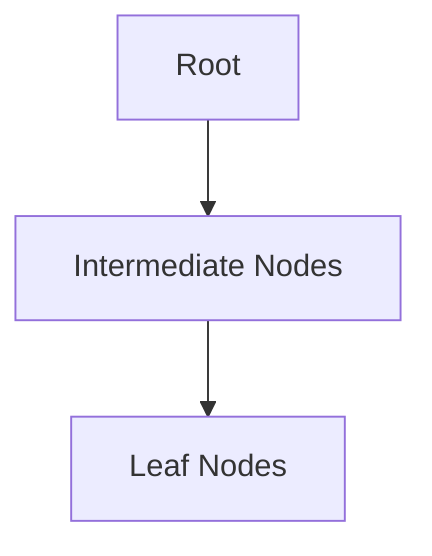

## 1. Short Answer (Interview Style)

---

> **An index is a data structure that improves query performance by allowing the database to quickly locate rows without scanning the entire table. It speeds up read operations but can slow down writes.**

---

## 2. Why This Question Matters

---

This question tests whether you understand:

- database performance optimization
- how queries are executed internally
- trade-offs between reads and writes
- real-world backend performance tuning

This is a very common backend interview question.

---

## 3. What is an Index?

---

An index is similar to an index in a book:

- instead of scanning the entire table
- database directly jumps to required data

Without index:

```text
Full Table Scan → slow
```

With index:

```text
Index Lookup → fast
```

---

## 4. Example Without Index

---

```sql
SELECT * FROM users WHERE email = 'abc@example.com';
```

Without index:

- DB scans every row
- time complexity: O(n)

---

## 5. Example With Index

---

```sql
CREATE INDEX idx_email ON users(email);
```

Now:

- DB uses index
- jumps directly to matching rows
- time complexity: O(log n)

---

## 6. How Index Works (Conceptual)

---

Most databases use **B-Tree structure**.



- sorted structure
- allows fast search, insert, delete

---

## 7. Types of Index (High Level)

---

- Primary Index (on primary key)
- Secondary Index (on non-key columns)
- Unique Index
- Composite Index (multiple columns)

---

## 8. Advantages of Index

---

- faster SELECT queries
- efficient filtering and joins
- improves overall query performance

---

## 9. Disadvantages of Index

---

- slows down INSERT/UPDATE/DELETE
- consumes extra storage
- requires maintenance

---

## 10. When Index is NOT Used (VERY IMPORTANT)

---

Index may not be used when:

- using functions on column

```sql
WHERE LOWER(email) = 'abc'
```

---

- leading wildcard

```sql
WHERE name LIKE '%abc'
```

---

- low selectivity (too many duplicate values)

---

## 11. Important Interview Points

---

### Does index always improve performance?
Answer: No, only for read-heavy queries.

---

### Why index slows down writes?
Answer: Because index also needs to be updated.

---

### What is composite index?
Answer: Index on multiple columns.

---

### What is full table scan?
Answer: DB reads entire table when no index is used.

---

## 12. Interview Summary Answer (Best Answer)

---

If interviewer asks:

> What is index and how it improves performance?

Answer like this:

> An index is a data structure that allows the database to quickly locate rows without scanning the entire table. It improves read performance by using structures like B-Trees for efficient lookup. However, it adds overhead to write operations and consumes extra storage, so it should be used carefully.