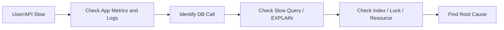

## 1. Short Answer (Interview Style)

---

> **When a database is slow, I debug it systematically by checking slow queries, execution plans, indexing, locks, connection pool health, resource usage, and recent changes. The goal is to identify whether the bottleneck is query design, contention, infrastructure, or application behavior.**

---

## 2. Why This Question Matters

---

This is one of the most important support and production debugging questions.

It tests:

- structured troubleshooting ability
- understanding of SQL performance
- ability to separate DB issue from app issue
- real production thinking under pressure

👉 Very common in backend, production support, and trading-system interviews.

---

## 3. First Principle

---

When someone says:

> "The database is slow"

that may actually mean several different things:

- one query is slow
- many queries are slow
- locks are blocking work
- DB CPU/memory is high
- app is waiting for connections
- downstream network latency exists

👉 So first, do **not** assume the root cause. Narrow it down.

---

## 4. Step-by-Step Debugging Approach (VERY IMPORTANT)

---

### Step 1 — Identify What Is Slow

Ask:

- all queries or specific query?
- read or write path?
- one service or multiple services?
- sudden issue or ongoing issue?

This helps decide whether it is:

- query-specific
- table-specific
- application-specific
- infrastructure-wide

---

### Step 2 — Check Slow Queries

Look for:

- long-running queries
- frequently executed expensive queries
- queries timing out

Common tools:

- slow query log
- APM traces
- DB monitoring dashboard

---

### Step 3 — Analyze Execution Plan

Use:

```sql
EXPLAIN SELECT * FROM orders WHERE customer_id = 101;
```

Check for:

- full table scan
- bad join strategy
- index not used
- large sort/temporary operations

👉 Execution plan is one of the most important things to inspect.

---

### Step 4 — Check Indexes

Ask:

- is filtering column indexed?
- is join column indexed?
- is index selective enough?
- is index missing or unused?

Problems from poor indexing:

- table scans
- slower reads
- more rows locked

---

### Step 5 — Check Locks / Blocking / Deadlocks

If DB appears slow, it may actually be **waiting**, not executing.

Check for:

- blocked sessions
- lock waits
- deadlocks
- long open transactions

👉 A blocked query can look like a slow query.

---

### Step 6 — Check Resource Usage

Look at DB server health:

- CPU usage
- memory pressure
- disk I/O
- network latency

Possible problems:

- CPU saturation from expensive queries
- disk bottleneck due to scans/sorts
- memory pressure causing spill to disk

---

### Step 7 — Check Connection Pool / Application Side

Sometimes DB is blamed, but issue is in app layer.

Check:

- active DB connections
- pool exhaustion
- connection wait times
- long transactions holding connections

👉 If app cannot get DB connection, user still experiences slowness.

---

### Step 8 — Check Recent Changes

Always verify recent changes:

- deployment
- new feature
- schema/index change
- traffic spike
- batch job started

👉 Many production incidents start after a change.

---

## 5. Real-World Example

---

Suppose an order API becomes slow.

You investigate:

1. API latency increased from 100 ms to 5 sec
2. application logs show DB call taking time
3. `EXPLAIN` shows full table scan on `orders`
4. recent deployment introduced filter on non-indexed column

👉 Root cause: missing index after query change

---

## 6. Real Production Flow

---



---

## 7. Common Root Causes (VERY IMPORTANT)

---

### 1. Missing or Poor Indexes

- full scan
- slow filtering
- slow joins

---

### 2. Bad Query Design

Examples:

- selecting unnecessary columns
- inefficient joins
- subqueries causing overhead
- no pagination

---

### 3. Locking / Blocking

- one transaction holds lock
- others wait behind it

---

### 4. High Data Volume

- query was fine earlier
- now table is much larger

---

### 5. Connection Pool Exhaustion

- app waiting for DB connections

---

### 6. Infrastructure Bottleneck

- high CPU
- disk I/O pressure
- storage latency

---

### 7. Long Transactions

- locks held longer
- resources occupied too long

---

## 8. Common Mistakes

---

❌ Assuming DB is slow without checking application logs  
❌ Adding indexes blindly without checking query pattern  
❌ Ignoring locks and blocked sessions  
❌ Looking only at query text, not execution plan  
❌ Treating connection pool issue as pure DB issue

---

## 9. Production Debugging Checklist

---

When DB is slow, I check:

1. Which API / query is affected?
2. Is the query actually slow or blocked?
3. What does the execution plan show?
4. Are indexes correct?
5. Are there lock waits or deadlocks?
6. Is DB CPU / memory / I/O healthy?
7. Is connection pool exhausted?
8. Was there a recent deployment or traffic spike?

---

## 10. Important Interview Questions

---

### What is your first step if DB is slow?

Answer:
First identify whether the slowness is from a specific query, blocking, connection issues, or overall DB resource pressure.

---

### Why is EXPLAIN important?

Answer:
It shows how the database plans to execute a query, including scans, joins, and index usage.

---

### Can slow API always mean slow query?

Answer:
No. It may be lock wait, connection pool exhaustion, network latency, or downstream contention.

---

### How do you separate app issue from DB issue?

Answer:
Check app logs, query timings, DB metrics, and connection pool behavior together instead of looking at only one layer.

---

## 11. Interview Summary Answer (Best Answer)

---

If interviewer asks:

> Database is slow, how will you debug?

Answer:

> I would debug it systematically by first identifying which query or workflow is slow. Then I would check slow query logs, analyze the execution plan using EXPLAIN, verify indexing, and check for locks or blocked sessions. I would also inspect DB CPU, memory, disk I/O, and application-side connection pool health. Finally, I would verify recent deployments or traffic changes. This helps isolate whether the issue is query design, locking, infrastructure, or application behavior.
