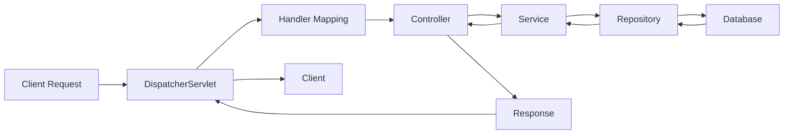

## 1. Short Answer (Interview Style)

---

> **In Spring Boot, an HTTP request is first handled by the DispatcherServlet, which routes it to the appropriate Controller. The Controller delegates to Service and Repository layers, and the response is returned back through the same flow to the client.**

---

## 2. Why This Question Matters

---

This question tests whether you understand:

- end-to-end request lifecycle
- role of DispatcherServlet
- layering (Controller → Service → Repository)
- where to debug issues

This is a very common Spring interview question.

---

## 3. High-Level Flow

---



---

## 4. Step-by-Step Flow

---

### 1. Client Sends Request

- HTTP request (GET/POST)
- hits application endpoint

---

### 2. DispatcherServlet (Front Controller)

- central entry point in Spring MVC
- receives all incoming requests

---

### 3. Handler Mapping

- maps request URL to appropriate controller method

Example:

```java
@GetMapping("/orders")
public List<Order> getOrders() {}
```

---

### 4. Controller Layer

- handles request
- validates input
- calls service layer

```java
@RestController
class OrderController {
    private final OrderService service;

    public OrderController(OrderService service) {
        this.service = service;
    }

    @GetMapping("/orders")
    public List<Order> getOrders() {
        return service.getOrders();
    }
}
```

---

### 5. Service Layer

- contains business logic

```java
@Service
class OrderService {
    private final OrderRepository repo;

    public OrderService(OrderRepository repo) {
        this.repo = repo;
    }

    public List<Order> getOrders() {
        return repo.findAll();
    }
}
```

---

### 6. Repository Layer

- interacts with database

```java
@Repository
interface OrderRepository {
    List<Order> findAll();
}
```

---

### 7. Database Interaction

- query executed
- data fetched

---

### 8. Response Returned

- data flows back: Repository → Service → Controller
- converted to JSON (via Jackson)
- sent to client

---

## 5. Important Components

---

### DispatcherServlet

- front controller
- handles all requests

---

### HandlerMapping

- maps URL → controller method

---

### HandlerAdapter

- invokes controller method

---

### ViewResolver (for MVC)

- resolves views (not used in REST APIs)

---

## 6. Where to Debug (VERY IMPORTANT)

---

If API fails:

1. **Controller** → wrong mapping?
2. **Service** → business logic issue?
3. **Repository** → DB query issue?
4. **Logs** → exceptions?
5. **DB** → slow or failing query?

---

## 7. Important Interview Points

---

### What is DispatcherServlet?

Answer: Central component that handles all incoming requests.

---

### Does request go directly to controller?

Answer: No, it goes through DispatcherServlet.

---

### Where is JSON conversion done?

Answer: By HttpMessageConverters (e.g., Jackson).

---

### Is service layer mandatory?

Answer: Not mandatory, but recommended for clean architecture.

---

## 8. Interview Summary Answer (Best Answer)

---

If interviewer asks:

> Explain request flow in Spring Boot

Answer like this:

> In Spring Boot, the request is first received by the DispatcherServlet, which routes it to the appropriate controller using handler mapping. The controller processes the request and delegates to the service and repository layers. The result is returned back through the same flow, converted to JSON, and sent to the client.
