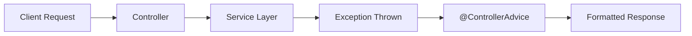

## 1. Short Answer (Interview Style)

---

> **Spring Boot provides exception handling using @ExceptionHandler and @ControllerAdvice, allowing centralized handling of errors across the application, ensuring consistent error responses and cleaner code.**

---

## 2. Why This Question Matters

---

This question tests:

- API error handling design
- clean architecture practices
- real-world debugging
- ability to standardize responses

👉 Very common in backend interviews

---

## 3. Problem Without Exception Handling

---

```java
@GetMapping("/user/{id}")
public User getUser(@PathVariable int id) {
    return userService.getUser(id); // may throw exception
}
```

Problems:

- ugly stack traces returned to client
- inconsistent error responses
- logic duplication with try-catch

---

## 4. Approach 1 — Local Handling (@ExceptionHandler)

---

```java
@RestController
public class UserController {

    @ExceptionHandler(UserNotFoundException.class)
    public ResponseEntity<String> handleUserNotFound() {
        return ResponseEntity.status(HttpStatus.NOT_FOUND).body("User not found");
    }
}
```

👉 Handles exception only for this controller

---

## 5. Approach 2 — Global Handling (@ControllerAdvice) ✅ BEST

---

```java
@RestControllerAdvice
public class GlobalExceptionHandler {

    @ExceptionHandler(UserNotFoundException.class)
    public ResponseEntity<String> handleUserNotFound(UserNotFoundException ex) {
        return ResponseEntity.status(HttpStatus.NOT_FOUND).body(ex.getMessage());
    }

    @ExceptionHandler(Exception.class)
    public ResponseEntity<String> handleGeneric(Exception ex) {
        return ResponseEntity.status(HttpStatus.INTERNAL_SERVER_ERROR)
                .body("Something went wrong");
    }
}
```

👉 Applies across all controllers  
👉 Centralized error handling

---

## 6. Structured Error Response (Production Standard)

---

Instead of returning plain string:

```json
"User not found"
```

Return structured response:

```json
{
  "timestamp": "2026-01-01T10:00:00",
  "status": 404,
  "error": "NOT_FOUND",
  "message": "User not found",
  "path": "/user/1"
}
```

---

Example:

```java
public class ErrorResponse {
    private LocalDateTime timestamp;
    private int status;
    private String error;
    private String message;
    private String path;
}
```

---

## 7. Real-World Flow

---



---

## 8. Common Pitfalls (VERY IMPORTANT)

---

### 1. Using try-catch everywhere

❌ Leads to messy code

---

### 2. Returning raw exception message

❌ Security risk (leaks internal details)

---

### 3. Not handling generic exception

❌ Can expose stack trace

---

### 4. Wrong HTTP status codes

- 200 for errors ❌
- Always use proper status

---

### 5. Not logging exceptions

👉 Always log:

```java
log.error("Error occurred", ex);
```

---

## 9. Production Debugging Angle

---

If API returns 500:

1. Check logs (stack trace)
2. Identify exception class
3. Check if handler exists
4. Validate mapping of exception → response
5. Check downstream failures (DB/API)

---

👉 Very common issue:

> "Why am I always getting 500 instead of 404?"

Answer:

- exception not mapped in @ControllerAdvice
- generic handler catching everything

---

## 10. Important Interview Questions

---

### Difference between @ExceptionHandler and @ControllerAdvice?

Answer:

- @ExceptionHandler → specific controller
- @ControllerAdvice → global

---

### Why global handling is preferred?

Answer:

- consistency
- cleaner code
- centralized logic

---

### Can we customize error response?

Answer:
Yes, using custom response objects

---

### What is @RestControllerAdvice?

Answer:
Combination of @ControllerAdvice + @ResponseBody

---

## 11. Interview Summary Answer (Best Answer)

---

If interviewer asks:

> How do you handle exceptions in Spring Boot?

Answer:

> In Spring Boot, exceptions can be handled using @ExceptionHandler for local handling and @ControllerAdvice for global handling. The recommended approach is to use @ControllerAdvice to centralize exception handling and return structured, consistent error responses. This improves maintainability, readability, and debugging in production systems.
