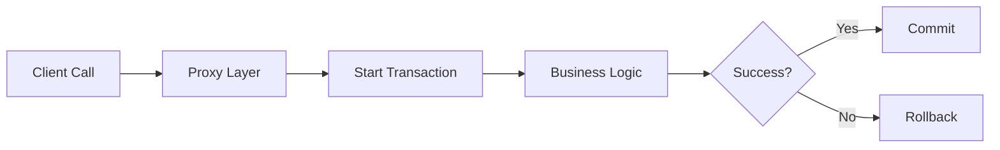

## 1. Short Answer (Interview Style)

---

> **@Transactional in Spring is used to manage database transactions declaratively. It ensures that a set of operations either fully succeed (commit) or fail together (rollback), maintaining data consistency.**

---

## 2. Why This Question Matters

---

This question tests:

- understanding of **data consistency**
- knowledge of **transaction management**
- real-world debugging ability
- awareness of **Spring AOP internals**

👉 Very common in **backend + production support interviews**

---

## 3. What is a Transaction?

---

A transaction is a **unit of work** that must follow ACID properties:

- **Atomicity** → all or nothing
- **Consistency** → valid state
- **Isolation** → independent execution
- **Durability** → persists after commit

---

Example:

```java
transferMoney() {
    debit(accountA);
    credit(accountB);
}
```

👉 If one fails → both should rollback

---

## 4. How @Transactional Works

---

Spring uses **AOP (Proxy-based mechanism)**

Flow:



---

Example:

```java
@Service
public class PaymentService {

    @Transactional
    public void processPayment() {
        // DB operations
    }
}
```

---

👉 Spring:

- opens transaction before method
- commits after success
- rolls back on failure

---

## 5. Where is it Used?

---

👉 Typically used in:

- **Service layer** (best practice)

❌ Avoid:

- Controller layer (bad design)
- Repository layer (too granular)

---

## 6. Exception Behavior (VERY IMPORTANT)

---

### Default Behavior:

| Exception Type    | Rollback? |
| ----------------- | --------- |
| RuntimeException  | ✅ Yes    |
| Checked Exception | ❌ No     |

---

Example:

```java
@Transactional
public void process() throws Exception {
    throw new Exception(); // ❌ NO rollback
}
```

---

### Fix:

```java
@Transactional(rollbackFor = Exception.class)
```

---

## 7. Real-World Example

---

```java
@Transactional
public void placeOrder() {
    orderRepository.save(order);
    paymentService.charge();
    inventoryService.reserve();
}
```

---

If:

- payment fails ❌
- inventory fails ❌

👉 Entire transaction rolls back

---

## 8. Common Pitfalls (VERY IMPORTANT)

---

### 1. Self Invocation Problem

```java
this.internalMethod(); // ❌ Transaction NOT applied
```

👉 Because Spring uses **proxy**, internal calls bypass it

---

### 2. Wrong Exception Handling

```java
try {
    ...
} catch (Exception e) {
    // swallowed → NO rollback
}
```

👉 If exception is handled → Spring thinks it's success

---

### 3. Long Transactions

- holding DB locks too long
- causes performance issues

---

### 4. Transaction on Private Methods

```java
@Transactional
private void method() {}
```

❌ Won’t work (proxy limitation)

---

### 5. Mixing External Calls

- DB + API call in same transaction
- leads to inconsistency

---

## 9. Important Configurations

---

### Propagation

Defines how transactions behave when nested:

- REQUIRED (default)
- REQUIRES_NEW
- SUPPORTS

---

### Isolation

Controls data visibility:

- READ_COMMITTED (most common)
- REPEATABLE_READ
- SERIALIZABLE

---

Example:

```java
@Transactional(
    propagation = Propagation.REQUIRED,
    isolation = Isolation.READ_COMMITTED
)
```

---

## 10. Real Production Debugging Angle

---

If transaction not working:

1. Check if method is called via **Spring proxy**
2. Check **exception type**
3. Check logs → commit vs rollback
4. Verify DB auto-commit settings
5. Check nested transactions
6. Check if method is **public**

---

👉 Common real issue:

> "Why is my data partially saved even after exception?"

Answer:

- checked exception OR
- exception swallowed OR
- self-invocation

---

## 11. Important Interview Questions

---

### Why does @Transactional not work sometimes?

Answer:

- proxy-based → internal calls bypass it
- wrong exception type
- method visibility issues

---

### Why Service layer?

Answer:

- transaction should cover business logic
- not too granular (repo)
- not too high-level (controller)

---

### What is propagation?

Answer:
Defines how transactions behave when one transaction calls another.

---

### Can we use it on class level?

Answer:
Yes, applies to all public methods.

---

## 12. Interview Summary Answer (Best Answer)

---

If interviewer asks:

> What is @Transactional in Spring?

Answer:

> @Transactional is used to manage database transactions declaratively in Spring. It ensures atomicity by committing changes on success and rolling back on failure. By default, it rolls back on runtime exceptions, and it works using proxy-based AOP, so method calls must go through the Spring container for it to be effective.
