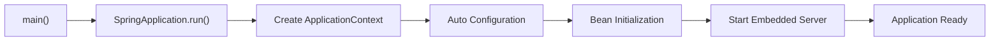

## 1. Short Answer (Interview Style)

---

> **When a Spring Boot application starts, the main method invokes SpringApplication.run(), which creates and initializes the ApplicationContext, performs auto-configuration, registers beans, and starts the embedded server (like Tomcat).**

---

## 2. Why This Question Matters

---

This question tests whether you understand:

- Spring Boot internals
- ApplicationContext lifecycle
- auto-configuration mechanism
- how a web application actually boots

This is a very common Spring interview question.

---

## 3. Entry Point — main() Method

---

```java
@SpringBootApplication
public class MyApp {
    public static void main(String[] args) {
        SpringApplication.run(MyApp.class, args);
    }
}
```

Everything starts from:

```java
SpringApplication.run()
```

---

## 4. High-Level Flow

---



---

## 5. Step-by-Step Flow

---

### 1. SpringApplication.run()

- bootstraps the application
- prepares environment
- decides application type (web/non-web)

---

### 2. Create ApplicationContext

- creates IoC container
- loads configuration classes

---

### 3. Auto-Configuration

- based on classpath and dependencies
- uses `@EnableAutoConfiguration`

Example:

- if Spring MVC is present → configure DispatcherServlet
- if JPA present → configure EntityManager

---

### 4. Component Scanning

- scans packages for:
  - @Component
  - @Service
  - @Repository
  - @Controller

---

### 5. Bean Creation & Dependency Injection

- beans are instantiated
- dependencies injected

---

### 6. Embedded Server Starts

- Tomcat/Jetty/Undertow starts
- port binding happens (default 8080)

---

### 7. Application Ready

- application starts accepting requests

---

## 6. Important Concepts Behind the Scene

---

### @SpringBootApplication

Combination of:

- @Configuration
- @EnableAutoConfiguration
- @ComponentScan

---

### Auto-Configuration Magic

Spring Boot automatically configures:

- DataSource
- DispatcherServlet
- Security (if present)

---

## 7. Real Debugging Insight (VERY IMPORTANT)

---

If app fails to start, check:

1. logs (startup errors)
2. missing beans
3. port conflicts
4. configuration issues (application.yml)
5. dependency conflicts

---

## 8. Important Interview Points

---

### What does SpringApplication.run() do?

Answer: Bootstraps application, creates context, starts server.

---

### What is ApplicationContext?

Answer: Spring container managing beans.

---

### What is auto-configuration?

Answer: Automatic configuration based on classpath.

---

### Does Spring Boot need external server?

Answer: No, it uses embedded server.

---

## 9. Interview Summary Answer (Best Answer)

---

If interviewer asks:

> What happens when a Spring Boot application starts?

Answer like this:

> When a Spring Boot application starts, the main method calls SpringApplication.run(), which initializes the ApplicationContext, performs auto-configuration based on dependencies, scans and creates beans, injects dependencies, and finally starts the embedded server like Tomcat to handle incoming requests.
