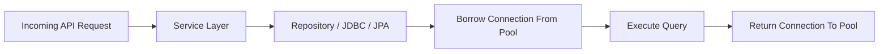

## 1. Short Answer (Interview Style)

---

> **Connection pooling is a technique where database connections are created in advance and reused instead of opening a new connection for every request. In Spring Boot, the default connection pool is HikariCP, which improves performance, reduces latency, and avoids the overhead of frequent connection creation.**

---

## 2. Why This Question Matters

---

This question tests:

- understanding of database performance basics
- production readiness
- troubleshooting ability under load
- knowledge of how Spring Boot talks to databases

👉 Very common in backend and support interviews because DB slowness often starts here.

---

## 3. Why Not Create a New Connection Every Time?

---

Opening a DB connection is expensive because it involves:

- network round trip
- authentication
- resource allocation on DB server
- session creation

If every request opens and closes a new connection:

- latency increases
- throughput drops
- DB gets overloaded faster

---

## 4. What is Connection Pooling?

---

A connection pool keeps a set of reusable DB connections ready.

Application flow:

1. request comes in
2. app borrows connection from pool
3. query executes
4. connection is returned to pool

👉 Reuse is the key idea.

---

## 5. How Spring Boot Uses It

---

In Spring Boot, your application typically uses a `DataSource`.

```java
@Autowired
private DataSource dataSource;
```

Spring Boot auto-configures a connection pool when DB dependencies are present.

👉 Default in modern Spring Boot: **HikariCP**

---

## 6. Real Flow in Production

---



---

## 7. Example Configuration

---

```yaml
spring:
  datasource:
    url: jdbc:mysql://localhost:3306/appdb
    username: app_user
    password: secret
    hikari:
      maximum-pool-size: 20
      minimum-idle: 5
      connection-timeout: 30000
      idle-timeout: 600000
      max-lifetime: 1800000
```

---

### Important Settings

- `maximum-pool-size` → max number of DB connections
- `minimum-idle` → minimum idle connections kept ready
- `connection-timeout` → how long app waits for a connection
- `idle-timeout` → idle connection cleanup time
- `max-lifetime` → max lifetime of a pooled connection

---

## 8. Real-World Example

---

Suppose your service gets 200 concurrent requests.

Without pooling:

- app tries to open many new DB connections
- response time becomes slow
- DB may hit connection limit

With pooling:

- app reuses existing connections
- better throughput
- lower latency
- controlled DB usage

---

## 9. Common Production Problems (VERY IMPORTANT)

---

### 1. Connection Pool Exhausted

Symptoms:

- requests hang
- timeout errors
- slow API response

Typical reason:

- all connections are busy and none available

---

### 2. Connection Leak

A connection is borrowed but not returned properly.

Example problem in manual JDBC code:

```java
Connection con = dataSource.getConnection();
// execute query
// forgot to close
```

👉 Over time pool gets exhausted

---

### 3. Pool Too Small

- app waits too long for free connection
- throughput drops during traffic spike

---

### 4. Pool Too Large

- DB server may get overloaded
- too many open connections waste resources

👉 Bigger pool is not always better.

---

### 5. Slow Queries Holding Connections

Even if pool is healthy, slow SQL can block connections for long time.

👉 Root cause may be query performance, not pool config.

---

## 10. Production Debugging Angle

---

If DB-backed API is slow, check:

1. pool usage metrics
2. active vs idle connections
3. connection timeout errors
4. DB max connection limit
5. slow query logs
6. transaction duration
7. connection leaks

---

👉 Common real issue:

> "Why is my API timing out even though CPU looks normal?"

Possible answer:

- app is waiting for DB connection from exhausted pool
- slow queries are holding connections too long
- connection leak

---

## 11. HikariCP Interview Points

---

### Why is HikariCP popular?

Answer:

- fast
- lightweight
- low overhead
- reliable in production

---

### What happens when pool is full?

Answer:
The application waits for a free connection up to `connection-timeout`. After that, it throws timeout exception.

---

### Is connection pool size equal to thread pool size?

Answer:
No. They are different. Too many app threads with too few DB connections can create waiting.

---

### Can connection pooling alone fix DB slowness?

Answer:
No. If queries are slow, indexing is poor, or transactions are long, pooling alone will not solve the issue.

---

## 12. Best Practices

---

- size pool carefully based on app + DB capacity
- monitor active/idle/waiting connections
- use try-with-resources in manual JDBC code
- optimize slow queries first
- avoid unnecessarily long transactions

---

## 13. Interview Summary Answer (Best Answer)

---

If interviewer asks:

> What is connection pooling and why is it important?

Answer:

> Connection pooling is a technique where database connections are reused instead of being created for every request. This reduces overhead, improves performance, and keeps latency low. In Spring Boot, HikariCP is the default connection pool, and it is important because database-heavy applications can become slow or fail under load if connections are not managed efficiently.
