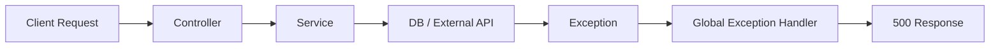

## 1. Short Answer (Interview Style)

---

> **When an API returns a 500 error, it indicates an unhandled server-side exception. Debugging involves checking logs, identifying the root cause, analyzing dependencies (DB, external APIs), and reproducing the issue systematically.**

---

## 2. Why This Question Matters

---

This is one of the most important production questions.

It tests:

- debugging mindset
- ability to work under pressure
- real production experience
- structured thinking

👉 Very common in L2/L3 support and backend roles

---

## 3. What is 500 Error?

---

HTTP 500 = **Internal Server Error**

Meaning:

- something failed inside the application
- exception was not handled properly

---

## 4. Step-by-Step Debugging Approach (VERY IMPORTANT)

---

### Step 1 — Check Logs (FIRST STEP ALWAYS)

```bash
grep "ERROR" application.log
```

Look for:

- stack trace
- exception type
- timestamp
- request path

---

### Step 2 — Identify Exception Type

Examples:

- `NullPointerException`
- `DataAccessException`
- `HttpClientErrorException`

👉 Exception type gives strong hint of root cause

---

### Step 3 — Check Request Input

- invalid payload?
- missing fields?
- wrong data type?

---

### Step 4 — Check Database Layer

- query failing?
- connection issue?
- constraint violation?

---

### Step 5 — Check Downstream Services

- external API failure?
- timeout?
- network issue?

---

### Step 6 — Check Recent Changes

- recent deployment?
- config changes?
- DB schema updates?

---

### Step 7 — Reproduce Locally

- use same payload
- simulate environment
- debug step-by-step

---

## 5. Real-World Flow

---



---

## 6. Where to Log Errors (VERY IMPORTANT)

---

👉 Best place: **Global Exception Handler (`@ControllerAdvice`)**

Example:

```java
@RestControllerAdvice
@Slf4j
public class GlobalExceptionHandler {

    @ExceptionHandler(Exception.class)
    public ResponseEntity<String> handleException(Exception ex, HttpServletRequest request) {

        log.error("Unhandled exception. path={}", request.getRequestURI(), ex);

        return ResponseEntity.status(HttpStatus.INTERNAL_SERVER_ERROR)
                .body("Something went wrong");
    }
}
```

---

### Logging Rules

- Expected errors → `warn`
- Unexpected errors → `error`
- Avoid duplicate logging in multiple layers

---

## 7. Common Root Causes (Production)

---

### 1. NullPointerException

- missing null check
- bad input

---

### 2. Database Issues

- connection pool exhausted
- query failure
- constraint violation

---

### 3. External API Failure

- timeout
- service down

---

### 4. Serialization Issues

- JSON mapping failure

---

### 5. Configuration Errors

- wrong environment config
- missing properties

---

## 8. Production Debugging Mindset

---

Think in layers:

1. Input → Is request valid?
2. App → Is logic failing?
3. DB → Is query slow/failing?
4. Network → Any downstream issue?

---

👉 Always narrow down step by step

---

## 9. Common Mistakes

---

❌ Jumping directly to code without logs  
❌ Ignoring stack trace  
❌ Not checking downstream services  
❌ Logging same error multiple times

---

## 10. Important Interview Questions

---

### What is your first step when API fails?

Answer:
Check logs and identify exception.

---

### Why logs are important?

Answer:
They provide root cause details like exception type, stack trace, and request context.

---

### How do you debug in production?

Answer:
Logs → metrics → isolate layer → reproduce → fix

---

## 11. Interview Summary Answer (Best Answer)

---

If interviewer asks:

> API is returning 500 error, how will you debug?

Answer:

> I start by checking logs to identify the exception and stack trace. Then I analyze whether the issue is in input, application logic, database, or downstream services. I also verify recent deployments or config changes. If needed, I reproduce the issue locally. This structured approach helps quickly isolate and resolve the root cause.
