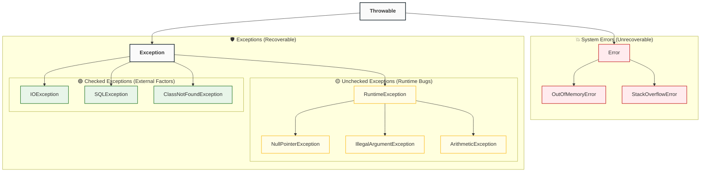

## 1. Short Answer (Interview Style)

---

> **The main difference is compiler enforcement. Checked exceptions are compiler-enforced, so we must either handle them using `try-catch` or declare them using `throws`. Unchecked exceptions are not compiler-enforced; they usually represent programming bugs, invalid input, or illegal runtime state.**

---

## 2. What is an Exception?

---

An exception is an event that interrupts the normal flow of program execution.

In Java, exceptions are represented as objects and are part of the `Throwable` hierarchy.

Common examples include:

- file not found
- invalid number format
- null access
- division by zero

Exceptions help us separate normal business logic from error handling logic.

---

## 3. Exception Hierarchy in Java

---

At a high level, Java’s hierarchy looks like this:



Important point:

- `Error` usually represents serious JVM/system problems
- `Exception` represents conditions applications may want to handle
- `RuntimeException` and its subclasses are **unchecked exceptions**
- Other subclasses of `Exception` are usually **checked exceptions**

---

## 4. What is a Checked Exception?

---

A checked exception is an exception that the compiler checks at compile time.

That means if a method may throw a checked exception, the caller is **forced by the compiler** to do one of these:

- handle it using `try-catch`
- declare it using `throws`

If the caller does neither, the code will not compile.

### Example

```java
class MyCheckedException extends Exception {
    public MyCheckedException(String message) {
        super(message);
    }
}

public class CheckedExceptionDemo {

    static void test() throws MyCheckedException {
        throw new MyCheckedException("Checked exception occurred");
    }

    public static void main(String[] args) {
        test(); // compilation error
    }
}
```

This fails to compile because `MyCheckedException` is checked, and `main()` neither catches it nor declares it.

### Correct ways to handle it

#### Option 1 — Catch it

```java
public class CheckedExceptionHandledDemo {

    static void test() throws MyCheckedException {
        throw new MyCheckedException("Checked exception occurred");
    }

    public static void main(String[] args) {
        try {
            test();
        } catch (MyCheckedException e) {
            System.out.println("Handled checked exception: " + e.getMessage());
        }
    }
}
```

#### Option 2 — Declare it

```java
public class CheckedExceptionDeclaredDemo {

    static void test() throws MyCheckedException {
        throw new MyCheckedException("Checked exception occurred");
    }

    public static void main(String[] args) throws MyCheckedException {
        test();
    }
}
```

### Common checked exceptions

- `IOException`
- `SQLException`
- `ClassNotFoundException`
- `ParseException`

---

## 5. What is an Unchecked Exception?

---

An unchecked exception is an exception that is **not checked by the compiler** at compile time.

These are subclasses of `RuntimeException`.

That means the caller is **not forced by the compiler** to catch them or declare them using `throws`.

### Example

```java
class MyUncheckedException extends RuntimeException {
    public MyUncheckedException(String message) {
        super(message);
    }
}

public class UncheckedExceptionDemo {

    static void test() {
        throw new MyUncheckedException("Unchecked exception occurred");
    }

    public static void main(String[] args) {
        test(); // compiles fine
    }
}
```

This compiles successfully even though the exception is not caught or declared.

The exception may still happen at runtime, but the compiler does not force handling.

### Important note

We _can_ still catch unchecked exceptions if needed:

```java
public class UncheckedExceptionHandledDemo {

    static void test() {
        throw new MyUncheckedException("Unchecked exception occurred");
    }

    public static void main(String[] args) {
        try {
            test();
        } catch (MyUncheckedException e) {
            System.out.println("Handled unchecked exception: " + e.getMessage());
        }
    }
}
```

### Common unchecked exceptions

- `NullPointerException`
- `ArithmeticException`
- `IllegalArgumentException`
- `ArrayIndexOutOfBoundsException`
- `NumberFormatException`

---

## 6. Key Difference Between Checked and Unchecked Exceptions

---

| Feature                 | Checked Exception                                      | Unchecked Exception                  |
| ----------------------- | ------------------------------------------------------ | ------------------------------------ |
| Compiler enforcement    | Yes                                                    | No                                   |
| Must handle or declare? | Yes                                                    | No                                   |
| Base type               | Subclass of `Exception` (excluding `RuntimeException`) | Subclass of `RuntimeException`       |
| Typical cause           | External/recoverable conditions                        | Programming mistakes / invalid state |
| Example                 | `IOException`                                          | `NullPointerException`               |

### The most important rule

- **Checked exception** → compiler forces handling or declaration
- **Unchecked exception** → compiler does not force handling or declaration

---

## 7. Why Java Has Both

---

Java separates checked and unchecked exceptions because different failures require different handling models.

- **Checked exceptions** are used when the caller is expected to explicitly handle the condition.
- **Unchecked exceptions** are used when the problem usually indicates a programming bug, invalid input, or illegal state.

So the distinction is not just technical — it is also about API design responsibility.

---

## 8. Should We Catch Unchecked Exceptions?

---

Usually, we do **not** catch unchecked exceptions everywhere.

Instead:

- fix the code causing them
- validate input earlier
- use global exception handling in applications where appropriate

For example, in Spring Boot, `RuntimeException` may be handled centrally using exception handlers.

The important point is:

> Unchecked exceptions are not ignored — they are just not forced by the compiler.

---

## 9. When Should We Create Custom Checked vs Unchecked Exceptions?

---

### 9.1 Use custom checked exceptions when:

- callers are expected to explicitly handle the condition
- the condition is recoverable or business-relevant
- you want to force the API user to think about it

### 9.2 Use custom unchecked exceptions when:

- the problem represents invalid input, bad state, or programming misuse
- recovery is usually not expected at the immediate caller level
- you want cleaner APIs without excessive `throws` declarations

In modern enterprise applications, custom unchecked exceptions are often more common unless there is a strong reason to force handling.

---

## 10. Example of Checked vs Unchecked in API Design

---

A more practical way to understand checked vs unchecked exceptions is through a banking-style API.

Imagine we are building a money transfer service.

### Example Exceptions

```java
class InsufficientBalanceException extends Exception {
    public InsufficientBalanceException(String message) {
        super(message);
    }
}

class InvalidTransferRequestException extends RuntimeException {
    public InvalidTransferRequestException(String message) {
        super(message);
    }
}
```

Here:

- `InsufficientBalanceException` is a **checked exception**
- `InvalidTransferRequestException` is an **unchecked exception**

---

### Service Example

```java
class TransferService {

    public void transfer(String fromAccount, String toAccount, double amount)
            throws InsufficientBalanceException {

        if (fromAccount == null || toAccount == null) {
            throw new InvalidTransferRequestException("Account details must not be null");
        }

        if (amount <= 0) {
            throw new InvalidTransferRequestException("Transfer amount must be greater than zero");
        }

        double availableBalance = 5000.0;

        if (amount > availableBalance) {
            throw new InsufficientBalanceException(
                    "Transfer failed: insufficient balance in source account"
            );
        }

        System.out.println("Transfer successful: " + amount +
                " transferred from " + fromAccount + " to " + toAccount);
    }
}
```

---

### Caller Example

```java
public class TransferApiExample {
    public static void main(String[] args) {
        TransferService service = new TransferService();

        try {
            service.transfer("ACC-101", "ACC-202", 6000.0);
        } catch (InsufficientBalanceException e) {
            System.out.println("Business recovery action: " + e.getMessage());
        }

        service.transfer("ACC-101", "ACC-202", -100.0);
    }
}
```

### What this example shows

#### InsufficientBalanceException → Checked

This is checked because the caller may reasonably recover from it.

For example, the caller may:

- show a user-friendly message
- ask the user to reduce the transfer amount
- retry after adding money

So this is a condition the caller is expected to explicitly handle.

#### InvalidTransferRequestException → Unchecked

This is unchecked because it represents invalid usage of the API.

Examples:

- passing null account values
- passing a negative amount
- violating API contract

These are not usually “recoverable business outcomes” at the immediate method level.
They indicate that the caller has made a mistake or failed validation.

---

### Design Insight

This is the key interview point:

- Use **checked exceptions** when the caller is expected to handle the situation explicitly
- Use **unchecked exceptions** when the problem represents invalid input, programming error, or illegal state

So in this example:

- **insufficient balance** can be treated as a recoverable business condition
- **negative amount or null account** is usually a caller bug or invalid request, so unchecked makes more sense

---

### Important Real-World Note

In many modern enterprise applications, especially Spring Boot systems, teams often prefer **custom unchecked exceptions** even for business scenarios, and then handle them centrally using global exception handlers.

So this is not just about “right vs wrong” — it is also about **API design style** and **how responsibility is distributed across the system**.

---

## 11. Important Interview Points

---

Strong points to mention in interviews:

- the main difference is **compiler enforcement**
- checked exceptions must be handled or declared
- unchecked exceptions are not compiler-enforced
- checked exceptions often represent recoverable external conditions
- unchecked exceptions often represent programming bugs or invalid state
- unchecked exceptions can still be caught if needed

---

## 12. Interview Follow-up Questions

---

After asking **"Checked vs Unchecked exception"**, interviewers often ask deeper follow-up questions.

### Common Follow-up Questions

| Follow-up Question                                   | What Interviewer Is Testing       |
| ---------------------------------------------------- | --------------------------------- |
| Why is `NullPointerException` unchecked?             | Runtime bug understanding         |
| Why is `IOException` checked?                        | Recoverable failure understanding |
| Should we create custom checked exceptions?          | API design                        |
| What is the difference between `throw` and `throws`? | Exception syntax                  |
| Can we catch unchecked exceptions?                   | Runtime handling                  |
| Should we catch `Exception` everywhere?              | Best practices                    |
| Should business exceptions be checked or unchecked?  | Design judgment                   |

---

## 13. Common Mistakes

---

Common mistakes developers make:

- Saying checked exceptions happen at compile time and unchecked happen at runtime
- Thinking unchecked exceptions cannot be caught
- Assuming checked exceptions are always better API design
- Catching very broad exceptions unnecessarily
- Using checked exceptions for every business rule
- Ignoring exception hierarchy

Important correction:

> Both checked and unchecked exceptions happen at runtime.  
> The difference is whether the compiler forces us to handle or declare them.

---

## 14. Interview Summary Answer (Best Answer)

---

If interviewer asks:

> What is the difference between checked and unchecked exceptions in Java?

Answer like this:

> The main difference is compiler enforcement. Checked exceptions must be either handled with `try-catch` or declared using `throws`, otherwise the code does not compile. Unchecked exceptions are subclasses of `RuntimeException` and are not enforced by the compiler. Checked exceptions usually represent recoverable external conditions, while unchecked exceptions usually represent programming bugs or invalid runtime state.

This is a **strong interview answer**.
