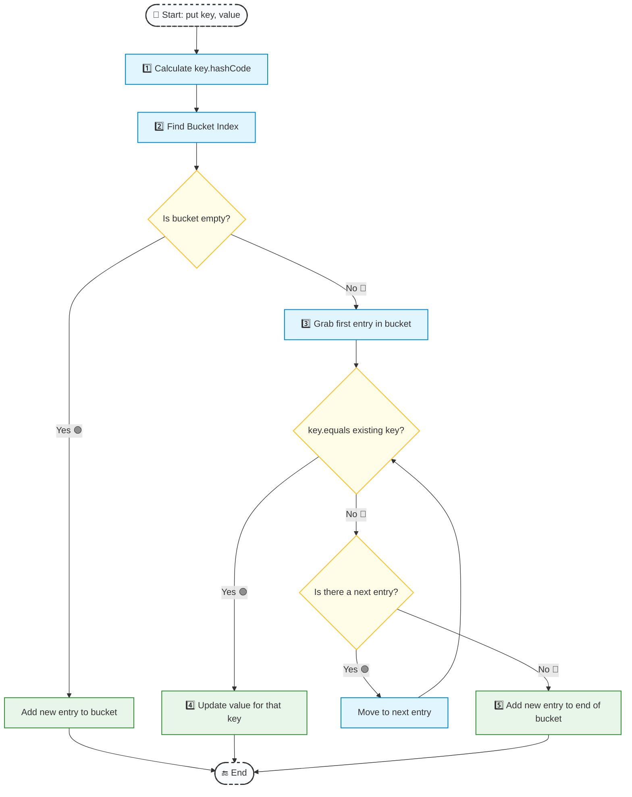

## 1. Short Answer (Interview Style)

---

> **equals() is used to compare logical equality between two objects,  
> while hashCode() returns an integer used by hash-based collections like HashMap and HashSet.  
> If two objects are equal according to equals(), they must return the same hashCode().**

---

## 2. What is equals()?

---

The equals() method is used to compare two objects for equality.

However, the behavior of equals() depends on whether the class overrides it or not.

### Default Behavior (Object Class)

By default, the equals() method from the Object class compares **memory references**, similar to the == operator.

```java
Object obj1 = new Object();
Object obj2 = new Object();

System.out.println(obj1.equals(obj2)); // false
```

Even if the objects contain the same data, it returns false because they are different objects in memory.

### Overridden equals() (Logical Equality)

Many classes like String, Integer, LocalDate, etc., override equals() to compare **logical content** instead of memory reference.

```java
String a = new String("hello");
String b = new String("hello");

System.out.println(a.equals(b)); // true
```

Here:

- a and b are different objects
- But their contents are the same
- So equals() returns **true**

### Important Conclusion

So depending on the class implementation, equals() may compare:

- memory reference (default behavior)
- logical content (overridden behavior)

### equals() vs ==

| Comparison          | What it checks                             |
| ------------------- | ------------------------------------------ |
| ==                  | Reference equality (same object in memory) |
| equals() default    | Reference equality                         |
| equals() overridden | Logical/content equality                   |

---

## 3. What is hashCode()?

---

`hashCode()` returns an integer value representing the object.

This value is mainly used by **hash-based collections** like:

- HashMap
- HashSet
- Hashtable
- ConcurrentHashMap

The hash code is used to decide **which bucket an object will be stored in**.

#### Example:

```java
String s = "abc";
System.out.println(s.hashCode());
```

### 3.1 Why String Objects Have Same hashCode

For many classes like **String, Integer, etc., overrides hashCode()** to calculate hash based on the **object’s content**.

Inside String class, hashCode is something like:

```java
int hash = 0;
for (char c : value) {
    hash = 31 * hash + c;
}
```

So hashCode depends on **content**, not memory address.

So:

```java
new String("hello");
new String("hello");
```

Both have same content → same hashCode.

Even though they are different objects.

#### Important point:

> Two different objects can have the same hashCode.

hashCode is **not a unique identifier**.

---

## 4. Contract Between equals() and hashCode() (Very Important)

---

Java defines a contract between `equals()` and `hashCode()`.

### Rule 1

If two objects are equal according to equals(), they **must** have the same hashCode().

### Rule 2

If two objects have the same hashCode(), they are **not necessarily equal** (collision can happen).

### Rule 3

If you override equals(), you **must override hashCode()**.

Otherwise hash-based collections will behave incorrectly.

---

## 5. How HashMap Uses equals() and hashCode()

---

When you insert a key into a HashMap, Java uses both methods.

### Internal Flow of HashMap (Simplified)



So:

| Method     | Purpose                      |
| ---------- | ---------------------------- |
| hashCode() | Find bucket                  |
| equals()   | Find exact key inside bucket |

Both methods are required for HashMap to work correctly.

---

## 6. Example Class with equals() and hashCode()

---

```java
import java.util.Objects;

class Employee {
    private int id;
    private String name;

    Employee(int id, String name) {
        this.id = id;
        this.name = name;
    }

    @Override
    public boolean equals(Object o) {
        if (this == o) return true;
        if (!(o instanceof Employee)) return false;
        Employee other = (Employee) o;
        return id == other.id && Objects.equals(name, other.name);
    }

    @Override
    public int hashCode() {
        return Objects.hash(id, name);
    }
}
```

---

## 7. What Happens If Only equals() Is Overridden?

---

If we override equals() but not hashCode(), hash-based collections may behave incorrectly.

#### Example:

```java
Set<Employee> set = new HashSet<>();
set.add(new Employee(1, "Shubham"));

System.out.println(set.contains(new Employee(1, "Shubham")));
```

This may return **false** if hashCode() is not overridden properly, even though objects are logically equal.

This happens because HashSet uses hashCode to find the bucket first.

---

## 8. Interview Follow-up Questions

---

After asking **"equals() vs hashCode()"**, interviewers often ask deeper questions.

### Common Follow-up Questions

| Follow-up Question                                    | What Interviewer Is Testing   |
| ----------------------------------------------------- | ----------------------------- |
| Why does HashMap use both equals and hashCode?        | HashMap internals             |
| Can two objects have same hashCode but not equal?     | Collisions                    |
| Can two objects be equal but have different hashCode? | Contract knowledge            |
| What happens if only equals is overridden?            | Collections behavior          |
| What happens if only hashCode is overridden?          | Object equality               |
| Which fields should be used in equals/hashCode?       | Object identity               |
| Should mutable fields be used in hashCode?            | Bugs & design                 |
| Difference between == and equals?                     | Reference vs logical equality |

---

## 9. Common Mistakes

---

Common mistakes developers make:

- Overriding `equals()` but not `hashCode()`
- Using mutable fields in `hashCode()`
- Thinking `hashCode()` is unique
- Confusing `==` with `equals()`
- Not understanding HashMap internal flow
- Returning random numbers in `hashCode()`
- Using all fields including non-identity fields

---

## 10. Interview Summary Answer (Best Answer)

---

If interviewer asks:

> What is the difference between `equals()` and `hashCode()`?

Answer like this:

> `equals()` is used to compare logical equality between two objects, while `hashCode()` is used by hash-based collections to determine the bucket location for storing objects.  
> HashMap first uses `hashCode()` to locate the bucket and then uses `equals()` to find the exact key inside the bucket.  
> If two objects are equal according to `equals()`, they must have the same `hashCode()`.

This is a **strong interview answer**
