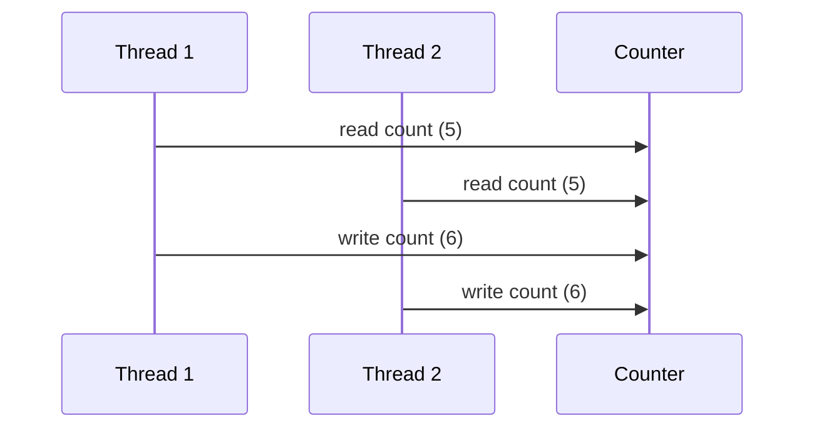

## 1. Short Answer (Interview Style)

---

> **A race condition occurs when multiple threads access and modify shared data concurrently without proper synchronization, leading to unpredictable and incorrect results.**

---

## 2. Why This Question Matters

---

This question tests whether you understand:

- concurrency issues
- shared mutable state problems
- need for synchronization
- real-world multithreading bugs

This is a very common Java concurrency interview question.

---

## 3. What is a Race Condition?

---

A race condition happens when:

- multiple threads access shared data
- at least one thread modifies it
- no proper synchronization is used

Result:

> Final output depends on thread execution order (which is unpredictable).

---

## 4. Example of Race Condition

---

```java
class Counter {
    int count = 0;

    void increment() {
        count++; // Not atomic
    }
}
```

```java
Counter counter = new Counter();

Runnable task = () -> {
    for (int i = 0; i < 1000; i++) {
        counter.increment();
    }
};

Thread t1 = new Thread(task);
Thread t2 = new Thread(task);

t1.start();
t2.start();
```

Expected output:

```text
2000
```

Actual output:

```text
< unpredictable (e.g., 1732, 1890, etc.) >
```

---

## 5. Why Does This Happen?

---

`count++` is not atomic. It consists of multiple steps:

```text
1. Read value
2. Increment
3. Write back
```

If two threads execute simultaneously:

```text
Thread A reads 5
Thread B reads 5
Thread A writes 6
Thread B writes 6
```

Final value becomes **6 instead of 7** → lost update.

---

## 6. Fix Using synchronized

---

```java
class Counter {
    int count = 0;

    synchronized void increment() {
        count++;
    }
}
```

Now:

- only one thread executes increment() at a time
- race condition is avoided

---

## 7. Fix Using Atomic Classes

---

```java
import java.util.concurrent.atomic.AtomicInteger;

class Counter {
    AtomicInteger count = new AtomicInteger(0);

    void increment() {
        count.incrementAndGet();
    }
}
```

Benefits:

- thread-safe
- non-blocking
- better performance than synchronized in many cases

---

## 8. Visual Flow (Race Condition)

---



---

## 9. Important Interview Points

---

### What causes race condition?

Answer: Multiple threads modifying shared data without synchronization.

---

### Is race condition possible without shared data?

Answer: No.

---

### Is race condition only about increment?

Answer: No, any read-modify-write operation can cause it.

---

### How to fix race condition?

Answer:

- synchronized
- locks (ReentrantLock)
- atomic classes

---

## 10. Interview Summary Answer (Best Answer)

---

If interviewer asks:

> What is race condition in Java?

Answer like this:

> A race condition occurs when multiple threads access and modify shared data concurrently without proper synchronization, leading to unpredictable results. It typically happens in read-modify-write operations like increment. It can be fixed using synchronization, locks, or atomic classes to ensure thread safety.
