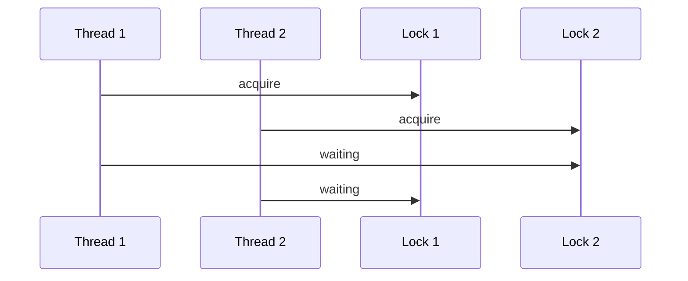

## 1. Short Answer (Interview Style)

---

> **Deadlock is a situation where two or more threads are blocked forever because each thread is waiting for a resource held by another thread. As a result, none of the threads can proceed.**

---

## 2. Why This Question Matters

---

This question tests whether you understand:

- thread blocking issues
- synchronization pitfalls
- system-level concurrency failures
- how to prevent deadlocks

This is a very common Java concurrency interview question.

---

## 3. What is Deadlock?

---

Deadlock occurs when:

- Thread A holds Lock 1 and waits for Lock 2
- Thread B holds Lock 2 and waits for Lock 1

Result:

> Both threads wait forever → system stuck

---

## 4. Example of Deadlock

---

```java
class DeadlockExample {
    private final Object lock1 = new Object();
    private final Object lock2 = new Object();

    public void method1() {
        synchronized (lock1) {
            System.out.println("Thread 1 acquired lock1");

            synchronized (lock2) {
                System.out.println("Thread 1 acquired lock2");
            }
        }
    }

    public void method2() {
        synchronized (lock2) {
            System.out.println("Thread 2 acquired lock2");

            synchronized (lock1) {
                System.out.println("Thread 2 acquired lock1");
            }
        }
    }
}
```

```java
DeadlockExample obj = new DeadlockExample();

Thread t1 = new Thread(obj::method1);
Thread t2 = new Thread(obj::method2);

t1.start();
t2.start();
```

This can cause deadlock if:

- Thread 1 locks `lock1`
- Thread 2 locks `lock2`
- Both wait for each other → deadlock

---

## 5. Visual Flow (Deadlock)

---



---

## 6. Four Necessary Conditions for Deadlock (VERY IMPORTANT)

---

Deadlock occurs only if all four conditions are true:

### 1. Mutual Exclusion

Only one thread can use a resource at a time.

### 2. Hold and Wait

Thread holds one resource while waiting for another.

### 3. No Preemption

Resources cannot be forcibly taken away.

### 4. Circular Wait

Threads form a circular dependency.

---

## 7. How to Prevent Deadlock

---

### 7.1 Lock Ordering (Best Practice)

Always acquire locks in same order:

```java
// Always lock lock1 before lock2
synchronized(lock1) {
    synchronized(lock2) {
        // safe
    }
}
```

---

### 7.2 Use `tryLock()` (`ReentrantLock`)

---

Another way to reduce deadlock risk is to use `tryLock()` instead of `lock()`.

With `lock()`, a thread waits until the lock becomes available.

```java
lock1.lock();
lock2.lock(); // may wait forever
```

This can cause deadlock if another thread already holds `lock2` and is waiting for `lock1`.

With `tryLock()`, the thread does not wait forever.

It tries to acquire the lock:

- if lock is available → returns true
- if lock is not available → returns false

```java
if (lock1.tryLock()) {
    try {
        if (lock2.tryLock()) {
            try {
                // critical section
            } finally {
                lock2.unlock();
            }
        }
    } finally {
        lock1.unlock();
    }
}
```

### How this prevents deadlock

Assume:

```text
Thread A holds lock1
Thread B holds lock2
```

Now:

```text
Thread A tries lock2
```

If `lock2` is not available, `tryLock()` returns `false`.

So Thread A does not wait forever.

Instead, it releases lock1:

```java
finally {
    lock1.unlock();
}
```

This allows other threads to continue.

### Key Idea

> If a thread cannot acquire all required locks, it releases the locks it already holds instead of waiting forever.

This breaks one of the main deadlock conditions: **hold and wait**.

### Important Note

This code avoids deadlock, but the work may be skipped if both locks are not acquired.

In real applications, we usually retry after a short delay.

```java
while (true) {
    if (lock1.tryLock()) {
        try {
            if (lock2.tryLock()) {
                try {
                    // critical section
                    break;
                } finally {
                    lock2.unlock();
                }
            }
        } finally {
            lock1.unlock();
        }
    }

    Thread.sleep(10);
}
```

---

### 7.3 Avoid Nested Locks

Reduce dependency between locks.

---

### 7.4 Timeout Mechanism

Use timed locks to avoid indefinite waiting.

---

## 8. Important Interview Points

---

### What is deadlock?

Answer: A situation where threads wait forever due to circular dependency on locks.

---

### What are the four conditions of deadlock?

Answer: Mutual exclusion, hold and wait, no preemption, circular wait.

---

### How to prevent deadlock?

Answer:

- consistent lock ordering
- avoid nested locks
- use tryLock

---

### Can deadlock happen with a single thread?

Answer: No, it requires at least two threads.

---

## 9. Interview Summary Answer (Best Answer)

---

If interviewer asks:

> What is deadlock in Java?

Answer like this:

> Deadlock is a situation where two or more threads are blocked forever because each thread is waiting for a resource held by another thread. It typically occurs due to circular dependency between locks. Deadlock can be prevented by following consistent lock ordering, avoiding nested locks, or using tryLock with timeouts.
