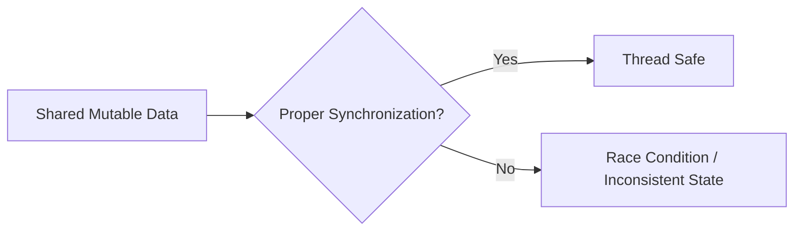

## 1. Short Answer (Interview Style)

---

> **Thread safety means that a piece of code, class, or object behaves correctly when accessed by multiple threads at the same time, without causing data inconsistency, race conditions, or unexpected behavior.**

---

## 2. Why This Question Matters

---

This question tests whether you understand:

- correctness in concurrent programs
- race condition prevention
- safe access to shared mutable state
- practical ways to write concurrent code

This is a very common Java concurrency interview question.

---

## 3. What is Thread Safety?

---

A class or method is **thread-safe** if:

- multiple threads can use it concurrently
- shared data remains consistent
- no race condition or corruption happens

In short:

> Thread-safe code gives correct results even under concurrent access.

---

## 4. Why Thread Safety is Needed

---

In multithreaded applications, multiple threads may read and modify the same data.

Without thread safety:

- data may become inconsistent
- updates may be lost
- program behavior becomes unpredictable

Example problem:

```java
class Counter {
    int count = 0;

    void increment() {
        count++;
    }
}
```

If multiple threads call `increment()` at the same time, `count` may not be updated correctly.

---

## 5. Ways to Achieve Thread Safety

---

### 1. Synchronization

Use `synchronized` methods or blocks.

```java
synchronized void increment() {
    count++;
}
```

---

### 2. Explicit Locks

Use `ReentrantLock` for more control.

```java
lock.lock();
try {
    count++;
} finally {
    lock.unlock();
}
```

---

### 3. Atomic Classes

Use atomic classes for simple operations.

```java
AtomicInteger count = new AtomicInteger(0);
count.incrementAndGet();
```

---

### 4. Immutability

Immutable objects are naturally thread-safe.

```java
final class Employee {
    private final int id;
    private final String name;

    Employee(int id, String name) {
        this.id = id;
        this.name = name;
    }
}
```

---

### 5. Thread Confinement

Give each thread its own data instead of sharing.

Example:

- local variables
- ThreadLocal

---

## 6. Thread-Safe vs Non-Thread-Safe Examples

---

### Non-Thread-Safe

```java
StringBuilder sb = new StringBuilder();
```

### Thread-Safe

```java
StringBuffer sb = new StringBuffer();
```

Another example:

- `ArrayList` → not thread-safe
- `CopyOnWriteArrayList` → thread-safe

---

## 7. Common Sources of Thread-Safety Issues

---

- shared mutable state
- race conditions
- improper locking
- visibility problems
- unsafe collection usage

---

## 8. Visual Understanding

---



---

## 9. Important Interview Points

---

### Are immutable objects thread-safe?
Answer: Yes.

---

### Are local variables thread-safe?
Answer: Yes, because they are thread-confined.

---

### Is synchronized the only way to achieve thread safety?
Answer: No. We can also use locks, atomic classes, immutability, and thread confinement.

---

### Is thread-safe code always faster?
Answer: No. Thread safety may introduce overhead, but correctness is more important.

---

## 10. Interview Summary Answer (Best Answer)

---

If interviewer asks:

> What is thread safety in Java?

Answer like this:

> Thread safety means that code behaves correctly when accessed by multiple threads concurrently, without causing inconsistent results or race conditions. In Java, thread safety can be achieved using synchronization, explicit locks, atomic classes, immutability, or thread confinement depending on the use case.