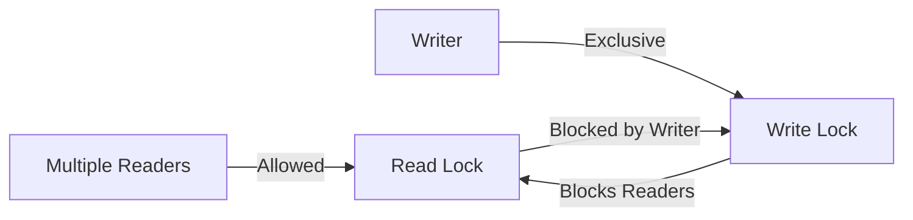

## 1. Short Answer (Interview Style)

---

> **ReadWriteLock is a locking mechanism in Java that allows multiple threads to read a shared resource concurrently while ensuring exclusive access for write operations. It improves performance in read-heavy scenarios.**

---

## 2. Why This Question Matters

---

This question tests whether you understand:

- read vs write contention
- improving throughput in read-heavy systems
- advanced locking beyond synchronized
- real-world concurrency optimization

---

## 3. What is ReadWriteLock?

---

`ReadWriteLock` is an interface in:

```java
java.util.concurrent.locks
```

It provides two separate locks:

- **Read Lock** → shared (multiple readers allowed)
- **Write Lock** → exclusive (only one writer, no readers)

Common implementation:

```java
ReentrantReadWriteLock
```

---

## 4. Basic Example

---

```java
import java.util.concurrent.locks.ReentrantReadWriteLock;

class DataStore {
    private int value = 0;
    private final ReentrantReadWriteLock rwLock = new ReentrantReadWriteLock();

    public int read() {
        rwLock.readLock().lock();
        try {
            return value;
        } finally {
            rwLock.readLock().unlock();
        }
    }

    public void write(int newValue) {
        rwLock.writeLock().lock();
        try {
            value = newValue;
        } finally {
            rwLock.writeLock().unlock();
        }
    }
}
```

---

## 5. How It Works

---



Rules:

- multiple readers → allowed simultaneously
- writer present → no readers allowed
- reader present → writer must wait

---

## 6. Why Use ReadWriteLock?

---

Compared to `synchronized`:

- synchronized allows **only one thread** at a time
- ReadWriteLock allows **multiple readers**

So:

> Better performance when reads >> writes

---

## 7. ReadWriteLock vs synchronized

---

| Feature                  | synchronized | ReadWriteLock |
| ------------------------ | ------------ | ------------- |
| Concurrent reads         | No           | Yes           |
| Write access             | Exclusive    | Exclusive     |
| Performance (read-heavy) | Lower        | Higher        |
| Complexity               | Simple       | Higher        |

---

## 8. ReentrantReadWriteLock Features

---

### 1. Reentrancy

Same thread can acquire read/write lock multiple times.

---

### 2. Lock Downgrading

Allowed: write → read

```java
rwLock.writeLock().lock();
try {
    // update
    rwLock.readLock().lock();
} finally {
    rwLock.writeLock().unlock();
}
```

---

### 3. No Lock Upgrading (Important)

Cannot safely go from read → write (may cause deadlock).

---

### 4. Fairness Policy

```java
new ReentrantReadWriteLock(true);
```

- fair → FIFO
- non-fair → better throughput

---

## 9. When to Use ReadWriteLock

---

Use when:

- system is **read-heavy**
- many threads read same data
- writes are infrequent

Avoid when:

- writes are frequent
- simple locking is sufficient

---

## 10. Important Interview Points

---

### Can multiple threads read simultaneously?

Answer: Yes.

---

### Can read and write happen together?

Answer: No.

---

### Can we upgrade read lock to write lock?

Answer: No (not safely).

---

### What is lock downgrading?

Answer: Converting write lock to read lock.

---

## 11. Interview Summary Answer (Best Answer)

---

If interviewer asks:

> What is ReadWriteLock in Java?

Answer like this:

> ReadWriteLock is a concurrency mechanism that allows multiple threads to read shared data simultaneously while ensuring exclusive access for write operations. It improves performance in read-heavy systems by reducing contention compared to synchronized locking.
