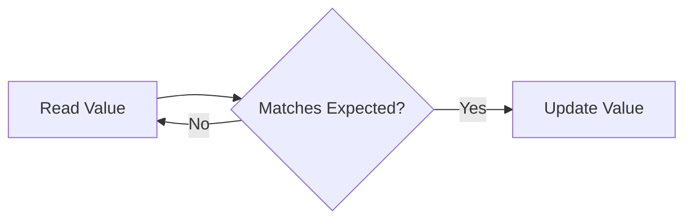

## 1. Short Answer (Interview Style)

---

> **Atomic classes in Java provide thread-safe operations on single variables without using locks. They use low-level Compare-And-Swap (CAS) operations to achieve high performance and avoid blocking.**

---

## 2. Why This Question Matters

---

This question tests whether you understand:

- lock-free concurrency
- performance optimization
- alternatives to synchronized/locks
- CAS (Compare-And-Swap)

This is a very common Java concurrency interview question.

---

## 3. What are Atomic Classes?

---

Atomic classes are part of:

```java
java.util.concurrent.atomic
```

They provide **thread-safe operations on variables** without using explicit locks.

Common classes:

- AtomicInteger
- AtomicLong
- AtomicBoolean
- AtomicReference

---

## 4. Why Not Use synchronized?

---

Using synchronized:

- blocks threads
- causes context switching
- can reduce performance under high contention

Atomic classes:

- non-blocking
- faster in many scenarios
- use hardware-level operations

---

## 5. Example (AtomicInteger)

---

```java
import java.util.concurrent.atomic.AtomicInteger;

class Counter {
    AtomicInteger count = new AtomicInteger(0);

    void increment() {
        count.incrementAndGet();
    }
}
```

This is equivalent to a thread-safe increment without using synchronized.

---

## 6. How Atomic Classes Work (CAS)

---

Atomic classes use **Compare-And-Swap (CAS)**:

```text
1. Read current value
2. Compare with expected value
3. If same → update
4. Else → retry
```

---

### CAS Flow



---

## 7. Common Methods

---

### incrementAndGet()

```java
count.incrementAndGet();
```

---

### getAndIncrement()

```java
count.getAndIncrement();
```

---

### compareAndSet()

```java
count.compareAndSet(expected, newValue);
```

---

### get()

```java
count.get();
```

---

## 8. Atomic vs synchronized

---

| Feature        | synchronized            | Atomic Classes   |
| -------------- | ----------------------- | ---------------- |
| Blocking       | Yes                     | No               |
| Performance    | Slower under contention | Faster           |
| Implementation | Locks                   | CAS              |
| Complexity     | Simple                  | Slightly complex |

---

## 9. When to Use Atomic Classes

---

Use Atomic classes when:

- working with single variable updates
- need high performance
- want non-blocking behavior

Do NOT use when:

- multiple variables must be updated together
- complex critical sections

---

## 10. Important Interview Points

---

### What is CAS?

Answer: Compare-And-Swap, a lock-free atomic operation.

---

### Are atomic classes thread-safe?

Answer: Yes.

---

### Are atomic classes always better than synchronized?

Answer: No, only for simple operations.

---

### What is limitation of atomic classes?

Answer: Cannot handle complex multi-variable operations.

---

### What is ABA problem in CAS?

Answer:
ABA problem occurs when a value changes from A → B → A. CAS sees the value as unchanged (A), but actually it was modified in between. This can lead to incorrect behavior. It is solved using techniques like AtomicStampedReference.

---

## 11. Interview Summary Answer (Best Answer)

---

If interviewer asks:

> What are Atomic classes in Java?

Answer like this:

> Atomic classes in Java provide thread-safe operations on variables without using locks. They use Compare-And-Swap (CAS) to ensure atomicity and are generally faster than synchronized in high-concurrency scenarios. However, they are best suited for simple operations and not complex critical sections.
