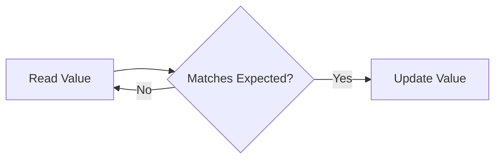

## 1. Short Answer (Interview Style)

---

> **Compare-And-Swap (CAS) is a low-level atomic operation used in Java to achieve thread safety without locks. It compares a variable’s current value with an expected value and updates it only if they match, ensuring safe concurrent updates.**

---

## 2. Why This Question Matters

---

This question tests whether you understand:

- lock-free concurrency
- atomic operations
- performance optimization
- how Atomic classes work internally

This is a common advanced Java concurrency interview question.

---

## 3. What is CAS?

---

CAS (Compare-And-Swap) works like this:

```text
if (currentValue == expectedValue) {
    currentValue = newValue;
}
```

But this happens **atomically at hardware level**, meaning:

> No other thread can interfere during this operation

---

## 4. Example Using AtomicInteger

---

```java
AtomicInteger count = new AtomicInteger(5);

boolean updated = count.compareAndSet(5, 10);

System.out.println(updated); // true
System.out.println(count.get()); // 10
```

If value was not 5:

```java
boolean updated = count.compareAndSet(4, 10);
```

Result:

```text
false
```

---

## 5. CAS Loop (Retry Mechanism)

---

CAS is usually used in a loop:

```java
while (true) {
    int current = count.get();
    int newValue = current + 1;

    if (count.compareAndSet(current, newValue)) {
        break;
    }
}
```

Why loop?

> Because another thread may update value before CAS executes

---

## 6. Visual Flow

---



---

## 7. Advantages of CAS

---

- non-blocking
- no context switching
- better performance under low contention
- avoids deadlocks

---

## 8. Limitations of CAS

---

### 1. Busy Waiting (Spin)

Threads may repeatedly retry → CPU usage increases

---

### 2. ABA Problem

Value changes A → B → A

CAS sees no change, but actual state changed

---

## 9. ABA Problem (Important)

---

Example:

```text
Thread 1 reads A
Thread 2 changes A → B → A
Thread 1 performs CAS (sees A unchanged)
```

CAS succeeds incorrectly.

Solution:

- AtomicStampedReference
- versioning

---

## 10. CAS vs synchronized

---

| Feature       | CAS                     | synchronized |
| ------------- | ----------------------- | ------------ |
| Blocking      | No                      | Yes          |
| Performance   | Better (low contention) | Slower       |
| Deadlock risk | No                      | Yes          |
| Complexity    | Higher                  | Lower        |

---

## 11. When to Use CAS

---

Use CAS when:

- simple atomic updates
- high-performance systems
- lock-free algorithms

Avoid CAS when:

- complex multi-step operations
- high contention causing excessive retries

---

## 12. Important Interview Points

---

### What is CAS?

Answer: Compare-And-Swap atomic operation.

---

### Is CAS lock-free?

Answer: Yes.

---

### What is ABA problem?

Answer: Value changes but appears unchanged.

---

### Why CAS uses loop?

Answer: To retry when update fails due to concurrent modification.

---

### Is CAS always better than locks?

Answer:
No. CAS performs better under low contention, but under high contention it may lead to excessive retries (spin), increasing CPU usage. In such cases, locks may perform better.

---

## 13. Interview Summary Answer (Best Answer)

---

If interviewer asks:

> What is Compare-And-Swap in Java?

Answer like this:

> Compare-And-Swap is a low-level atomic operation used to update a variable only if it matches an expected value. It is used in atomic classes to achieve lock-free concurrency. CAS improves performance by avoiding blocking, but it can suffer from issues like busy-waiting and the ABA problem.
