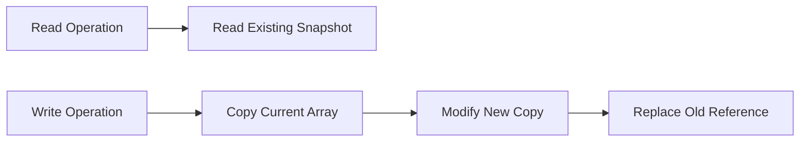

## 1. Short Answer (Interview Style)

---

> **CopyOnWriteArrayList is a thread-safe variant of ArrayList in which every write operation creates a new copy of the underlying array. It is best suited for read-heavy and write-light scenarios.**

---

## 2. Why This Question Matters

---

This question tests whether you understand:

- thread-safe collections in Java
- read-heavy vs write-heavy trade-offs
- snapshot iteration behavior
- concurrent collection design

This is a common Java concurrency interview question.

---

## 3. What is CopyOnWriteArrayList?

---

`CopyOnWriteArrayList` is a class in:

```java
java.util.concurrent
```

It is a thread-safe version of `ArrayList`.

Key idea:

> On every write operation (`add`, `remove`, `set`), it creates a fresh copy of the internal array.

So:

- reads happen on stable snapshot
- writes are expensive

---

## 4. Why is it Thread-Safe?

---

Because readers access an immutable snapshot of the array, while writers create a completely new copy.

This avoids:

- race conditions during iteration
- ConcurrentModificationException in most iteration scenarios

---

## 5. Basic Example

---

```java
import java.util.concurrent.CopyOnWriteArrayList;

CopyOnWriteArrayList<String> list = new CopyOnWriteArrayList<>();
list.add("A");
list.add("B");
list.add("C");

for (String item : list) {
    System.out.println(item);
    list.add("X");
}
```

Important:

- iteration works on old snapshot
- modification does not affect current iteration
- no ConcurrentModificationException

---

## 6. Snapshot Iteration

---

This is the most important concept.

Example:

```java
CopyOnWriteArrayList<String> list = new CopyOnWriteArrayList<>();
list.add("A");
list.add("B");

for (String item : list) {
    System.out.println(item);
    list.add("C");
}
```

Output:

```text
A
B
```

Even though `C` is added during iteration, current loop does not see it.

Why?

> Iterator uses a snapshot of the array at the time iteration started.

---

## 7. Internal Working (Conceptual)

---



---

## 8. Advantages

---

- thread-safe
- safe iteration without explicit synchronization
- no ConcurrentModificationException during iteration
- excellent for read-heavy workloads

---

## 9. Disadvantages

---

- every write copies full array
- high memory overhead for frequent writes
- poor choice for write-heavy scenarios

---

## 10. CopyOnWriteArrayList vs ArrayList

---

| Feature                       | ArrayList       | CopyOnWriteArrayList         |
| ----------------------------- | --------------- | ---------------------------- |
| Thread-safe                   | No              | Yes                          |
| Iteration during modification | Fails fast      | Uses snapshot                |
| Read performance              | Fast            | Fast                         |
| Write performance             | Fast            | Slow                         |
| Best use case                 | General purpose | Read-heavy concurrent access |

---

## 11. When to Use CopyOnWriteArrayList

---

Use when:

- reads are much more frequent than writes
- list size is moderate
- safe iteration is important

Examples:

- event listener lists
- observer lists
- configuration snapshots

Avoid when:

- writes are frequent
- list is large
- memory usage is critical

---

## 12. Important Interview Points

---

### Why is CopyOnWriteArrayList thread-safe?

Answer: Because writes create a new copy and readers work on snapshot data.

---

### Does it throw ConcurrentModificationException?

Answer: No, iteration is snapshot-based.

---

### Is it good for write-heavy systems?

Answer: No, writes are expensive because full array is copied.

---

### When should we use it?

Answer: In read-heavy, write-light concurrent scenarios.

---

## 13. Interview Summary Answer (Best Answer)

---

If interviewer asks:

> What is CopyOnWriteArrayList in Java?

Answer like this:

> CopyOnWriteArrayList is a thread-safe version of ArrayList where every write operation creates a new copy of the internal array. It provides safe snapshot-based iteration without ConcurrentModificationException and is best suited for read-heavy, write-light concurrent scenarios.
