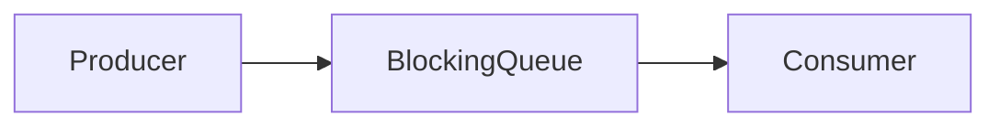

## 1. Short Answer (Interview Style)

---

> **BlockingQueue is a thread-safe queue in Java that supports operations which wait (block) when the queue is empty or full, making it ideal for producer-consumer scenarios.**

---

## 2. Why This Question Matters

---

This question tests whether you understand:

- inter-thread communication
- producer-consumer pattern
- blocking vs non-blocking structures
- real-world concurrency design

This is a very common backend interview question.

---

## 3. What is BlockingQueue?

---

`BlockingQueue` is an interface in:

```java
java.util.concurrent
```

It extends Queue and provides **blocking operations**.

---

## 4. Key Idea

---

BlockingQueue automatically handles synchronization between threads.

> No need to manually use synchronized, wait(), or notify().

---

## 5. Producer-Consumer Example

---

```java
import java.util.concurrent.BlockingQueue;
import java.util.concurrent.ArrayBlockingQueue;

BlockingQueue<Integer> queue = new ArrayBlockingQueue<>(2);

// Producer
new Thread(() -> {
    try {
        queue.put(1);
        queue.put(2);
        queue.put(3); // waits if full
    } catch (InterruptedException e) {
        e.printStackTrace();
    }
}).start();

// Consumer
new Thread(() -> {
    try {
        Thread.sleep(1000);
        System.out.println(queue.take());
        System.out.println(queue.take());
        System.out.println(queue.take());
    } catch (InterruptedException e) {
        e.printStackTrace();
    }
}).start();
```

---

## 6. Important Methods

---

### put()

```java
queue.put(item);
```

- blocks if queue is full

---

### take()

```java
queue.take();
```

- blocks if queue is empty

---

### offer()

```java
queue.offer(item);
```

- returns false if full (non-blocking)

---

### poll()

```java
queue.poll();
```

- returns null if empty (non-blocking)

---

### peek()

```java
queue.peek();
```

- returns head without removing

---

## 7. Types of BlockingQueue

---

| Type | Description |
|-----|-------------|
| ArrayBlockingQueue | bounded, fixed size |
| LinkedBlockingQueue | optionally bounded |
| PriorityBlockingQueue | priority-based |
| DelayQueue | delayed elements |
| SynchronousQueue | no storage (direct handoff) |

---

## 8. Visual Flow (Producer-Consumer)

---



---

## 9. Why Use BlockingQueue?

---

- built-in thread safety
- handles blocking automatically
- avoids manual wait/notify
- simplifies concurrent code

---

## 10. Important Interview Points

---

### Does BlockingQueue need synchronization?
Answer: No, it is internally thread-safe.

---

### Difference between put() and offer()?
Answer:

- put() → blocks
- offer() → returns immediately

---

### Difference between take() and poll()?
Answer:

- take() → blocks
- poll() → returns null if empty

---

### What is SynchronousQueue?
Answer: A queue with no capacity where each insert waits for a remove.

---

## 11. Interview Summary Answer (Best Answer)

---

If interviewer asks:

> What is BlockingQueue in Java?

Answer like this:

> BlockingQueue is a thread-safe queue that supports blocking operations when the queue is empty or full. It is commonly used in producer-consumer scenarios and simplifies inter-thread communication by handling synchronization internally.