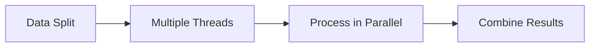

## 1. Short Answer (Interview Style)

---

> **Parallel streams in Java allow processing of data in parallel using multiple threads, leveraging the ForkJoinPool under the hood to improve performance for CPU-bound operations.**

---

## 2. Why This Question Matters

---

This question tests whether you understand:

- parallel processing using streams
- abstraction over multithreading
- performance trade-offs
- when parallelism is beneficial

This is a common advanced Java concurrency interview question.

---

## 3. What are Parallel Streams?

---

Parallel streams are a feature of Java Streams API that allow operations to be executed in parallel.

Instead of:

```java
list.stream()
```

We use:

```java
list.parallelStream()
```

---

## 4. Basic Example

---

```java
List<Integer> list = List.of(1, 2, 3, 4, 5);

list.parallelStream()
    .forEach(System.out::println);
```

Output order may vary because execution is parallel.

---

## 5. How It Works Internally

---

Parallel streams use:

> **ForkJoinPool.commonPool()**

Flow:



---

## 6. Example — Parallel Computation

---

```java
int sum = list.parallelStream()
              .mapToInt(i -> i * 2)
              .sum();
```

Steps:

- split data
- process in parallel
- combine result

---

## 7. Sequential vs Parallel Stream

---

| Feature     | Sequential Stream | Parallel Stream         |
| ----------- | ----------------- | ----------------------- |
| Execution   | Single thread     | Multiple threads        |
| Order       | Maintained        | Not guaranteed          |
| Performance | Lower             | Higher (for large data) |

---

## 8. When to Use Parallel Streams

---

Use when:

- tasks are CPU-bound
- large dataset
- independent operations

Examples:

- data processing
- mathematical computations

---

## 9. When NOT to Use

---

Avoid when:

- tasks are I/O-bound
- small datasets
- order matters strictly
- shared mutable state is involved

---

## 10. Common Pitfalls

---

### 10.1 Shared Mutable State

Avoid mutating shared objects inside a parallel stream.

```java
List<Integer> result = new ArrayList<>();

list.parallelStream().forEach(result::add); // Not thread-safe
```

Why it is a problem:

- multiple threads modify the same ArrayList
- can lead to race conditions or corrupted results

Better approach:

- use stream collectors
- avoid shared mutable state

```java
List<Integer> result = list.parallelStream()
                           .collect(Collectors.toList());
```

---

### 10.2 Performance Overhead

Parallelism has overhead → not always faster.

Why:

- splitting work across threads has overhead
- combining results also has overhead
- for small collections or lightweight operations, sequential streams may be faster

Better approach:

- use parallel streams only when:
  - data size is large
  - work per element is significant
  - task is CPU-intensive
- otherwise prefer normal stream

```java
list.stream().map(this::process).toList();          // often better for small/light tasks
list.parallelStream().map(this::heavyProcess).toList(); // better candidate for parallelism
```

---

### 10.3 Order Issues

Parallel streams may not preserve encounter order in all operations.

```java
list.parallelStream().forEach(System.out::println); // order not guaranteed
```

If order matters, use:

```java
list.parallelStream().forEachOrdered(System.out::println);
```

But note:

- `forEachOrdered()` preserves order
- preserving order can reduce parallel performance

So:

- use `forEach()` when order does not matter
- use `forEachOrdered()` only when order is required

---

## 11. Important Interview Points

---

### Do parallel streams use thread pool?

Answer: Yes, ForkJoinPool.commonPool().

---

### Are parallel streams always faster?

Answer: No, depends on workload and data size.

---

### Can we control thread pool?

Answer: Not directly, unless using custom ForkJoinPool.

---

### Difference between forEach and forEachOrdered?

Answer:

- forEach → no order guarantee
- forEachOrdered → maintains order

---

## 12. Interview Summary Answer (Best Answer)

---

If interviewer asks:

> What are parallel streams in Java?

Answer like this:

> Parallel streams allow processing of data in parallel using multiple threads, internally backed by ForkJoinPool. They improve performance for CPU-bound operations on large datasets but should be used carefully due to overhead, lack of ordering guarantees, and potential issues with shared mutable state.
