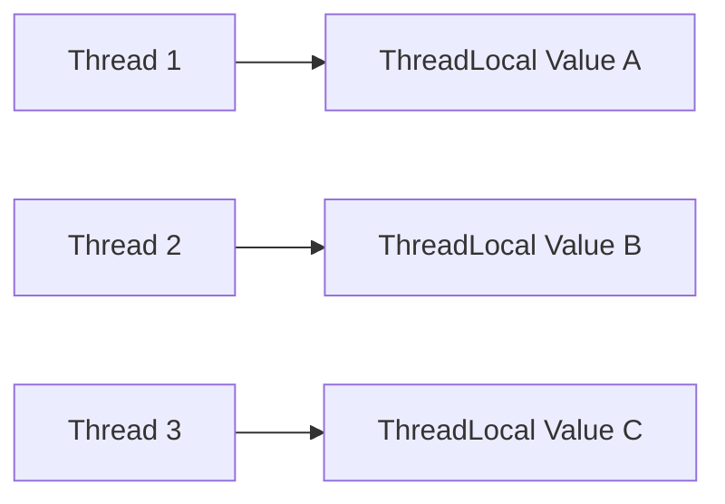

## 1. Short Answer (Interview Style)

---

> **ThreadLocal in Java provides thread-specific storage, meaning each thread gets its own independent copy of a variable. It is used when we want data to be isolated per thread instead of shared across threads.**

---

## 2. Why This Question Matters

---

This question tests whether you understand:

- thread confinement
- per-thread state management
- avoiding shared mutable state
- real-world concurrency utilities

This is a common Java concurrency interview question.

---

## 3. What is ThreadLocal?

---

`ThreadLocal` is a class in:

```java
java.lang
```

It allows us to store data that is:

- unique to each thread
- not shared between threads

So instead of one common variable for all threads:

> each thread gets its own private value

---

## 4. Basic Example

---

```java
ThreadLocal<Integer> local = new ThreadLocal<>();

local.set(100);
System.out.println(local.get());
```

This value belongs only to the current thread.

---

## 5. Example with Multiple Threads

---

```java
ThreadLocal<String> userContext = new ThreadLocal<>();

Runnable task1 = () -> {
    userContext.set("User-A");
    System.out.println(Thread.currentThread().getName() + " -> " + userContext.get());
};

Runnable task2 = () -> {
    userContext.set("User-B");
    System.out.println(Thread.currentThread().getName() + " -> " + userContext.get());
};

new Thread(task1).start();
new Thread(task2).start();
```

Each thread sees its own value.

---

## 6. Common Methods

---

### set()

```java
threadLocal.set(value);
```

Stores value for current thread.

---

### get()

```java
threadLocal.get();
```

Returns value for current thread.

---

### remove()

```java
threadLocal.remove();
```

Removes current thread’s value.

This is very important in real applications.

---

### withInitial()

```java
ThreadLocal<Integer> local = ThreadLocal.withInitial(() -> 0);
```

Provides default initial value.

---

## 7. Why Use ThreadLocal?

---

Use ThreadLocal when:

- data should not be shared across threads
- each thread needs its own context
- passing values through multiple method calls is inconvenient

Examples:

- user/session context
- database connection per thread
- transaction context
- request tracing

---

## 8. How It Works Internally

---

Each `Thread` object maintains its own `ThreadLocalMap`.

So:

- ThreadLocal is like a key
- each thread stores its own value against that key

---

### Visual



---

## 9. Important Warning — Memory Leak Risk

---

This is the most important interview point.

If ThreadLocal is used in thread pools and `remove()` is not called:

- thread gets reused
- old value may remain attached
- memory leak or data leakage may happen

Best practice:

```java
try {
    threadLocal.set(value);
    // business logic
} finally {
    threadLocal.remove();
}
```

---

## 10. ThreadLocal vs Shared Variable

---

| Shared Variable                   | ThreadLocal               |
| --------------------------------- | ------------------------- |
| Same value visible to all threads | Separate value per thread |
| Requires synchronization          | No synchronization needed |
| Risk of race condition            | Thread-confined           |

---

## 11. Important Interview Points

---

### Is ThreadLocal thread-safe?

Answer: Yes, because each thread gets its own isolated value.

---

### Does ThreadLocal share data between threads?

Answer: No.

---

### Why must we call remove()?

Answer: To prevent stale values and memory leaks, especially in thread pools.

---

### Is ThreadLocal useful for passing request context?

Answer: Yes.

---

## 12. Interview Summary Answer (Best Answer)

---

If interviewer asks:

> What is ThreadLocal in Java?

Answer like this:

> ThreadLocal in Java provides thread-specific storage, where each thread has its own independent copy of a variable. It is useful when data should be isolated per thread, such as request context, transaction state, or user session information. It also avoids synchronization, but remove() must be called carefully in thread pools to avoid memory leaks.
