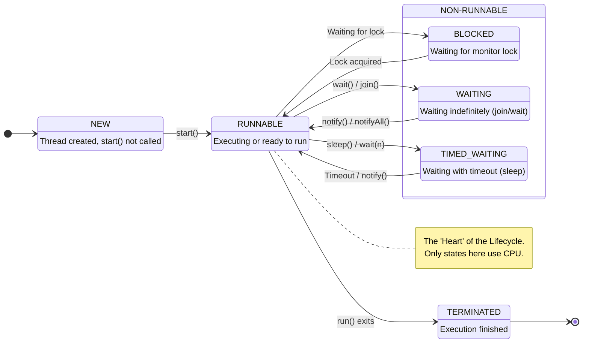

## 1. Short Answer (Interview Style)

---

> **The lifecycle of a thread in Java consists of multiple states: NEW, RUNNABLE, BLOCKED, WAITING, TIMED_WAITING, and TERMINATED. A thread moves between these states based on scheduling, synchronization, and method calls like start(), wait(), sleep(), and join().**

---

## 2. Why This Question Matters

---

This question tests whether you understand:

- how threads behave internally
- scheduling and execution flow
- blocking vs waiting
- how synchronization affects threads

This is a very common Java concurrency interview question.

---

## 3. Thread Lifecycle States

---

Java defines thread states in `Thread.State` enum:

| State         | Description                             |
| ------------- | --------------------------------------- |
| NEW           | Thread created but not started          |
| RUNNABLE      | Ready or running (scheduled by JVM)     |
| BLOCKED       | Waiting for monitor lock                |
| WAITING       | Waiting indefinitely for another thread |
| TIMED_WAITING | Waiting for a specified time            |
| TERMINATED    | Execution completed                     |

---

## 4. Lifecycle Diagram (Mermaid)

---



---

## 5. State Explanations

---

### 1. NEW

Thread is created but not started.

```java
Thread t = new Thread();
```

---

### 2. RUNNABLE

Thread is ready to run or currently executing.

```java
t.start();
```

Important:

> Java does not distinguish between ready and running states.

---

### 3. BLOCKED

Thread is waiting to acquire a lock (monitor).

```java
synchronized(obj) {
    // thread waits if lock not available
}
```

---

### 4. WAITING

Thread waits indefinitely for another thread.

```java
obj.wait();
thread.join();
```

---

### 5. TIMED_WAITING

Thread waits for a specific time.

```java
Thread.sleep(1000);
obj.wait(1000);
```

---

### 6. TERMINATED

Thread has finished execution.

---

## 6. Example Flow

---

```java
Thread t = new Thread(() -> {
    try {
        Thread.sleep(1000);
    } catch (InterruptedException e) {
        e.printStackTrace();
    }
});

t.start();
```

Flow:

```text
NEW → RUNNABLE → TIMED_WAITING → RUNNABLE → TERMINATED
```

---

## 7. Important Interview Points

---

### What is difference between BLOCKED and WAITING?

Answer:

- BLOCKED → waiting for a lock
- WAITING → waiting for another thread signal

---

### Does start() create a new thread?

Answer: Yes, it creates a new thread and calls run() internally.

---

### What happens if we call run() directly?

Answer: It executes in the same thread, no new thread is created.

---

### What moves thread from WAITING to RUNNABLE?

Answer: notify(), notifyAll(), or thread completion (join).

---

## 8. Interview Summary Answer (Best Answer)

---

If interviewer asks:

> Explain thread lifecycle in Java.

Answer like this:

> The lifecycle of a thread in Java includes states like NEW, RUNNABLE, BLOCKED, WAITING, TIMED_WAITING, and TERMINATED. A thread starts in NEW state, moves to RUNNABLE when start() is called, may enter BLOCKED or WAITING depending on synchronization or coordination, and finally reaches TERMINATED after execution completes. Understanding these states helps in debugging concurrency issues and managing thread behavior effectively.
