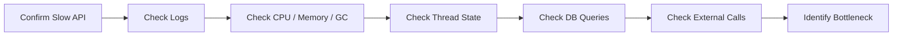

## 1. Short Answer (Interview Style)

---

> **If an API is slow, I would debug it layer by layer: first confirm the symptom, then check application logs, CPU, memory, GC, thread state, database latency, and downstream calls. The goal is to identify whether the bottleneck is in application code, infrastructure, database, or network.**

---

## 2. Why This Question Matters

---

This question tests whether you understand:

- structured production debugging
- end-to-end request flow
- performance bottleneck isolation
- practical backend troubleshooting

This is one of the most important backend and production support interview questions.

---

## 3. First Principle — Do Not Guess

---

When an API is slow, do not jump to conclusions.

A slow API could be caused by:

- high CPU
- memory pressure / GC
- database slowness
- thread contention
- downstream API latency
- network issue
- connection pool exhaustion
- bad code or inefficient query

So the correct approach is:

> **Debug step by step and isolate the bottleneck.**

---

## 4. High-Level Debugging Flow

---



---

## 5. Step-by-Step Debugging Approach

---

### 1. Confirm the Problem

First confirm:

- Is slowness happening for one endpoint or all endpoints?
- Is it constant or intermittent?
- Did it start after a deployment?
- Are error rates also increasing?

This helps decide whether the problem is:

- endpoint-specific
- service-wide
- environment-related

---

### 2. Check Application Logs

Look for:

- exceptions
- timeout messages
- downstream call failures
- database errors
- retry storms

Linux commands:

```bash
tail -f app.log
```

```bash
tail -f app.log | grep ERROR
```

---

### 3. Check CPU Usage

Use:

```bash
top
```

or

```bash
ps -eo pid,ppid,cmd,%cpu --sort=-%cpu
```

If CPU is high:

- infinite loop?
- excessive computation?
- thread contention?
- too many requests?

---

### 4. Check Memory Usage

Use:

```bash
free -m
```

or monitor JVM memory / container memory.

Check:

- high heap usage
- memory leaks
- excessive object creation

---

### 5. Check GC Behavior

If JVM application is slow:

- frequent GC pauses?
- long full GC?
- heap pressure?

Symptoms:

- latency spikes
- CPU high due to GC
- throughput drop

---

### 6. Take Thread Dump

Very important for Java applications.

Use thread dump to check:

- blocked threads
- deadlocks
- waiting threads
- stuck requests
- thread pool exhaustion

Typical command:

```bash
jstack <pid>
```

Look for:

- many threads in BLOCKED or WAITING state
- same code path repeated
- lock contention

---

### 7. Check Database Queries

This is one of the most common root causes.

Questions to ask:

- Is query slow?
- Is index missing?
- Is DB under heavy load?
- Is connection pool exhausted?

Check:

- slow query logs
- execution plan
- DB CPU / locks / waits

---

### 8. Check External API Calls / Downstream Services

If your API depends on another service:

- is downstream service slow?
- network latency high?
- timeout misconfigured?
- retries causing amplification?

This is common in microservices.

---

### 9. Check Connection Pools

Examples:

- DB connection pool
- HTTP client pool
- thread pool

If pool is exhausted:

- requests queue up
- latency increases
- timeouts happen

---

### 10. Correlate with Recent Change

Always ask:

- did deployment happen recently?
- config change?
- traffic spike?
- DB migration?

Sometimes the fastest root cause comes from change history.

---

## 6. Structured Interview Answer (Very Important)

---

A strong way to answer in interview:

1. **Confirm scope of issue**
2. **Check logs for errors/timeouts**
3. **Check CPU, memory, and GC**
4. **Take thread dump if Java app**
5. **Inspect DB queries and connection pool**
6. **Check downstream services / network**
7. **Correlate with recent deployment or traffic spike**
8. **Identify bottleneck and then fix**

This sounds structured and production-ready.

---

## 7. Example Strong Answer (Spoken Style)

---

> If an API is slow, I would first confirm whether the issue is endpoint-specific or service-wide. Then I would check logs for exceptions, timeouts, or downstream failures. After that I would inspect CPU, memory, and GC behavior to see whether the application is resource-constrained. For Java services, I would also take a thread dump to check for blocked threads or thread pool exhaustion. Next, I would investigate database performance, slow queries, and connection pool usage, and then verify whether any downstream API or network dependency is causing latency. Finally, I would correlate the issue with any recent deployment, config change, or traffic spike to isolate the root cause.

---

## 8. Important Interview Points

---

### What should you check first?

Answer: Confirm scope and check logs first.

---

### Why thread dump is important?

Answer: It shows blocked, waiting, or stuck threads.

---

### Why DB is often the bottleneck?

Answer: Slow queries, missing indexes, lock contention, connection pool issues.

---

### Why not jump directly to code?

Answer: Because bottleneck may be infra, DB, network, or downstream dependency.

---

## 9. Interview Summary Answer (Best Answer)

---

If interviewer asks:

> API is slow — how will you debug?

Answer like this:

> I would debug it layer by layer. First I would confirm whether the issue is endpoint-specific or service-wide. Then I would check logs, CPU, memory, and GC behavior. For a Java service, I would take a thread dump to check blocked threads or thread pool exhaustion. After that, I would inspect database queries, indexes, connection pools, and downstream API latency. This structured approach helps isolate whether the problem is in application code, database, infrastructure, or network.
