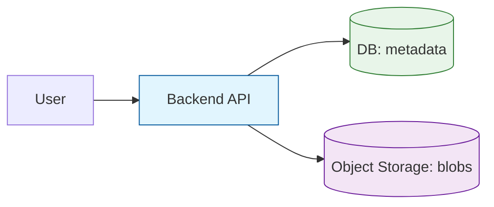

# Object Storage — What It Is (S3/GCS mental model)

---

In system design interviews, the most common storage question is:

> Where do you store large user-generated content (photos, videos, documents)?

The default answer in modern architectures is **object storage** (S3/GCS-style).

Object storage is not a filesystem and not a disk.

It is a different abstraction optimized for:

- massive scale
- high durability
- cheap storage
- HTTP-based access

This article gives you the mental model you can reuse everywhere.

---

## 1. What Is Object Storage (One Definition)

---

**Object storage** stores data as immutable (or versioned) **objects** identified by a **key**.

An object is:

- a blob of bytes (the content)
- plus metadata (content-type, checksum, custom tags)

Access is via an API over HTTP:

- `PUT object`
- `GET object`
- `DELETE object`
- `LIST objects` (by prefix)

Unlike a filesystem:

- there is no true directory tree
- “folders” are usually just key prefixes

---

## 2. The Mental Model: Bucket + Key + Object

---

Think of it like:

- **Bucket**: a logical container
- **Key**: the object identifier (string)
- **Object**: content + metadata

Example keys:

- `users/123/avatar.png`
- `videos/2026/03/16/abcd.mp4`
- `invoices/2026/receipt-9912.pdf`

Even though keys look like paths, they are still just strings.

---

## 3. How Object Storage Differs From Block and File Storage

---

### 3.1 Block storage (disk abstraction)

- looks like a raw disk volume
- low-latency random reads/writes
- attached to a single machine (usually)

Good for:

- database storage
- VM disks

### 3.2 File storage (filesystem abstraction)

- directories + filenames
- POSIX-like semantics
- shared access (NFS/SMB)

Good for:

- shared application files
- legacy workflows needing file semantics

### 3.3 Object storage (blob abstraction)

- HTTP API
- keys, not real directories
- optimized for large blobs
- extremely durable and scalable

Good for:

- media
- backups
- archives
- static assets
- data lakes

---

## 4. Why Object Storage Scales So Well

---

Object storage scales because the system is designed around:

- immutable objects (writes are typically create/replace, not in-place update)
- horizontal partitioning by key
- simple operations (GET/PUT/LIST)
- replication and erasure coding for durability

In practice, that means you can store:

- billions of objects
- petabytes of data

without building your own storage cluster.

---

## 5. Typical Architecture Pattern: App + DB (metadata) + Object Store (blob)

---

Object storage is almost never used alone.

Typical pattern:

- object store holds the blob
- database holds metadata and references

Example:

- DB stores: `photoId`, `userId`, `bucket`, `key`, `size`, `checksum`, `createdAt`
- Object store stores: the actual image/video bytes

Why split like this?

- DB is great at queries and relationships
- object storage is great at cheap, durable blob storage

---

## 6. Common Access Patterns (What Interviewers Expect)

---

### 6.1 Upload via backend (simple baseline)

- client sends file to backend
- backend uploads to object storage

Pros:

- easiest to implement

Cons:

- backend becomes a bandwidth bottleneck

### 6.2 Direct upload with presigned URLs (common at scale)

- backend issues a **presigned URL** for a specific key
- client uploads directly to object store
- backend stores metadata after upload completes

Pros:

- backend is not a data plane bottleneck
- scales better

Cons:

- requires careful validation (size/type/checksum)

(We’ll cover presigned URLs and multipart uploads in 10.4.)

---

## 7. When Object Storage Is the Wrong Choice

---

Object storage is not ideal when you need:

- ultra-low latency random writes
- in-place updates to small blocks
- filesystem semantics (rename atomicity, file locks)

If the workload looks like:

- “update a few bytes inside a file frequently”

object storage will feel awkward.

That’s where block/file storage is usually a better fit.

---

## Key Takeaways

---

- Object storage stores blobs as **objects** addressed by **keys** over HTTP.
- It is not a disk and not a filesystem.
- The winning architecture pattern is:
  - DB for metadata + object store for blobs.
- Use object storage for media, backups, archives, and static assets.
- Avoid object storage for low-latency random writes and filesystem semantics.

---

## TL;DR

---

Object storage (S3/GCS-style) is the default modern choice for storing large blobs at massive scale.

Store the blob in object storage and keep metadata + references in a database.

---

### 🔗 What’s Next

---

Next we’ll go deeper on what makes object storage production-grade:

- durability and replication model
- immutability and versioning
- lifecycle policies and retention

👉 **Up Next: →**  
**[Object Storage — Durability, Immutability, Versioning](/learning/advanced-skills/high-level-design/10_concepts-storage-system/10_3_object-storage-durability-immutability-versioning/)**
