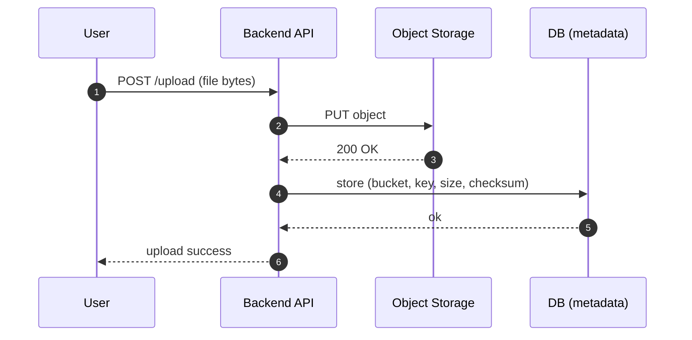
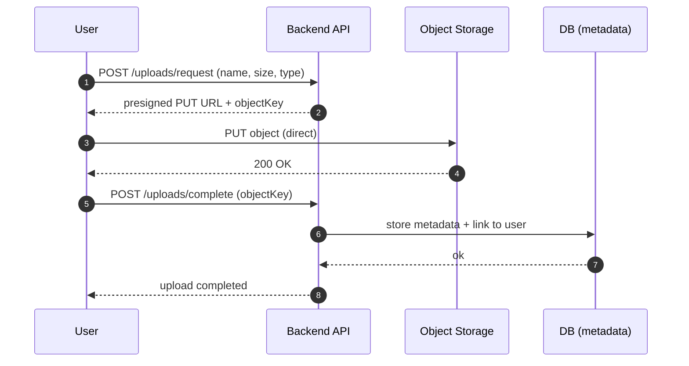
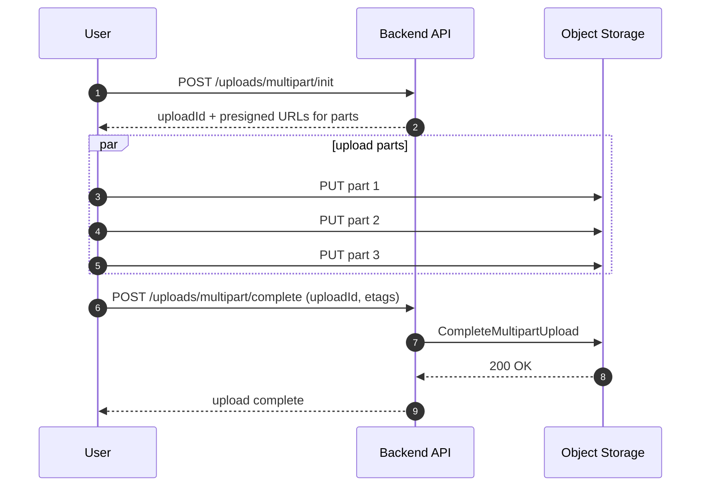

# Object Storage — Access Patterns (Multipart, Presigned URLs, CDN)

---

Once you choose object storage, the next question becomes:

> how do users upload and download safely at scale?

In interviews, this is where you show real engineering judgment:

- avoid making your backend a bandwidth bottleneck
- protect against malicious uploads
- prevent unauthorized access to private objects
- reduce latency and cost using CDN

This article covers the access patterns you will use in real systems.

---

## 1. Upload Patterns

---

### 1.1 Upload through backend (simple baseline)

Flow:

1. client uploads file to backend
2. backend uploads to object store
3. backend stores metadata in DB

Pros:

- easiest to implement
- backend can validate file before storing

Cons:

- backend becomes expensive bottleneck (bandwidth + CPU)
- upload latency increases
- scaling uploads scales your API fleet

This is fine for small systems, but it’s rarely the final architecture.

---

### 1.2 Direct upload with presigned URLs (recommended)

Flow:

1. client asks backend for upload permission
2. backend returns a presigned PUT URL for a specific key
3. client uploads directly to object storage
4. client notifies backend to finalize metadata

Pros:

- backend is no longer the data plane
- scales much better
- reduces cost (bandwidth offloaded)

Cons:

- backend must validate after upload
- requires careful security controls

---

### Security controls for presigned uploads (must mention)

- presign URL with short TTL (e.g., 5–15 minutes)
- key should include user scope (e.g., `users/{userId}/...`)
- enforce size/content-type constraints (where supported)
- store expected checksum (client provides) and verify after upload
- finalize only after verification (never trust client “complete” call)

---

## 2. Multipart Upload (Large Files)

---

For large uploads (videos), use multipart upload:

- split file into parts
- upload parts in parallel
- complete upload only when all parts succeed

Why multipart matters:

- retries are per part (faster recovery)
- parallel uploads improve speed
- supports very large objects

Operational notes:

- enforce max part size/part count
- clean up abandoned uploads (lifecycle policies or periodic cleanup job)

---

## 3. Download Patterns

---

### 3.1 Backend proxy download (simple)

Backend fetches from object store and returns to client.

Pros:

- easy access control

Cons:

- backend becomes bandwidth bottleneck
- expensive at scale

---

### 3.2 Direct download with presigned GET URLs (recommended)

Flow:

- client requests access
- backend authorizes and returns a presigned GET URL
- client downloads directly

This keeps backend off the data plane.

---

## 4. CDN Integration (Performance + Cost)

---

CDN is ideal for:

- public or semi-public static assets
- thumbnails, images, videos (depending on product)

Pattern:

1. store object in object storage
2. serve via CDN in front (origin = object store)
3. use cache headers and versioned keys

Key design choices:

- use immutable keys (content hash or versioned path)
- cache aggressively at CDN
- invalidate rarely (prefer versioned keys)

Security note:

- private content often needs signed CDN URLs or token auth at edge.

---

## 5. Validation and Malware Scanning (Real-world)

---

Uploads are untrusted input.

Common validation pipeline:

- verify content-type and size
- checksum verification (detect corruption)
- virus/malware scanning (async)
- quarantine bucket for unverified files
- move to “clean” bucket after scan

This is how you prevent:

- serving malicious files
- unexpected content stored under trusted keys

---

## 6. Common Pitfalls

---

- using predictable keys without authorization checks
- long-lived presigned URLs (leak risk)
- trusting client-provided metadata without verification
- no cleanup for abandoned multipart uploads
- caching private content at CDN accidentally

---

## Key Takeaways

---

- Backend upload/download is simplest but doesn’t scale (bandwidth bottleneck).
- Presigned URLs move the data plane to object storage while backend controls authorization.
- Multipart uploads improve reliability and speed for large files.
- CDN reduces latency and cost for read-heavy content; use immutable keys.
- Always validate and scan uploads; treat files as hostile input.

---

## TL;DR

---

Use presigned URLs + multipart upload for scalable uploads, direct GET or CDN for scalable downloads, and enforce security controls (TTL, scoped keys, checksum validation, scanning).

---

### 🔗 What’s Next

Next we’ll cover where object storage fits in real architectures:

- media pipelines (upload → processing → CDN)
- backups and archives
- logs and data lakes

👉 **Up Next: →**  
**[Object Storage — Common Use Cases (Media, Backups, Logs, Static Assets)](/learning/advanced-skills/high-level-design/10_concepts-storage-system/10_5_object-storage-use-cases/)**
