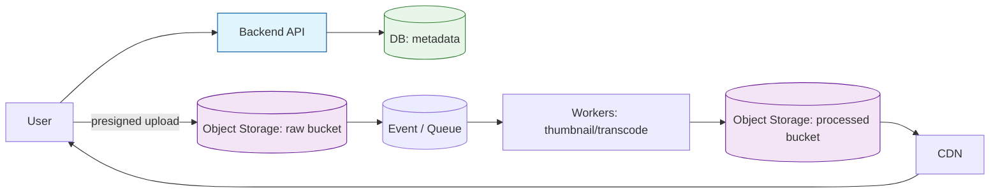

# Object Storage — Common Use Cases (Media, Backups, Logs, Static Assets)

---

Object storage is the default for blobs, but interviews often expect more than:

- “store it in S3”.

They expect you to connect object storage to real product workflows:

- uploads
- processing
- delivery
- retention
- cost
- security

This article covers the most common real-world use cases and the design patterns behind them.

---

## 1. Media Upload + Processing Pipeline (Most Common Interview Case)

---

### Problem

Users upload:

- photos
- videos
- documents

You need:

- scalable uploads
- processing (thumbnails, transcode)
- fast delivery

### Architecture pattern

Key decisions (what interviewers look for):

- uploads via **presigned URLs** (avoid API bandwidth bottleneck)
- raw vs processed buckets (quarantine vs clean)
- async processing via queue/event
- immutable keys (content hash / versioned path)
- serve through CDN

### Correctness/security add-ons

- verify content-type, size, checksum
- malware scanning before moving to processed bucket
- restrict private content with signed URLs / auth at edge

---

## 2. Static Assets (Web/App Content) + CDN

---

Typical use:

- images
- JS/CSS bundles
- public downloads

Pattern:

- object storage as origin
- CDN in front
- long cache TTL with **immutable keys**

Design notes:

- prefer versioned filenames (`app.v123.js`) to avoid cache invalidation
- set cache-control headers aggressively
- keep public assets in a separate bucket/prefix from private assets

---

## 3. Backups and Archives

---

Object storage is ideal for backups because:

- high durability
- cheap at scale
- lifecycle tiering

Typical backup strategy:

- store daily snapshots for 30 days
- store weekly/monthly backups for longer
- archive old backups to cheaper storage tier

Design notes:

- backups must be encrypted
- access must be restricted (backup bucket is sensitive)
- test restores regularly (backup without restore is hope)

---

## 4. Logs and Data Lakes

---

Object storage is the foundation of many data platforms.

Pattern:

- services emit logs/events
- stream into object storage partitioned by time (and tenant)
- query later using analytics engines

Example partitioning:

- `logs/service=payments/date=2026-03-16/hour=10/...`

Design notes:

- append-only writes
- lifecycle policies to control retention
- compact/merge small files (optional optimization)

---

## 5. Document Storage (Invoices, Statements, Reports)

---

A very common enterprise case.

Pattern:

- object store for PDFs
- DB for metadata and ACL

Key decisions:

- private bucket + presigned GET for authorized users
- versioning for audit and rollback
- retention policy for compliance

---

## 6. Disaster Recovery (DR) and Cross-Region Storage

---

Object storage is often used for DR because:

- it can store backups in another region
- it can store replicated artifacts

Design notes:

- choose RPO/RTO targets
- store backups cross-region
- ensure encryption key management works across regions

---

## 7. Mistakes to Avoid (Quick Interview Wins)

---

- proxying all uploads/downloads through backend (cost + bottleneck)
- storing blobs in relational DB (unless extremely small + rare)
- predictable object keys without auth checks
- mixing public and private assets under the same access policy
- no lifecycle/retention policy (cost creep)
- no scanning/quarantine for user uploads

---

## Key Takeaways

---

- The highest ROI object-storage use case is media pipelines: upload → process → CDN.
- Use DB for metadata and permissions; use object storage for blobs.
- Apply lifecycle policies for retention and cost control.
- Separate raw vs processed content and treat uploads as untrusted input.

---

## TL;DR

---

Object storage powers media, static assets, backups, and data lakes.

In interviews, show the full workflow: presigned upload, async processing, immutable keys, CDN delivery, and lifecycle/security controls.

---

### 🔗 What’s Next

Next we’ll switch to the storage model databases usually sit on:

- what block storage is
- why it’s different from objects
- and where it fits in system design

👉 **Up Next: →**  
**[Block Storage — What It Is (VM disks mental model)](/learning/advanced-skills/high-level-design/10_concepts-storage-system/10_6_block-storage-what-it-is/)**
