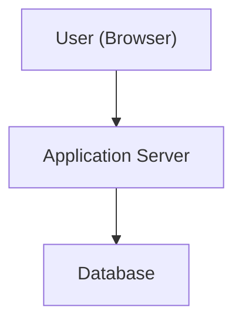

## 1. Introduction

---

Now that we clearly understand **what problem we are solving** and **what constraints we are operating under**, we can move to the most important step in High-Level Design:

> **Defining the system architecture.**

At this stage, we are not choosing frameworks or writing code.  
We are deciding **what components exist**, **how they interact**, and **why each one is necessary**.

This architecture will act as the **baseline blueprint** for all future evolutions of the system.

---

## 2. High-Level Architecture Overview

---

At a high level, our simple web system consists of four core components:

This may look trivial — but this structure forms the foundation of almost every modern web system.

As the system grows, we don’t replace this model — we **extend and scale it**.

---

## 3. Core Components

---

Let’s examine each component and its responsibility.

### 3.1 Client (Web Browser)

**Responsibility**

- Initiates requests
- Displays responses to users

**Key Points**

- Communicates with the system over HTTP/HTTPS
- Stateless from the system’s perspective
- Can be a browser, mobile app, or any HTTP client

At this stage, the client is intentionally simple.

---

### 3.2 Application Server

**Responsibility**

- Handles incoming requests
- Contains business logic
- Coordinates data access
- Generates responses

**Why It Exists**

- Separates business logic from presentation
- Acts as the central processing unit of the system

**Key Characteristics**

- Stateless
- Handles multiple concurrent requests
- Can be scaled independently in the future

---

### 3.3 Database

**Responsibility**

- Stores persistent data
- Provides durability across restarts and failures

**Key Points**

- Single database instance (for now)
- Used for both reads and writes
- Strong consistency by default

At this stage, simplicity is preferred over distribution.

---

## 4. Request Flow (Step-by-Step)

---

Understanding **how a request moves through the system** is critical.

1. User sends a request from the browser
2. Request reaches the application server
3. Application server processes the request
4. Application server queries the database (if needed)
5. Database returns data
6. Application server builds the response
7. Response is sent back to the user

This synchronous flow keeps reasoning simple and predictable.

---

## 5. Logical vs Physical View

---

### Logical View

- Client
- Application
- Database

This is how we **reason about responsibilities**.

### Physical View

- All components may initially run on a single machine
- Or application and database may run on separate machines

At HLD level, **logical separation matters more than physical deployment**.

---

## 6. Architecture Choices (and Why)

---

### Choice 1: Single Application Server

- Simpler to develop and debug
- Sufficient for low traffic
- Easy to evolve later

### Choice 2: No Load Balancer (Yet)

- Traffic volume does not justify it
- Adds unnecessary complexity early
- Will be introduced when scaling becomes a requirement

### Choice 3: Single Database

- Avoids replication complexity
- Strong consistency by default
- Easy schema evolution

Each choice favors **clarity and correctness** over premature scalability.

---

## 7. What This Architecture Enables

---

This baseline architecture allows us to:

- clearly understand request flow
- reason about failures
- identify future bottlenecks
- extend the system incrementally

Most importantly, it gives us a **stable mental model**.

---

## 8. What This Architecture Does Not Solve (Yet)

---

This design intentionally does **not** address:

- high availability
- horizontal scaling
- performance optimization
- fault isolation
- distributed consistency

These are not omissions — they are **future design milestones**.

---

## 9. Concepts Used (and Why)

---

- **Client–Server Model** — clear separation of concerns
- **Stateless Application Server** — enables future scaling
- **Synchronous Request Flow** — easier reasoning
- **Single Source of Truth (Database)** — correctness first

Each of these concepts will be revisited and expanded later.

---

## Conclusion

---

In this article, we designed the **high-level architecture** of a simple web system.

We:

- identified core components
- defined their responsibilities
- explained request flow
- made deliberate architectural choices

This architecture is not “basic” — it is **foundational**.

---

### 🔗 What’s Next?

In the next article, we will examine **architecture alternatives and trade-offs**.

We will explore:

- monolithic vs layered designs
- early scaling considerations
- how this architecture can evolve without breaking

👉 **Next:**  
**[Example 1: Simple Web System — Architecture Choices & Trade-offs](/learning/advanced-skills/high-level-design/2_foundation-designing-first-app/2_4_architecture-choices-and-trade-offs)**

---

> 📝 **Takeaway**:
>
> - Architecture starts with **responsibilities**, not tools.
> - Simple systems are easier to evolve than complex ones.
> - Statelessness is a powerful early decision.
> - High-Level Design is about **what exists and why**.
