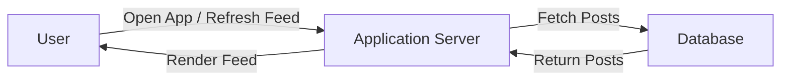
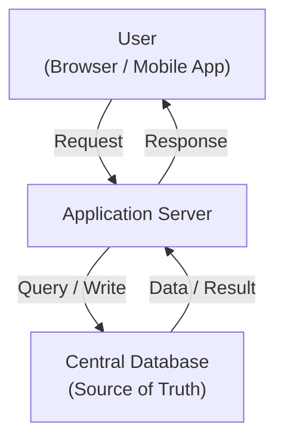

## 1. Problem Overview

---

In this phase, we design a **News Feed System** similar to those used by social media platforms.

Examples include:

- Twitter timeline
- Facebook news feed
- Instagram home feed
- LinkedIn feed

A news feed allows users to **view a continuously updated list of posts from people they follow**.

When users open the application, they expect to immediately see:

- recent posts
- updates from friends
- newly published content

The challenge is that **millions of users may request their feed at the same time**.

---

## 2. Basic System Behavior

---

At a high level, the system should allow users to:

- view posts from accounts they follow
- scroll through their feed
- refresh the feed to see new posts

Users primarily **consume content rather than create it**.

This makes the system **read-heavy**.

---

## 3. Read-Heavy Workload

---

In many real-world systems:

```text
Reads >> Writes
```

For example:

| Operation    | Frequency      |
| ------------ | -------------- |
| View feed    | Very high      |
| Scroll feed  | Extremely high |
| Refresh feed | High           |
| Create post  | Relatively low |

Millions of users may open the application every minute to check updates.

This creates **massive read traffic**.

---

## 4. Simplified User Flow

A typical interaction looks like this:



### Diagram Explanation

1. The user opens the application or refreshes the feed.
2. The application server receives the request.
3. The server retrieves the required posts from the database.
4. The feed is returned to the user.

This architecture looks very similar to the **Phase 1 Simple Web System**.

---

## 5. Functional Requirements

---

The system should support the following features.

### 5.1 View News Feed

Users can see posts from accounts they follow.

---

### 5.2 Refresh Feed

Users can refresh the feed to retrieve new posts.

---

### 5.3 Scroll Feed

Users can continuously scroll through the feed.

---

### 5.4 Create Posts

Users can publish posts that appear in the feeds of their followers.

---

## 6. Non-Functional Requirements

---

Large systems must also consider performance and reliability.

### 6.1 Low Latency

Users expect their feed to load quickly.

Target response time:

```text
~100–300 ms
```

---

### 6.2 High Availability

The system should remain available even when traffic spikes.

---

### 6.3 Massive Scale

The system must handle:

- millions of users
- large volumes of posts
- continuous feed refreshes

---

## 7. Early Scaling Signals

---

Even with a simple architecture, certain challenges quickly appear.

### 7.1 Database Read Pressure

If every feed request queries the database directly, the database may become overloaded.

---

### 7.2 Application Server Load

Handling millions of simultaneous feed requests can overwhelm application servers.

---

### 7.3 Geographic Latency

Users from different regions may experience slower response times.

---

## 8. Why Phase 1 Architecture May Struggle

---

The simple architecture used in Phase 1 looks like this:



This architecture works well for small systems.

However, as traffic grows:

- the **database becomes a bottleneck**
- the **server must handle too many requests**
- latency increases

The system needs new architectural techniques to handle this scale.

---

## 9. Key Observation

---

The core challenge in a news feed system is:

```text
Extremely high read traffic
```

Most users are **consuming data**, not creating it.

This imbalance requires systems to optimize **read performance**.

---

## 10. Key Takeaway

---

News feed systems are **read-heavy systems** where millions of users frequently request data.

A simple architecture works initially, but high read traffic eventually creates **database bottlenecks and latency issues**.

Understanding these pressures helps us design architectures that scale.

---

## Conclusion

---

In this article, we defined the **problem and requirements** for a news feed system.

We saw that:

- users frequently request feed updates
- read traffic greatly exceeds write traffic
- simple architectures eventually struggle under this load

The next step is to examine the baseline architecture and identify where it begins to break under scale.

---

### 🔗 What’s Next?

👉 **Up Next →**  
**[Example 2: News Feed System — Baseline Architecture](/learning/advanced-skills/high-level-design/3_scaling-for-reads/3_3_baseline-architecture)**
