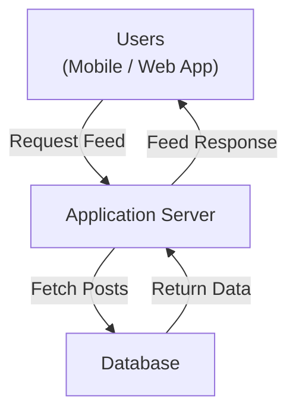
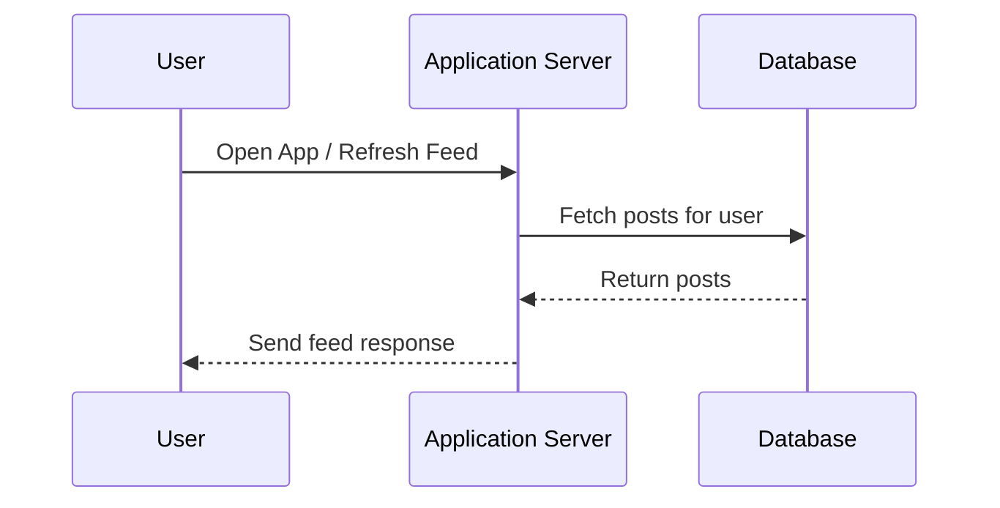

## 1. Starting with a Simple Architecture

---

Before introducing complex scaling strategies, it is important to begin with the **simplest architecture that works**.

At an early stage, the system can follow the same structure used in Phase 1:

- a client application
- an application server
- a single database

This design is simple, easy to understand, and quick to implement.

---

## 2. Baseline System Architecture

---

---

## 3. Diagram Explanation

---

The request flow works as follows:

1. A user opens the application or refreshes the news feed.
2. The request reaches the **application server**.
3. The server retrieves the relevant posts from the **database**.
4. The posts are returned to the client as the news feed.

This architecture is essentially the same **client–server model** introduced earlier.

---

## 4. Why This Architecture Works Initially

---

For small systems, this architecture performs well.

Advantages include:

### 4.1 Simplicity

The system has only a few components, making it easy to develop and maintain.

---

### 4.2 Strong Consistency

All data is stored in a **single database**, ensuring a consistent view of posts.

---

### 4.3 Easy Development

Developers can focus on implementing features rather than managing complex infrastructure.

---

### 4.4 Fast Iteration

Early-stage products benefit from architectures that allow quick development cycles.

---

## 5. Typical Request Flow

---

When a user refreshes their feed, the system processes the request through a sequence of interactions between the client, application server, and database.

### 5.1 Flow Explanation

1. The **user opens the application** or refreshes their news feed.
2. The request is sent to the **application server**.
3. The server queries the **database** to retrieve relevant posts.
4. The database returns the data to the server.
5. The server formats the data and sends the **feed response** back to the user.

This request flow is straightforward and efficient when the number of users and requests is relatively small.

---

## 6. Early System Performance

---

At this stage, the system might handle:

- thousands of users
- moderate traffic
- occasional feed refreshes

Under these conditions:

- the application server can process requests comfortably
- the database can handle the query load

Everything appears to work smoothly.

---

## 7. The Hidden Problem

---

As the platform grows, user behavior begins to change.

Users start:

- refreshing feeds frequently
- scrolling continuously
- opening the app many times per day

This dramatically increases **read traffic**.

A single database now receives **millions of read requests**.

---

## 8. Early Warning Signals

---

When traffic increases, several problems begin to appear.

### 8.1 Database Pressure

Every feed request requires database queries.

---

### 8.2 Increasing Latency

As the database receives more requests, response times increase.

---

### 8.3 Server Load

Application servers must handle more concurrent requests.

---

## 9. Why the Baseline Architecture Struggles

---

The baseline architecture was designed for **simplicity**, not massive scale.

As traffic grows:

- the database becomes a bottleneck
- application servers become overloaded
- users experience slower response times

This forces the system to evolve.

---

## Key Takeaway

---

A simple architecture works well in the early stages of a system.

However, when a system becomes **read-heavy**, the database quickly becomes a bottleneck.

Understanding this pressure helps us identify where architectural improvements are needed.

---

## Conclusion

---

The baseline architecture provides a good starting point for building a news feed system.

However, as user traffic increases, the system begins to experience **performance limitations**, particularly around database reads.

The next step is to analyze the **database bottleneck** and understand why it becomes the first major scaling challenge.

---

### 🔗 What’s Next?

👉 **Up Next →**  
**[Database Bottleneck in Read-Heavy Systems](/learning/advanced-skills/high-level-design/3_scaling-for-reads/3_4_database-bottleneck)**

In the next article, we will examine why databases struggle under heavy read traffic and why new architectural strategies become necessary.
