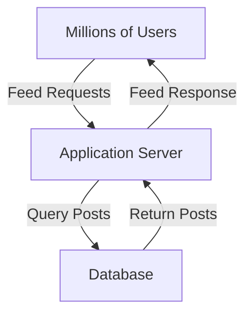

## 1. Growing System Traffic

---

In the early stages of a system, the baseline architecture works well.

However, as the platform grows, the number of users increases dramatically.

Consider a platform with:

- millions of users
- frequent feed refreshes
- continuous scrolling behavior

Every time a user refreshes their feed, the system must **query the database for posts**.

This creates a significant amount of **read traffic**.

---

## 2. Increasing Read Requests

---

In a news feed system, most operations are **read operations**.

Typical user behavior looks like this:

```text
User opens app
User scrolls feed
User refreshes feed
User checks feed again
```

This behavior repeats millions of times per day.

As a result:

```text
Read traffic >> Write traffic
```

The database receives an extremely high number of **read queries**.

---

## 3. Where the Bottleneck Appears

---

The baseline architecture processes feed requests like this:



Every feed request requires the application server to **query the database directly**.

As traffic increases, the database becomes responsible for processing a huge number of read queries.

---

## 4. Why Databases Struggle Under Heavy Reads

---

Databases are powerful systems, but they have limits.

When read traffic becomes extremely high, several problems begin to appear.

### 4.1 Query Processing Load

The database must execute a large number of queries simultaneously.

---

### 4.2 Resource Saturation

Heavy queries can consume:

- CPU
- memory
- disk I/O

---

### 4.3 Increased Latency

As query load increases, response times begin to slow down.

Users start experiencing **delays when loading their feeds**.

---

## 5. Example Scenario

---

Imagine a system with:

- 10 million users
- each user refreshing their feed multiple times per hour

If each refresh triggers a database query, the system could easily generate **hundreds of thousands of queries per second**.

A single database instance may struggle to sustain this level of traffic.

---

### 5.1 Quick Throughput Estimation (Interview Style)

System design interviews often estimate traffic using simple assumptions.

Let’s approximate the load on the database.

Assume:

- 10 million daily active users
- each user refreshes their feed **20 times per day**

Total feed requests per day:

```
10,000,000 users × 20 refreshes = 200,000,000 requests/day
```

Now convert this into **requests per second (RPS)**:

```
200,000,000 ÷ 86,400 seconds ≈ 2,300 requests/second
```

However, real systems rarely receive evenly distributed traffic.

Peak traffic may be **5–10× higher than the average**.

This means the database might need to handle:

```
10,000 – 20,000 read queries per second
```

If each request triggers multiple queries (for example fetching posts, user info, and relationships), the load increases even further.

This simple estimation shows how a seemingly reasonable user base can quickly overwhelm a single database instance.

---

## 6. Observable System Symptoms

---

When the database becomes overloaded, several symptoms appear.

### 6.1 Slower Feed Loading

Users experience delays when opening or refreshing their feeds.

---

### 6.2 Increased Server Wait Time

Application servers spend more time waiting for database responses.

---

### 6.3 Resource Spikes

The database server shows increased usage of:

- CPU
- memory
- disk operations

---

## 7. Why Scaling the Database Is Not Enough

---

One approach might be to increase the size of the database server.

This is called **vertical scaling**.

```text
Bigger machine
More CPU
More memory
Faster disks
```

However, vertical scaling has limitations:

- hardware upgrades are expensive
- machines eventually reach hardware limits
- performance improvements are temporary

At some point, simply upgrading the database is no longer sufficient.

---

## 8. The Core Problem

---

The fundamental issue is that the system is repeatedly fetching **the same data** from the database.

Many users may request **identical posts** at the same time.

This means the database performs **the same expensive queries repeatedly**.

---

## Key Takeaway

---

In read-heavy systems like news feeds, the database often becomes the **first major bottleneck** as traffic increases.

Repeated queries for the same data place excessive load on the database, causing latency and performance degradation.

Understanding this bottleneck helps us identify where architectural improvements are necessary.

---

## Conclusion

---

The baseline architecture works well initially, but as user traffic increases, the database becomes overwhelmed by read requests.

Simply scaling the database vertically cannot solve this problem indefinitely.

The system needs a way to **serve frequently requested data without repeatedly querying the database**.

---

### 🔗 What’s Next?

👉 **Up Next →**  
**[Introducing Caching](/learning/advanced-skills/high-level-design/3_scaling-for-reads/3_5_introducing-caching)**

In the next article, we will introduce **caching**, one of the most important techniques for improving performance in read-heavy systems.
