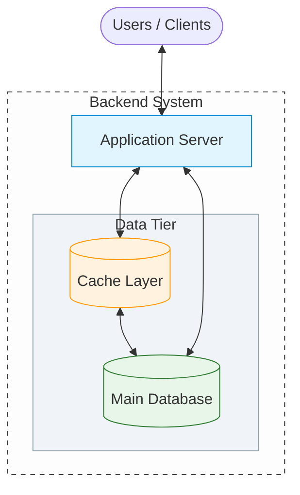
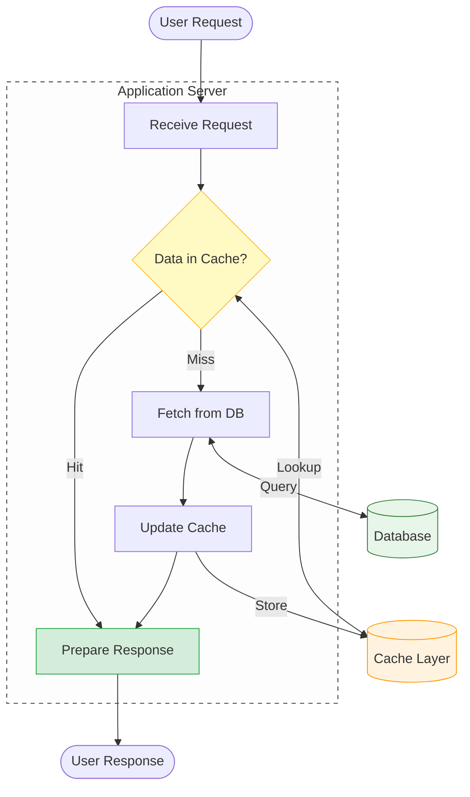

## 1. The Problem Recap

---

In the previous article, we observed that the **database becomes the first major bottleneck** in a read-heavy system.

Every request for the news feed requires the application server to query the database:

```text
User → Application Server → Database
```

When millions of users request the same data repeatedly, the database must execute **the same expensive queries over and over again**.

This creates:

- high database load
- increased latency
- slower user experience

To solve this problem, systems introduce an intermediate layer called a **cache**.

---

## 2. What Is Caching?

---

Caching is a technique where **frequently accessed data is stored in a fast-access storage layer** so that future requests can retrieve it quickly.

Instead of repeatedly querying the database, the system first checks whether the data already exists in the cache.

If the data exists in the cache, the system can return it immediately without contacting the database.

---

## 3. Updated System Architecture

---

Introducing a cache changes the architecture slightly:



The cache sits between the application server and the database.

---

## 4. How Request Processing Changes

---

With caching in place, the request flow becomes:



This behavior introduces two key concepts:

### 4.1 Cache Hit

The requested data is already stored in the cache.

```text
User → Server → Cache → Response
```

No database query is required.

---

### 4.2 Cache Miss

The requested data is not found in the cache.

```text
User → Server → Cache → Database → Cache → Response
```

The database is queried, and the result is stored in the cache for future requests.

---

## 5. Why Caching Improves Performance

---

Caching significantly improves system performance in read-heavy systems.

### 5.1 Reduced Database Load

Frequently requested data no longer requires database queries.

Instead of the database handling every request, the cache serves most of the traffic.

---

### 5.2 Lower Latency

Caches typically use **in-memory storage**, which is significantly faster than disk-based databases.

Retrieving data from memory can take microseconds, while database queries often take milliseconds.

---

### 5.3 Better Scalability

By reducing the number of database queries, the system can support a much larger number of users.

This allows the database to focus on writes and less frequent queries.

---

## 6. Real-World Caching Technologies

---

Common technologies used for caching include:

- **Redis** – an in-memory data store commonly used for distributed caching
- **Memcached** – a high-performance distributed memory caching system
- **CDN Edge Caches** – caches located closer to users around the world
- **Application-Level In-Memory Caches** – local caching within application servers

These systems are optimized for **extremely fast data retrieval**.

---

## 7. Example Impact of Caching

---

Recall the earlier estimation for database traffic:

```
10,000 – 20,000 database queries per second
```

If caching serves **80–90% of requests**, the database may only need to process:

```
1,000 – 2,000 queries per second
```

This dramatically reduces database pressure and improves system responsiveness.

---

## 8. A New Challenge Appears

---

While caching improves performance, it introduces a new challenge:

```
How do we ensure cached data stays fresh?
```

If a user creates a new post, the cache might still contain **old data**.

This can lead to situations where users see outdated information.

Handling this correctly requires **cache invalidation strategies**.

---

## Key Takeaway

---

Caching reduces database load by storing frequently accessed data in a fast-access layer.

In read-heavy systems like news feeds, caching is one of the most effective techniques for improving performance and scalability.

However, caching introduces new challenges related to **data freshness and consistency**.

---

## Conclusion

---

Introducing a cache layer significantly reduces the number of database queries in a read-heavy system.

This allows the system to serve millions of users while maintaining low response times.

However, caching also introduces architectural considerations that must be handled carefully.

---

### 🔗 What’s Next?

👉 **Up Next →**  
**[Load Balancing & Traffic Distribution](/learning/advanced-skills/high-level-design/3_scaling-for-reads/3_6_application-server-bottleneck)**

As traffic continues to grow, a single application server will eventually become overwhelmed.

In the next article, we will introduce **load balancing**, which allows traffic to be distributed across multiple servers.
