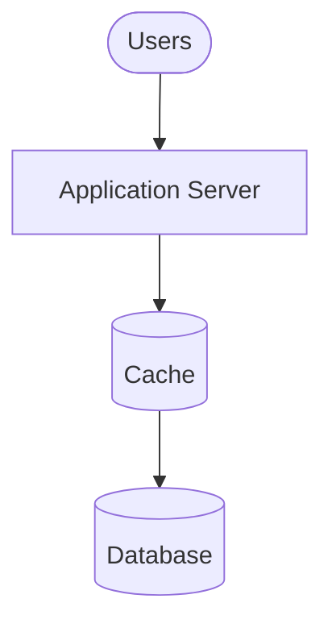
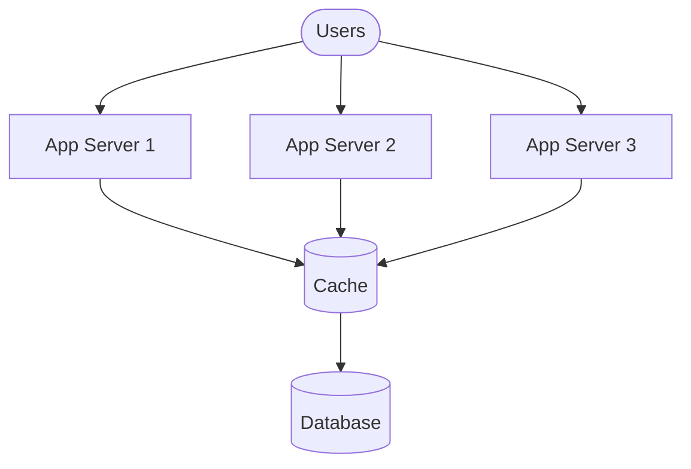
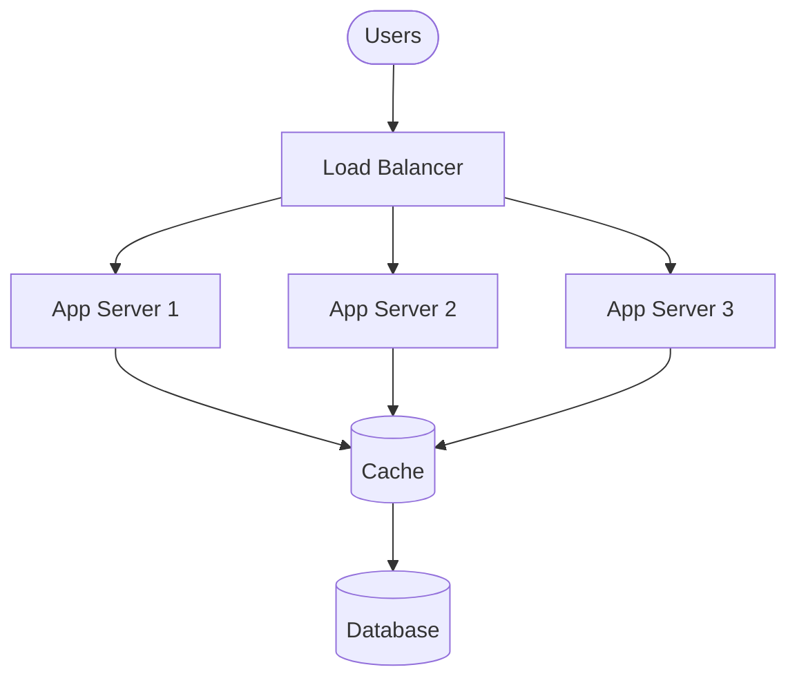
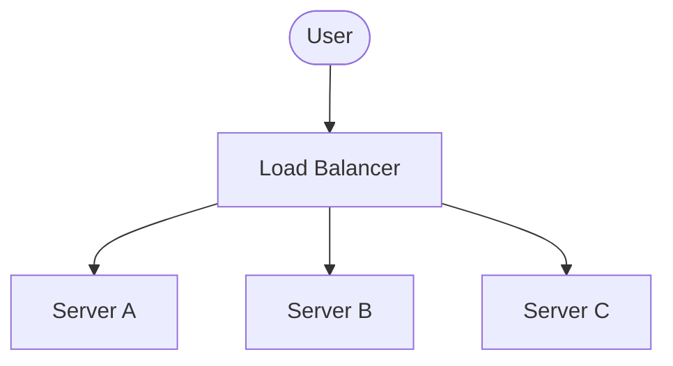
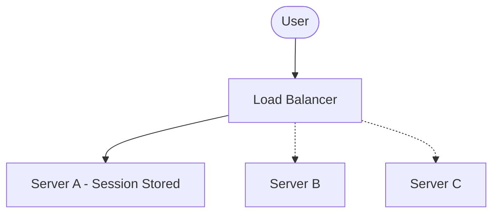
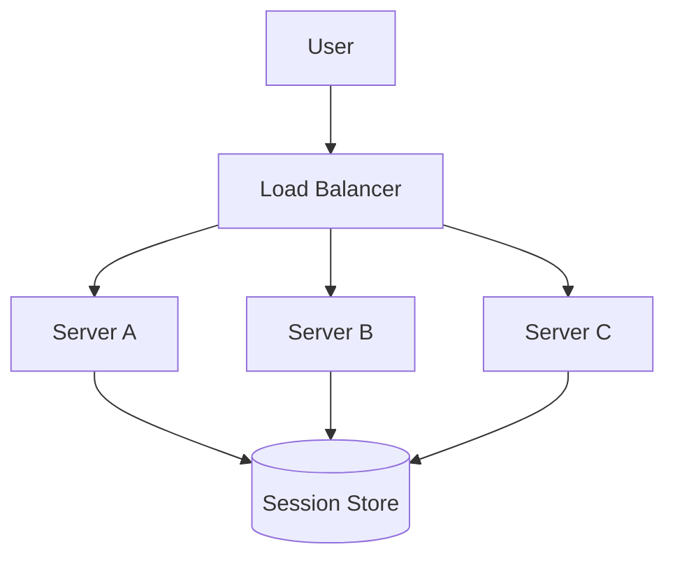

## 1. The Next Bottleneck

---

Caching significantly reduced the load on the database.

The architecture now looks like this:



The cache absorbs most read traffic, which prevents the database from becoming overloaded.

However, another problem begins to appear.

All user requests still pass through **a single application server**.

---

## 2. Growing Request Volume

---

As the platform grows, the number of incoming requests increases rapidly.

Consider a system with:

- millions of active users
- frequent feed refreshes
- continuous scrolling

Even if the cache handles most database queries, the application server must still:

- process incoming requests
- validate users
- assemble responses
- communicate with the cache

Eventually, the server reaches its limits.

---

## 3. Symptoms of Server Overload

---

When the application server becomes overloaded, several issues appear.

### 3.1 Increased Response Time

Requests begin to queue while waiting for server processing.

---

### 3.2 CPU Saturation

The server's CPU usage approaches maximum capacity.

---

### 3.3 Request Failures

Under extreme load, the server may start rejecting or dropping requests.

---

## 4. Vertical Scaling Is Not Enough

---

One possible solution is to upgrade the server:

```
More CPU
More memory
Faster machine
```

This approach is called **vertical scaling**.

However, vertical scaling has limitations:

- hardware upgrades are expensive
- machines eventually reach hardware limits
- downtime may be required for upgrades

Large systems instead rely on **horizontal scaling**.

---

## 5. Horizontal Scaling

---

Horizontal scaling means **adding more servers instead of making one server larger**.

Instead of one application server, we deploy multiple servers:



Now the system has more processing capacity.

However, this architecture introduces a new problem.

---

## 6. The Traffic Distribution Problem

---

Users cannot randomly choose which server to connect to.

Without coordination, traffic might become uneven:

```
Server 1 → overloaded
Server 2 → idle
Server 3 → idle
```

To solve this problem, systems introduce a **Load Balancer**.

---

## 7. Introducing a Load Balancer

---

A **Load Balancer** is a component that sits in front of application servers and distributes incoming requests.



The load balancer ensures that requests are **distributed evenly across servers**.

This allows the system to scale by simply **adding more servers**.

---

## 8. Stateless Application Servers

---

For load balancing to work effectively, application servers must usually be **stateless**.

A stateless server does not store session information between requests.

Each request contains all the information required for processing.

This allows the load balancer to send any request to any server.

To understand why stateless servers work well with load balancing, consider how requests are distributed in a stateless system.

### Stateless Routing



In a stateless architecture:

- each request is **independent**
- servers do **not store session state**
- the load balancer can route requests to **any available server**

This enables efficient traffic distribution and allows the system to scale horizontally.

---

### 8.1 What If the Application Requires Sessions?

Some applications require maintaining **user session data**, such as:

- authentication state
- shopping carts
- user preferences

If session data is stored directly on an application server, the system becomes **stateful**.

In this case, the load balancer must ensure that all requests from a user go to the **same server instance**.

This technique is called:

```text
Sticky Sessions
```

With sticky sessions, the load balancer routes a user's requests consistently to the same server.

However, this requirement prevents the load balancer from freely distributing traffic.

### Sticky Sessions (Stateful Servers)



However, this approach has drawbacks:

- uneven traffic distribution
- reduced fault tolerance
- harder horizontal scaling
- session loss if the server fails

Because of these limitations, modern architectures usually avoid storing session state directly on application servers.

---

### 8.2 Modern Approach

Modern architectures usually avoid server-side session storage.

Instead, session state is stored in **external systems**, such as:

- distributed caches (Redis)
- databases
- signed tokens (JWT)

This allows application servers to remain **stateless**, enabling effective load balancing.



This architecture keeps application servers stateless while allowing user sessions to persist across requests, enabling effective load balancing and horizontal scaling.

---

## 9. Benefits of Load Balancing

---

Load balancing provides several advantages.

### 9.1 Improved Scalability

New servers can be added to handle increasing traffic.

---

### 9.2 Higher Availability

If one server fails, traffic can be routed to other servers.

---

### 9.3 Better Resource Utilization

Traffic is distributed evenly across servers.

---

## 10. Key Takeaway

---

After introducing caching, the next scaling challenge appears at the **application server layer**.

Horizontal scaling with multiple servers requires a mechanism to distribute traffic efficiently.

Load balancers solve this problem by routing incoming requests across available servers.

---

## Conclusion

---

As user traffic increases, a single application server eventually becomes a bottleneck.

Horizontal scaling allows systems to handle higher traffic volumes, but requires a component that can distribute requests efficiently.

Load balancing enables scalable architectures by spreading traffic across multiple servers.

---

### 🔗 What’s Next?

👉 **Up Next →**  
**[Global Users & Content Delivery Networks (CDN)](/learning/advanced-skills/high-level-design/3_scaling-for-reads/3_7_global-users-and-cdn)**

As systems grow globally, users may experience latency due to geographic distance.

In the next article, we will explore how **CDNs improve performance for global users**.
