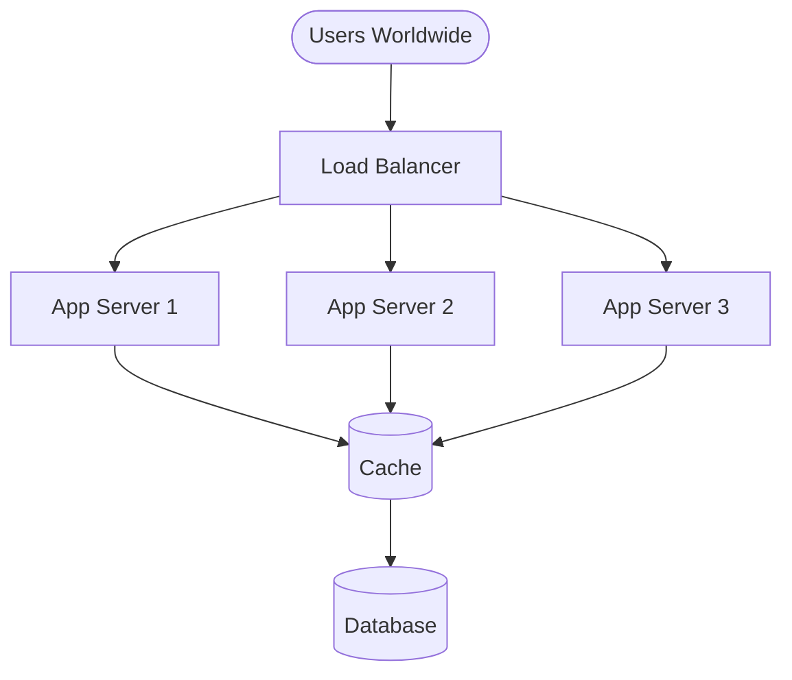
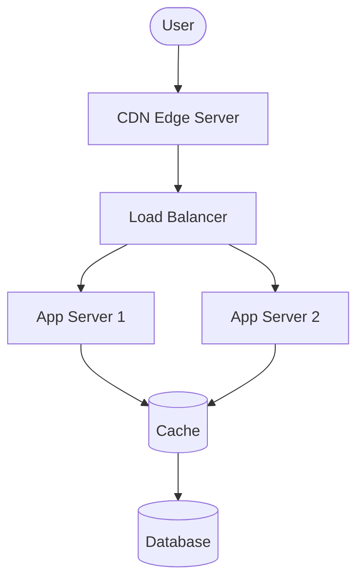

## 1. The Global Latency Problem

---

After introducing caching and load balancing, the architecture now looks like this:



This architecture can scale well for **processing requests**.

However, another challenge appears as the system grows globally.

Users may be located **far away from the data center**.

---

## 2. Network Latency

---

When a user accesses the system, the request must travel across the internet.

For example:

```
User (Europe) → Data Center (US)
```

This physical distance introduces **network latency**.

Even if the server processes the request quickly, the **network round‑trip time** can still slow down the user experience.

---

## 3. Why Latency Matters

---

Users expect applications to feel **instantaneous**.

Small delays can significantly affect user experience.

Typical latency expectations:

| Operation    | Expected Response |
| ------------ | ----------------- |
| Feed refresh | < 200 ms          |
| Page load    | < 1 second        |

If users must wait for requests to travel long distances, these expectations become difficult to meet.

---

## 4. Introducing Content Delivery Networks (CDN)

---

To solve the global latency problem, systems introduce **Content Delivery Networks (CDNs)**.

A CDN is a **network of geographically distributed servers** that store copies of frequently requested content.

Instead of requesting data from a distant data center, users can retrieve content from a **nearby edge server**.

---

## 5. Updated Architecture with CDN

---



The CDN sits **between users and the application infrastructure**.

---

## 6. What CDNs Cache

---

CDNs are typically used to cache **static or semi‑static content**, such as:

- images
- videos
- profile pictures
- static assets (CSS, JavaScript)

For a news feed system, CDNs often cache:

- media content
- thumbnails
- user avatars

This reduces both **latency and server load**.

---

## 7. Benefits of CDNs

---

### 7.1 Reduced Latency

Users retrieve content from servers located **closer to their geographic location**.

---

### 7.2 Reduced Server Load

CDNs absorb a large portion of requests, preventing them from reaching the application servers.

---

### 7.3 Improved Scalability

Traffic spikes can be handled by the distributed CDN infrastructure.

---

## 8. Example Request Flow

---

With a CDN in place, the request flow becomes:


If the CDN already has the requested content cached, the request may never reach the application servers.

---

## 9. Key Takeaway

---

As systems scale globally, **network latency becomes a major performance factor**.

Content Delivery Networks improve user experience by serving content from servers located closer to users.

This reduces response time and offloads traffic from the core application infrastructure.

---

## Conclusion

---

Even well‑scaled backend systems can suffer from poor user experience if users are geographically far from the servers.

CDNs address this challenge by distributing content across edge servers worldwide.

This allows applications to deliver fast responses to users regardless of their location.

---

### 🔗 What’s Next?

👉 **Up Next →**  
**[Consistency Trade‑offs in Cached Systems](/learning/advanced-skills/high-level-design/3_scaling-for-reads/3_8_consistency-trade-offs)**

Caching and CDNs improve performance, but they introduce new challenges around **data freshness and consistency**.

In the next article, we will explore the trade‑offs between **performance and data consistency**.
