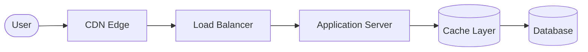
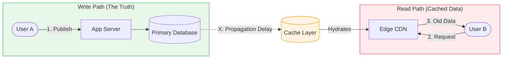

## 1. Performance vs Data Freshness

---

In the previous articles, we introduced several techniques to improve performance in a read-heavy system:

- caching
- load balancing
- content delivery networks (CDNs)

These techniques dramatically improve scalability and response times.

However, they introduce a new challenge:

> **How do we keep data consistent across multiple layers?**

When data is cached in multiple places, it is possible for users to see **slightly outdated information**.

This is known as a **consistency trade-off**.

---

## 2. Where Inconsistency Appears

---

After adding caching and CDNs, the architecture now looks like this:

Data may now exist in several places:

- CDN edge cache
- application cache
- database

If new data is written to the database, cached layers may still hold **older versions of that data**.

---

## 3. Example Scenario

---

Consider a news feed system where a user publishes a new post.

Another user may refresh their feed and still see the **old version of the data** for a short time.

This delay occurs because cached layers must be **updated or invalidated**.

---

## 4. The Consistency Trade-off

---

At this point, system designers face a choice:

| Option                                 | Result                                   |
| -------------------------------------- | ---------------------------------------- |
| Always fetch latest data from database | Strong consistency but high latency      |
| Use cached data                        | Faster responses but possible stale data |

Large-scale systems usually choose the second option.

They accept **slightly stale data in exchange for massive performance improvements**.

---

## 5. Eventual Consistency

---

This design approach is called **eventual consistency**.

Eventual consistency means:

> All nodes will eventually reflect the latest data,  
> but not necessarily at the exact same moment.

In practice, this means:

- users may briefly see outdated data
- the system will eventually synchronize

Most large internet systems rely on this model.

---

## 6. Why Eventual Consistency Works for Feeds

---

News feed systems tolerate small delays in updates.

For example:

- seeing a new post a few seconds later
- refreshing a feed to get the latest data

These delays are acceptable for users.

However, the performance gains are enormous.

This makes eventual consistency a practical choice.

---

## 7. Systems That Cannot Use Eventual Consistency

---

Some systems cannot tolerate stale data.

Examples include:

- payment systems
- banking transactions
- inventory management

In these systems, **strong consistency is critical**.

We will explore these types of systems later in **Phase 3**.

---

## 8. Key Takeaway

---

Scaling systems with caches and CDNs introduces **consistency trade-offs**.

Most large-scale platforms choose **eventual consistency** because it allows systems to serve millions of users with low latency.

Understanding this trade-off is a key step in designing scalable architectures.

---

## Conclusion

---

Performance optimizations such as caching and CDNs significantly improve scalability.

However, they introduce complexity around **data freshness and synchronization**.

Designing large systems requires carefully balancing performance and consistency.

---

### 🔗 What’s Next?

👉 **Up Next →**  
**[Phase 2 Summary: Concepts Introduced](/learning/advanced-skills/high-level-design/3_scaling-for-reads/3_9_phase2-summary)**

In the next article, we will summarize the architectural concepts introduced in this phase before moving to more advanced distributed system challenges.
