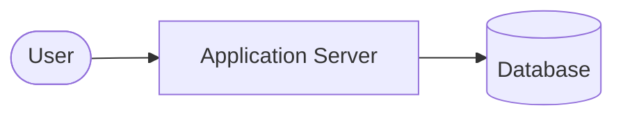
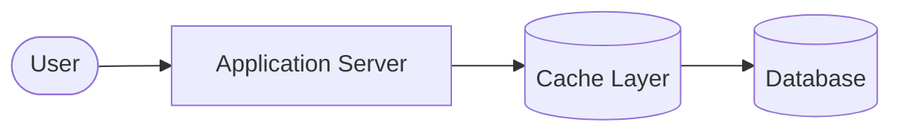
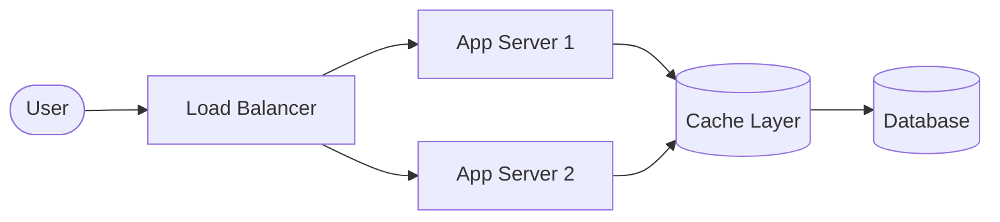
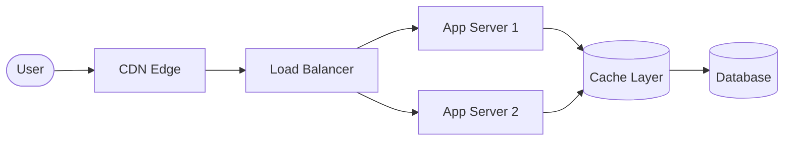

## 1. What We Built in Phase 2

---

In this phase, we evolved a **simple web system** into a system capable of supporting **millions of users**.

We started with a basic architecture introduced in Phase 1 and gradually improved it by solving real scaling problems.

Each improvement addressed a **new bottleneck** that appeared as the system grew.

---

## 2. Architecture Evolution

---

The system architecture evolved through several stages.

### 2.1 Phase 1 Architecture



This architecture works well for small systems but quickly encounters limits when traffic grows.

---

### 2.2 After Introducing Caching



Caching reduces the number of database queries by storing frequently accessed data in memory.

---

### 2.3 After Adding Load Balancing



Load balancing distributes traffic across multiple servers, allowing the system to scale horizontally.

---

### 2.4 After Introducing CDN



CDNs bring content closer to users, reducing latency for globally distributed traffic.

---

## 3. The Scaling Lessons

---

During this phase, we encountered several important architectural lessons.

### 3.1 Bottlenecks Appear in Layers

Scaling rarely requires changing everything at once.

Instead, bottlenecks appear sequentially:

```
Database bottleneck
      ↓
Application server bottleneck
      ↓
Global network latency
```

Each problem requires a **different architectural solution**.

---

### 3.2 Read‑Heavy Systems Behave Differently

Many large internet systems are dominated by **read traffic**.

Examples include:

- social media feeds
- content platforms
- media streaming

Optimizing these systems requires focusing on:

- caching
- replication
- content distribution

---

### 3.3 Performance vs Consistency

Caching and CDNs improve performance but introduce **stale data risks**.

This leads to an important distributed systems concept:

```
Eventual Consistency
```

Most large-scale platforms accept small delays in data synchronization in exchange for massive performance improvements.

---

## 4. Concepts Introduced in Phase 2

---

This phase introduced several foundational High-Level Design concepts.

1. [Caching — What is Caching ?](/learning/advanced-skills/high-level-design/7_concepts-phase2/7_1_what-is-caching)
2. [Caching — Cache Hit vs Cache Miss](/learning/advanced-skills/high-level-design/7_concepts-phase2/7_2_cache-hit-and-miss)
3. [Caching — Caching Patterns](/learning/advanced-skills/high-level-design/7_concepts-phase2/7_3_caching-patterns)
4. [Caching — Cache Invalidation](/learning/advanced-skills/high-level-design/7_concepts-phase2/7_4_cache-invalidation)
5. [Caching — Cache Eviction Policies](/learning/advanced-skills/high-level-design/7_concepts-phase2/7_5_cache-eviction-policies)
6. [Caching — Local vs Distributed Cache](/learning/advanced-skills/high-level-design/7_concepts-phase2/7_6_local-vs-distributed-cache)
7. [Horizontal Scaling](/learning/advanced-skills/high-level-design/7_concepts-phase2/7_7_horizontal-scaling)
8. [Load Balancing](/learning/advanced-skills/high-level-design/7_concepts-phase2/7_8_load-balancing)
9. [Stateless Application Servers](/learning/advanced-skills/high-level-design/7_concepts-phase2/7_9_stateless-application-servers)
10. [Content Delivery Networks (CDN)](/learning/advanced-skills/high-level-design/7_concepts-phase2/7_10_cdn)
11. [Eventual Consistency](/learning/advanced-skills/high-level-design/7_concepts-phase2/7_11_eventual-consistency)

These concepts form the backbone of modern scalable architectures.

---

## 5. Key Takeaway

---

Scaling real systems is an **iterative process**.

Architectures evolve as traffic grows and new bottlenecks emerge.

Understanding how to identify these bottlenecks and apply the correct architectural solution is a core High-Level Design skill.

---

## Conclusion

---

By the end of Phase 2, we transformed a simple web application into a system capable of handling **global traffic at scale**.

We introduced caching, load balancing, CDNs, and eventual consistency — all essential building blocks for modern distributed systems.

---

## 🔗 What’s Next?

👉 **Up Next →**  
**[Phase 3: Designing Systems That Require Strong Consistency](/learning/advanced-skills/high-level-design/4_correct-reliable-systems/4_1_introduction)**

In the next phase, we will design systems where correctness is critical, such as **payment systems and financial transactions**.

These systems introduce new challenges including:

- strong consistency
- replication
- distributed coordination
- CAP theorem
