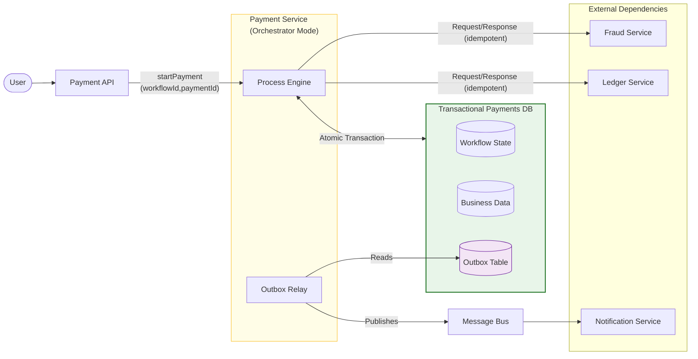
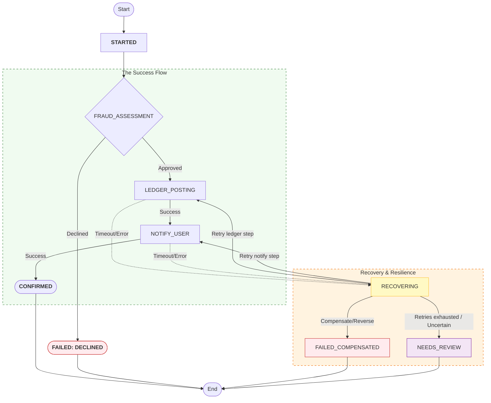

## 1. Why This Article Exists

---

In the previous article, we introduced **Saga** as the coordination model for multi-service payment workflows, and we chose **orchestration** for our baseline design.

But a saga is only reliable if it survives real-world conditions:

- processes crash
- networks time out
- messages are duplicated
- downstream services partially succeed
- responses are lost

If our orchestrator keeps state only in memory, or retries without rules, we still end up with:

> **“Payment says confirmed, ledger disagrees.”**

So this article upgrades the saga from a concept to a **production-safe workflow**.

We’ll add:

- a **durable workflow state machine**
- **idempotent step execution**
- **bounded retries + timeouts**
- **compensating transactions**
- an operating model for **observability + stuck workflows**

(Deep theory will also be reinforced later in Concepts.)

---

## 2. Updated Architecture: Adding Reliability Components

---

Compared to previous design, the biggest change is that payment processing is no longer “one request chain”.

It becomes a **durable workflow** with a clear transactional boundary.

To make the saga production-safe, we add:

- **Payment Orchestrator (Process Engine)** — controls step progression and state transitions
- **Workflow Store** — persists workflow state (step-by-step progress)
- **Outbox Table** — stores messages/events to be published reliably
- **Outbox Relay** — publishes outbox records to the message bus (decoupled from the request path)

The key reliability property we want is:

> **Workflow state + business data + outbox record are written in one atomic transaction.**  
> Publishing happens later via a relay, so we never lose messages after committing state.

A refined baseline architecture:

> **Note:** In Phase 3, we evolve the existing **Payment Service** into an orchestrator (it contains the process engine + workflow state). In larger systems this may be split into a dedicated Orchestrator service later.

A few important clarifications:

- **Fraud + Ledger** are shown as **request/response** calls here for baseline simplicity.
  - They still must be **idempotent** because the orchestrator can retry.
- **Notification** is triggered **asynchronously** via the message bus.
  - Payment confirmation should not block on sending a receipt.
- The **Outbox Relay** makes delivery resilient:
  - if publishing fails, it retries safely because the outbox record is durable.

(We’ll revisit messaging guarantees and deeper patterns in the Concepts section.)

---

## 3. Durable Workflow State Machine (The Core)

---

To be resilient, the saga must have a persisted “truth” of progress.

A useful way to model this is a **durable workflow state machine**:

### 3.1 Example state model for our payment workflow

We track progress in steps:

- `FRAUD`
- `LEDGER`
- `NOTIFY`

And we maintain terminal outcomes:

- `RUNNING`
- `SUCCEEDED`
- `FAILED`
- `FAILED_COMPENSATED`
- `NEEDS_REVIEW`

A simplified state diagram:

### 3.2 What we persist per workflow

In the workflow store (table/document), we typically persist:

- workflowId, paymentId, idempotencyKey
- current status (STARTED, RECOVERING, CONFIRMED, …)
- current step (FRAUD, LEDGER, NOTIFY)
- attempt counts per step
- timestamps (createdAt, lastUpdatedAt, nextRetryAt)
- last error (errorCode, errorMessage, lastFailedStep)

This persistence is what survives:

- orchestrator restarts
- transient outages
- long retries
- delayed compensations

---

## 4. Execution Model: Commands + Idempotent Step Handlers

---

Once a saga is durable, retries are inevitable.

That means each step must be safe to execute more than once.

### 4.1 Command shape (concept)

Each command should carry stable identifiers so both the orchestrator and downstream services can reason about:

- **what workflow this belongs to**
- **which step is being executed**
- **whether this is a retry**

A practical command envelope:

- `workflowId`
- `paymentId`
- `stepName`
- `stepAttempt`
- idempotency token per step

### 4.2 Step idempotency keys (baseline)

A simple baseline for idempotency keys per step:

- Ledger posting idempotency key: `paymentId:LEDGER`
- Notification idempotency key: `paymentId:NOTIFY`
- Fraud assessment idempotency key: `paymentId:FRAUD`

So if the orchestrator sends the same command again, the service can safely respond with:

- “already done”
- “still processing”
- “failed permanently”

> ✅ **Rule:** Orchestrator retries must never create new side effects.

---

## 5. Retry Policy: Bounded, Classified, Observable

---

Retries are not a hack. They are a first-class design tool — but only with rules.

### 5.1 Classify failures

At a high level:

- **Retryable**
  - timeouts
  - 5xx
  - network errors
  - temporary downstream unavailability
- **Non-retryable**
  - validation errors
  - fraud declined
  - insufficient funds (business rule)
- **In-doubt / ambiguous**
  - timeout after request was sent (downstream may have processed)

### 5.2 Bounded retry rules

A baseline policy:

- max attempts per step
- a “retry budget” per step (ledger ≠ notification)
- exponential backoff + jitter
  - **Exponential backoff:** wait time between attempts increases exponentially (e.g., 1s, 2s, 4s)
  - **Jitter:** random variation added to the backoff delay to ensure that multiple clients do not retry at the exact same moment
  - **Examples:**
    - **Failure 1:** Wait 1000ms + random_between(0, 100ms)
    - **Failure 2:** Wait 2000ms + random_between(0, 200ms)
    - **Failure 3:** Wait 4000ms + random_between(0, 400ms)

Example policy (concept):

| Step   | Max attempts | Backoff                     |
| ------ | -----------: | --------------------------- |
| FRAUD  |            3 | short backoff               |
| LEDGER |            5 | longer backoff              |
| NOTIFY |           10 | best-effort, async friendly |

Every retry decision should be recorded in the workflow store:

- attempts increment
- last error saved
- next retry scheduled

This makes retries debuggable and measurable.

---

## 6. Timeouts + “In-Doubt” Handling

---

Timeouts are dangerous because they create ambiguity.

If you time out waiting for Ledger:

- the ledger might not have processed it
- or it might have processed it and the response was lost

### 6.1 Three timeouts to separate

- **call timeout**: how long we wait for a single request
- **step timeout**: maximum time we keep retrying a step
- **workflow timeout**: maximum time we allow the saga to run

### 6.2 What we do when outcome is ambiguous

Because handlers are idempotent, a safe first response is:

- retry the command with the same idempotency key

If ambiguity persists past retry limits, we do **not** guess.

We transition to:

- `NEEDS_REVIEW` (or `PENDING_RECONCILIATION`)

This is a production-grade move:

> Some outcomes cannot be resolved automatically without risking money correctness.

---

## 7. Compensation Mechanics

---

When a saga fails after some steps have committed, we need a controlled recovery path.

### 7.1 Two common types of compensation

1. **Logical reversal**

- Example: ledger entry reversal (create a compensating entry)
- Important: do not delete history; record the reversal

2. **Business compensation**

- Example: refund to customer
- Often used when money movement already happened externally

### 7.2 Compensation is also a workflow step

Compensation must be:

- idempotent
- retried with bounded policy
- recorded in workflow state

So the orchestrator can safely run:

- `COMPENSATE_LEDGER`
- `REFUND_PAYMENT`

with the same safety properties as forward steps.

---

## 8. Reliable Messaging: Transactional Outbox (Baseline Pattern)

---

Once you coordinate via commands/events, you must avoid:

> “DB commit succeeded, but the message was never published.”

That leads to stuck workflows and silent inconsistency.

### 8.1 Outbox concept (HLD-level)

Instead of:

- update workflow state
- publish message

(two separate operations)

We do:

- write workflow state update **and** an outbox record in **one DB transaction**
- a publisher process drains outbox records to the message bus

This gives us:

- durability
- replayability
- audit trail

(Deep details go into Concepts: Processing Guarantees + Outbox.)

---

## 9. Operating Model: Observability + Stuck Workflows

---

A saga-based system is only “reliable” if you can operate it.

Minimum operational requirements:

### 9.1 Observability signals

- Metrics:
  - saga success rate
  - step retry counts
  - compensation rate
  - `NEEDS_REVIEW` volume
  - time-to-complete distribution
- Tracing:
  - `workflowId` propagated across services
- Logs:
  - state transitions as structured logs

### 9.2 Stuck workflow detection

A workflow is “stuck” when:

- no state transition for N minutes/hours
- step retry budget exhausted
- in-doubt state persists too long

Mitigations:

- scheduled reconciliation job
- manual tooling to:
  - replay a step safely
  - trigger compensation
  - close as resolved

> This is how you prevent mismatches from becoming daily operational debt.

---

## 10. What Our Payment Design Chooses (Explicit Baseline)

---

For Phase 3 baseline, our payment system evolves to:

- **Payment Service in orchestrator mode** (process engine + workflow state)
- **Workflow store** persisted (same Payments DB boundary is fine for baseline)
- **Per-step idempotency**
- **Bounded retries + exponential backoff**
- **Timeout + in-doubt handling** → `NEEDS_REVIEW`
- **Compensation steps** (reversal/refund as required)
- **Observability-first** (metrics + tracing + transition logs)
- **Transactional outbox + relay** (recommended baseline if using a message bus)

> ✅ **Note (Choreography-based sagas):**  
> The same reliability requirements apply even if you run a saga via events (choreography): idempotent steps, durable progress, retries/timeouts, compensations, and observability.  
> The difference is _where_ the logic lives (distributed across services). We cover choreography sagas in depth in the **Concepts → Saga Pattern & Distributed Coordination** section.

---

## 11. Key Takeaways

---

- A saga becomes reliable only when **workflow progress is durable** and **steps are idempotent**.
- Retries must be **bounded, classified, and observable** — not blind.
- Timeouts create “in-doubt” outcomes; production systems must support `NEEDS_REVIEW`.
- Compensation is not an afterthought — it is a **first-class workflow path**.
- Transactional Outbox prevents “DB commit but message lost” failure modes.
- Reliability includes an operating model: metrics, tracing, and stuck-workflow handling.

---

## TL;DR

---

Saga + orchestration fixes partial failures only if the workflow is **durable and recoverable**.

Make it production-safe by persisting workflow state, enforcing step idempotency, adding bounded retries/timeouts, defining compensation paths, and instrumenting the system to detect and resolve stuck workflows.

---

### 🔗 What’s Next

Next we’ll wrap Phase 3 with a summary that:

- recaps how the payment architecture evolved from baseline → reliable distributed workflow
- lists the Phase 3 concepts introduced (with cross-links)
- provides a final “mental model” checklist for correctness & reliability design

👉 **Up Next: →**  
**[Phase 3 Summary — Payment System (Correctness & Reliability)](/learning/advanced-skills/high-level-design/4_correct-reliable-systems/4_11_phase-3-summary)**
