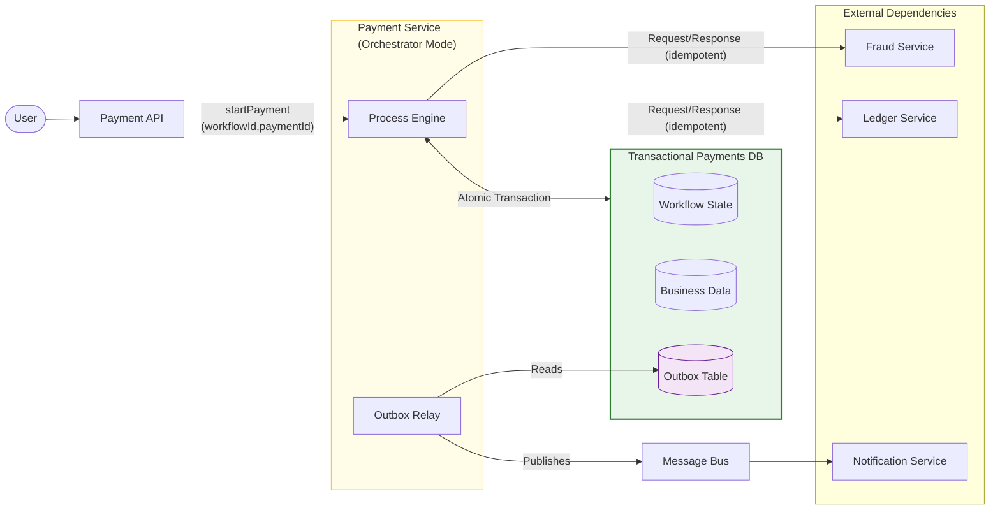

## 1. What Phase 3 Was Really About

---

Phase 3 is where system design stops feeling “clean”.

In Phase 2 we mainly solved **scaling** problems.

In Phase 3 we dealt with something harder:

> **Correctness under failure.**

Because in distributed systems:

- requests time out even when work succeeds
- retries can duplicate side effects
- replication creates stale reads
- concurrent writes create race conditions
- multi-service workflows fail partially

So the goal of Phase 3 was not just “design a payment system”.

It was:

> **Design a payment system that stays correct when the world is unreliable.**

---

## 2. The Evolution Storyline (Baseline → Pressure → Fix)

---

Below is the Phase 3 evolution timeline.

Each article introduced one real production pressure and evolved the architecture by one step.

| Article                   | Pressure introduced                               | What we changed (design move)                                                |
| ------------------------- | ------------------------------------------------- | ---------------------------------------------------------------------------- |
| **4.2 Requirements**      | correctness risks are inevitable                  | we framed upcoming pressures (retries, replication, partial failures)        |
| **4.3 Baseline**          | retry duplicates can happen even without scaling  | simplest API → Payment Service → DB, revealed duplicate risk                 |
| **4.4 Idempotency**       | retries must be safe                              | idempotency key + DB-first idempotency record (atomic)                       |
| **4.5 Scaling**           | service throughput increases, DB pressure moves   | load balancer + service fleet; correctness still holds via idempotency       |
| **4.6 Replication**       | scaling reads introduces stale reads              | leader–replica model; critical reads to leader; read-your-writes window      |
| **4.7 Concurrent Writes** | race conditions corrupt money correctness         | atomic debit update + ACID transaction; optimistic/pessimistic options       |
| **4.8 Partial Failures**  | multi-service workflows break globally            | revealed mismatch scenarios + requirements for coordination                  |
| **4.9 Saga Model**        | need distributed coordination without global ACID | introduced saga; orchestration vs choreography; chose orchestration baseline |
| **4.10 Reliable Saga**    | sagas must survive timeouts, duplicates, restarts | durable workflow state machine, retries/timeouts, compensation, outbox       |

This pattern is the heart of your HLD approach:

**start simple → reveal hidden failure mode → fix with a deliberate design move.**

---

## 3. Where We Ended Up (Final Phase 3 Architecture)

---

At the end of Phase 3, payment processing is no longer “one request chain”.

It is a **durable workflow** that can survive failures.

A final snapshot (baseline):

What matters is the reliability invariant:

> **Workflow state + business data + outbox record are written atomically.**  
> Publishing happens via the relay, so we don’t “commit state but lose the message”.

---

## 4. The Explicit Design Decisions (Locked Baseline)

---

These are the decisions our Phase 3 design explicitly chose.

### 4.1 Idempotency (API + workflow steps)

- **Default:** idempotency records stored in the same SQL DB as payment records.
- Written atomically with the payment update (single transaction).
- Redis/KV can be added later for speed, but DB remains source of truth.

### 4.2 Replication reads (correctness vs scale)

- **Writes → Leader**
- **Critical reads → Leader**
- **Non-critical reads → Replicas**
- **Read-your-writes** for a short window after payment for better UX
- Synchronous replication and quorum reads are advanced options, not baseline.

### 4.3 Safe concurrent writes

- Leader as the single write authority.
- ACID transaction boundary for money correctness.
- Atomic debit update pattern:
  - `UPDATE accounts SET balance = balance - amount WHERE balance >= amount`
- Transaction record written in the same transaction.

### 4.4 Multi-service correctness

- Payment is a workflow, not a single DB write.
- We choose **Saga** for coordination.
- Execution style choice (baseline):
  - **Orchestration** (explicit control flow + simpler operability)

### 4.5 Reliability hardening

- Durable workflow state machine (persisted).
- Step-level idempotency keys.
- Bounded retries + timeouts with failure classification.
- Compensation paths for partial commits.
- Terminal state `NEEDS_REVIEW` for ambiguous outcomes.
- Transactional outbox + relay for reliable publication.

---

## 5. Phase 3 Failure-Handling Playbook (Mental Checklist)

---

When you face a payment correctness problem, use this checklist:

### 5.1 Classify the failure

- Is it **retryable** (timeout, 5xx, network)?
- Is it **permanent** (fraud decline, validation)?
- Is it **in-doubt** (timeout after request sent)?

### 5.2 Find the correctness boundary

- What is the **source of truth** (leader DB, workflow record)?
- Where is the **idempotency boundary** (API, per-step)?

### 5.3 Choose the recovery path

- retry (bounded, step-aware)
- compensate (reversal/refund)
- escalate (`NEEDS_REVIEW`)

### 5.4 Make it observable

- do we have step transition logs?
- do we have workflow metrics?
- can we answer: “where is payment X stuck?”

If you can’t answer the last question quickly, you don’t have reliability yet.

---

## 6. Concepts Introduced in Phase 3 (Cross-links)

---

Phase 3 introduces correctness concepts that show up in almost every real distributed system.

> These live in the Concepts section as deep dives.

1. **ACID Transactions**  
   The baseline tool for local correctness within one service boundary.

2. **Idempotency**  
   The foundation for safe retries at the API edge and per workflow step.

3. **Database Replication**  
   How we scale reads and why stale reads appear.

4. **Consistency Models**  
   Strong vs eventual vs read-your-writes — and why UX depends on it.

5. **Distributed Transactions**  
   Why global ACID is rarely the baseline, and what trade-offs it brings.

6. **Processing Guarantees**  
   At-most-once / at-least-once / exactly-once — and how these affect workflows.

7. **Saga Pattern & Distributed Coordination**  
   How we coordinate multi-service workflows safely.

8. **CAP Theorem**  
   A synthesis lens after you’ve seen these trade-offs in real examples.

---

## 7. What We Did Not Solve Yet (On Purpose)

---

Phase 3 deliberately stays at “correctness foundations”.

We did **not** deep dive into:

- write-heavy scaling (sharding/partitioning)
- multi-region payments, DR(Disaster Recovery) posture, and cross-region consistency
- advanced ledger models and reconciliation systems
- deeper processing semantics and “exactly-once illusions” in practice

These will appear later:

- Phase 4 (event-driven systems)
- Phase 5 (multi-region / internet-scale bridge)
- Large-Scale System Design deep dives

---

## 8. Key Takeaways

---

- Correctness is harder than scaling because failures create ambiguity.
- You cannot rely on a single DB transaction once the workflow spans services.
- The correctness toolkit we built in Phase 3:
  - idempotency
  - leader/replica read strategy
  - concurrency-safe writes (atomic updates)
  - saga coordination
  - durable workflow state + retries/timeouts + compensation
  - outbox + observability

---

## TL;DR

---

Phase 3 evolved a payment system from a simple baseline into a reliable distributed workflow.

The final design treats payment processing as a **durable saga** with idempotent steps, bounded retries/timeouts, compensation paths, and observability — so the system stays correct even when services fail partially.

---

### 🔗 What’s Next

Next, you can go in two directions:

1. Continue to **Phase 4: Real-Time & Event-Driven Systems** (Chat/Notifications)
2. Deepen understanding via Phase 3 **Concepts** (Saga, Processing Guarantees, Replication, CAP)

👉 **Up Next: →**  
**[Phase 4 — Real-Time & Event-Driven Systems](/learning/advanced-skills/high-level-design/5_real-time-event-driven-systems/)**
