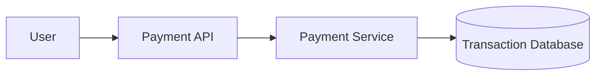
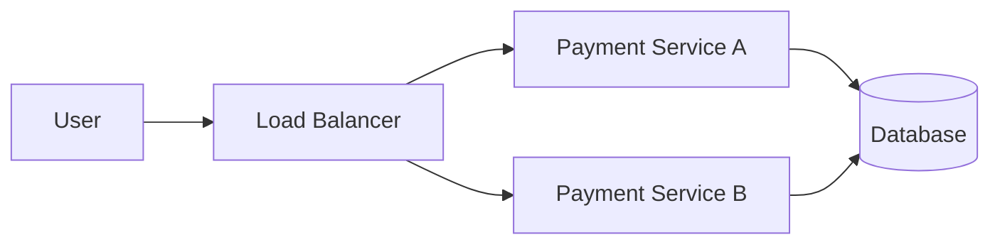

## 1. The System We Are Designing

---

In this phase we will design a simplified **payment processing system**.

The system allows users to transfer money or complete a purchase.

Example scenario:

```
User → Pay $100
System → Process payment
System → Confirm success
```

While this flow appears simple, payment systems must guarantee **correctness and reliability**.

Unlike systems optimized purely for performance, payment systems must ensure:

- money is **never duplicated**
- money is **never lost**
- operations are **consistent even during failures**

This makes payment processing one of the most challenging distributed system problems.

---

## 2. Core Functional Requirements

---

At a high level, the system must support the following operations.

### Process Payment

A user should be able to initiate a payment.

Example:

```
User → Pay $100 to Merchant
```

The system must:

- validate the request
- deduct the user's balance
- record the transaction
- confirm the payment

---

### Payment Status

Users should be able to check whether a payment was:

- successful
- pending
- failed

---

### Transaction History

The system should maintain a record of past payments.

Example:

```
User → View payment history
```

Each transaction record should include:

- transaction ID
- payer
- receiver
- amount
- timestamp
- status

---

## 3. Non‑Functional Requirements

---

In financial systems, **non-functional requirements are often more critical than functional ones**.

### Correctness

The system must ensure:

```
No duplicate payments
No lost transactions
```

---

### Reliability

Failures must not result in inconsistent data.

Example failure scenario:

```
Money deducted
Order confirmation not recorded
```

The system must recover safely from such cases.

---

### Idempotency

The system must handle **duplicate requests safely**.

Example:

```
User clicks "Pay" twice
Network retries request
```

The payment must only be processed **once**.

Handling this safely in distributed systems often requires techniques such as:

- idempotency keys
- transaction identifiers
- safe retry mechanisms

These mechanisms ensure that **repeated requests do not create duplicate financial operations**.

---

### Auditability

Financial systems must maintain a complete record of transactions for auditing purposes.

---

## 4. Basic System Components

---

A simplified payment system architecture might look like this:



Components:

- **Payment API** – receives user requests
- **Payment Service** – processes business logic
- **Transaction Database** – stores transaction records

This architecture works for a basic system.

However, once we consider real-world failures, new challenges emerge.

---

## 5. Key Problems Introduced by Payments

---

Payment systems introduce several challenges that do not appear in simpler applications.

### Duplicate Requests

Example:

```
User presses Pay twice
```

Without safeguards, the system may process **two payments**.

---

### Network Retries

Clients often retry requests when network failures occur.

Example:

```
Client sends payment
Network times out
Client retries
```

The system must ensure the retry does **not trigger another payment**.

---

### Partial Failures

Distributed systems may fail halfway through an operation.

Example:

```
Balance deducted
Transaction record not saved
```

This results in inconsistent state.

---

### Concurrent Operations

Multiple requests may modify the same account simultaneously.

Example:

```
Two payments from the same account at the same time
```

The system must prevent **race conditions**.

---

## 6. Why This Is Hard in Distributed Systems

---

Modern systems run across multiple servers.

Example architecture:



Because multiple services can process requests simultaneously, the system must ensure:

- data consistency
- correct ordering of operations
- safe retries

Handling these issues requires careful system design.

---

## 7. The Design Challenge

---

The key challenge in a payment system is ensuring that **each transaction is processed exactly once**, even in the presence of failures.

Distributed environments introduce several complications:

- requests may be retried due to network failures
- multiple servers may process requests concurrently
- systems may fail halfway through an operation
- databases may replicate data asynchronously

Because of this, a naive implementation can easily lead to problems such as:

```text
duplicate payments
inconsistent account balances
lost transactions
```

Designing a reliable payment system therefore requires mechanisms that guarantee:

- safe retries
- consistent data updates
- correct ordering of operations
- recovery from partial failures

In the following articles, we will explore how real systems solve these problems step by step.

---

## Key Takeaways

---

- Payment systems prioritize **correctness over performance**.
- Duplicate requests and partial failures must be handled safely.
- Distributed environments introduce additional complexity.
- Designing reliable transactions requires specialized techniques.

---

### 🔗 What’s Next?

Now that we understand the challenges of payment systems, the next step is to design a **high‑level architecture** for handling transactions safely.

👉 **Up Next: →**  
**[Payment System — High-Level Architecture](/learning/advanced-skills/high-level-design/4_correct-reliable-systems/4_3_high-level-architecture)**
