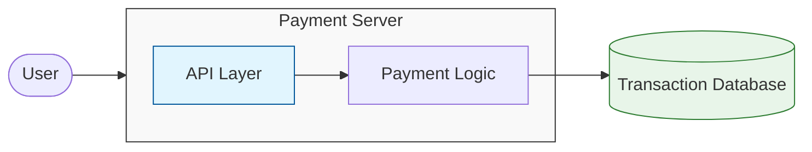
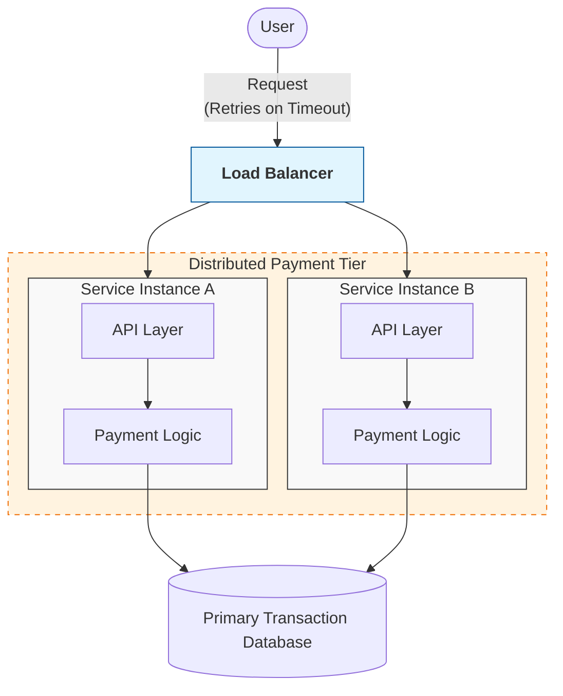

## 1. The System We Are Designing

---

In this phase we will design a simplified **payment processing system**.

The system allows users to transfer money or complete a purchase.

Example scenario:

```
User → Pay $100
System → Process payment
System → Confirm success
```

At first glance this flow appears simple.

However, payment systems must guarantee **correctness and reliability**, even when failures occur.

Unlike systems optimized primarily for performance, financial systems must ensure:

- money is **never duplicated**
- money is **never lost**
- operations remain **consistent during failures**

Because of these strict guarantees, payment systems are one of the most challenging types of distributed systems to design.

---

## 2. Core Functional Requirements

---

At a high level, the system must support the following operations.

### 2.1 Process Payment

A user should be able to initiate a payment.

Example:

```
User → Pay $100 to Merchant
```

The system must:

- validate the request
- deduct the payer's balance
- record the transaction
- confirm the payment

---

### 2.2 Payment Status

Users should be able to check whether a payment was:

- successful
- pending
- failed

---

### 2.3 Transaction History

The system should maintain a record of past payments.

Example:

```
User → View payment history
```

Each transaction record should include:

- transaction ID
- payer
- receiver
- amount
- timestamp
- status

---

## 3. Non‑Functional Requirements

---

In financial systems, **non-functional requirements are often more critical than functional ones**.

### 3.1 Correctness

The system must ensure:

```
No duplicate payments
No lost transactions
```

Financial errors can have severe consequences, so correctness is the highest priority.

---

### 3.2 Reliability

Failures must not leave the system in an inconsistent state.

Example failure scenario:

```
Money deducted
Order confirmation not recorded
```

The system must be able to **recover safely** from such situations.

---

### 3.3 Safe Handling of Retries

Clients may retry requests due to network failures or timeouts.

Example:

```
User clicks "Pay" twice
Network retries request
```

Or

```
Client sends payment request
Network timeout occurs
Client retries request
```

The system must ensure that retries do **not create duplicate financial operations**.

---

### 3.4 Auditability

Financial systems must maintain a complete record of transactions for auditing purposes.

---

## 4. Basic System Components

---

A simplified payment system architecture might look like this:



Components:

- **Payment API** – receives user requests
- **Payment Service** – processes business logic
- **Transaction Database** – stores transaction records

This architecture works for a simple system.

However, once we introduce **distributed infrastructure**, new challenges begin to appear.

---

## 5. Key Problems Introduced by Payments

---

Payment systems introduce several challenges that do not appear in simpler applications.

### 5.1 Duplicate Requests and Retries

Users may unintentionally send the same request multiple times.

Example:

```
User presses Pay twice
```

Clients may also retry requests automatically.

```
Payment request sent
Network timeout occurs
Client retries request
```

Without safeguards, the system may process **multiple payments for the same request**.

---

### 5.2 Replication Lag and Stale Reads

Distributed systems often use **database replication** to scale reads.

However, replication is frequently **asynchronous**, meaning replicas may temporarily contain stale data.

Example:

```
Payment recorded in primary database
Replica still shows old balance
```

This can cause users to see **incorrect or outdated information**.

---

### 5.3 Partial Failures in Distributed Systems

In real systems, a payment may involve multiple components.

Example:

```
Payment recorded
Ledger updated
Notification sent
```

But failures may occur midway.

Example:

```
Payment recorded
Ledger update fails
```

This creates **inconsistent system state**.

---

### 5.4 Concurrent Operations

Multiple operations may attempt to modify the same account simultaneously.

Example:

```
Two payments from the same account at the same time
```

Without proper safeguards, this can lead to **race conditions and incorrect balances**.

---

## 6. Why This Is Hard in Distributed Systems

---

Modern systems run across multiple servers.

Example architecture:



Because multiple services process requests concurrently, the system must ensure:

- correct ordering of operations
- safe retries
- consistent database state
- reliable coordination between services

Handling these issues requires careful system design.

---

## 7. The Design Challenge

---

The key challenge in a payment system is ensuring that **each transaction is processed safely and correctly**, even in the presence of failures.

Distributed environments introduce several complications:

- requests may be retried
- multiple servers may process requests concurrently
- systems may fail halfway through an operation
- databases may replicate data asynchronously

A naive implementation can easily lead to problems such as:

```text
duplicate payments
inconsistent account balances
lost transactions
```

To build a reliable system, we must introduce mechanisms that guarantee:

- safe request handling
- consistent data updates
- correct coordination between services
- recovery from partial failures

In the following articles, we will explore how real systems solve these problems step by step.

---

## 8. How We Will Solve These Problems

---

In the next articles, we will address these challenges step by step.

The system will evolve as we introduce mechanisms that make the architecture more reliable.

1. **Duplicate Requests and Retry Failures**  
   → Solved using **Idempotency and Safe Retries**
2. **Replication Lag and Stale Reads**  
   → Solved using **Replication and Write Consistency**
3. **Partial Failure Across Services**  
   → Solved using **Distributed Coordination patterns such as the Saga pattern**

By solving each of these problems, we will gradually transform the simple architecture into a **reliable distributed payment system**.

---

## Key Takeaways

---

- Payment systems prioritize **correctness over performance**.
- Distributed environments introduce new failure modes
- Duplicate requests, replication lag, and partial failures must be handled carefully
- Designing reliable transactions requires specialized distributed system techniques

---

### 🔗 What’s Next?

Now that we understand the challenges of payment systems, the next step is to design a **high‑level architecture** for handling transactions safely.

👉 **Up Next: →**  
**[Payment System — Baseline Architecture](/learning/advanced-skills/high-level-design/4_correct-reliable-systems/4_3_baseline-architecture)**
