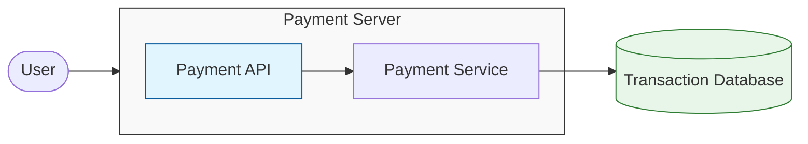
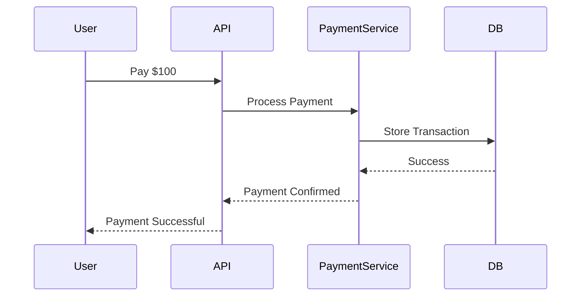
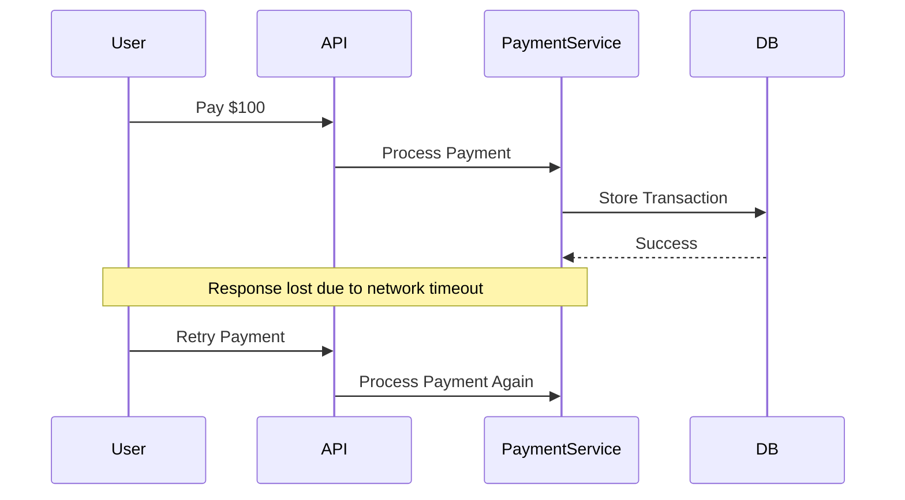

## 1. From Requirements to Architecture

---

In the previous article we defined the **requirements of a payment system**.

Now we begin designing the system architecture.

When approaching system design, it is usually best to **start with the simplest system that satisfies the requirements**, and then gradually evolve the architecture as new challenges appear.

For a payment system, the core responsibilities are:

1. receive a payment request
2. validate the request
3. process the payment
4. record the transaction
5. return the result to the user

A simple architecture that fulfills these requirements might look like this.



Components:

- **Payment API** – receives incoming requests
- **Payment Service** – executes business logic
- **Transaction Database** – stores transaction records

Payment systems typically use **relational databases** because they provide strong guarantees through **ACID transactions**, ensuring that financial operations either complete fully or fail safely.

We will explore these guarantees in more detail later in the concepts section.

For a **small system**, this **single server system** architecture works well.

---

## 2. Typical Payment Processing Flow

---

Let’s look at what a normal successful payment looks like.



Steps involved:

1. The user sends a payment request.
2. The API forwards the request to the payment service.
3. The payment service validates and processes the request.
4. Transaction is recorded in the database
5. The system returns confirmation to the user.

Under normal conditions, the flow is straightforward and reliable.

However, real systems operate in **unreliable network environments**, and this introduces the first reliability risk.

---

## 3. Hidden Reliability Risk: Request Retries

---

In distributed systems, **network failures are common**.

Consider the following scenario.



From the user’s perspective:

```
Payment request timed out
```

So the client retries the request.

However, **the first payment may have already been processed successfully**.

This creates a dangerous situation:

```
Payment processed twice
User charged twice
```

This problem can occur **even in very simple architectures** because networks cannot guarantee that responses will always be delivered successfully.

In financial systems, this type of failure is unacceptable.

The system must guarantee that **retries never result in duplicate payments**.

---

## 4. Why This Is Dangerous in Payment Systems

---

In many applications, duplicate requests may be harmless.

But in financial systems, duplicate operations can lead to serious consequences:

- users may be **charged twice**
- merchants may receive **duplicate payments**
- account balances may become inconsistent

Because of this, payment systems must guarantee that **retries never result in duplicate transactions**.

Designing systems that safely handle retries is therefore one of the most important challenges in payment system architecture.

---

## Key Takeaways

---

- A payment system begins with a simple **API → service → database architecture**.
- Under normal conditions the payment flow works correctly.
- However, **network failures and client retries can lead to duplicate transactions**.
- Preventing duplicate payments is a critical requirement for financial systems.

---

### 🔗 What’s Next?

The most common cause of duplicate payments in distributed systems is **retrying requests after timeouts or network failures**.

In the next article, we will examine how duplicate requests occur and why naive implementations fail.

👉 **Up Next: →**  
**[Payment System — Handling Duplicate Requests (Idempotency)](/learning/advanced-skills/high-level-design/4_correct-reliable-systems/4_4_handling-duplicate-request)**
