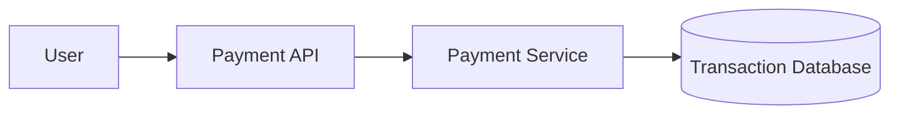
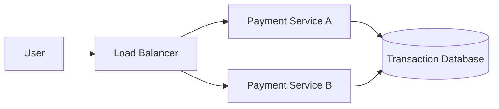
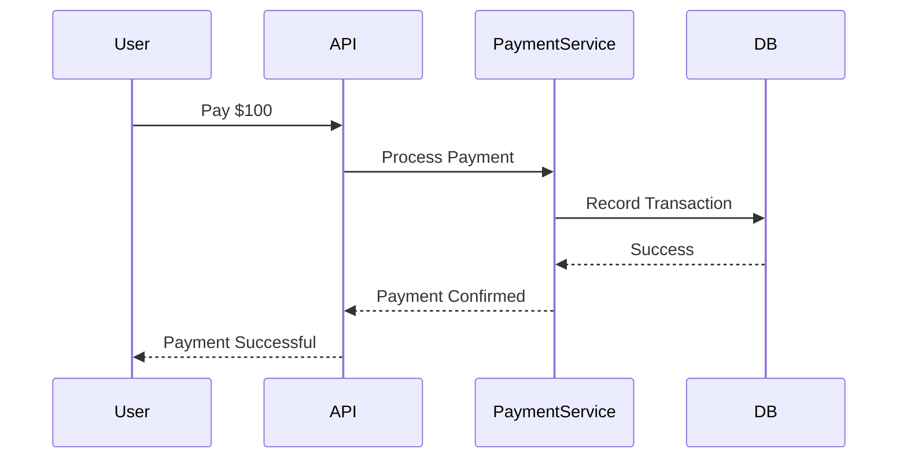

## 1. From Requirements to Architecture

---

In the previous article we defined the **requirements of a payment system**.

Now we design the **initial high‑level architecture** that processes payments.

At a high level the system must:

1. receive payment requests
2. validate the request
3. process the transaction
4. store the transaction record
5. return the payment status

A simplified architecture might look like this.



Components:

- **Payment API** – receives incoming requests
- **Payment Service** – executes business logic
- **Transaction Database** – stores transaction records

This architecture works for a **single server system**, but real systems require more reliability and scalability.

---

## 2. Introducing Horizontal Scaling

---

To handle large traffic, payment systems typically run **multiple service instances** behind a load balancer.



This architecture improves:

- availability
- scalability
- fault tolerance

However, it also introduces new challenges.

Because **multiple servers may process requests concurrently**, the system must guarantee that financial transactions remain **correct and consistent**.

---

## 3. A Typical Payment Processing Flow

---

A simplified payment transaction may follow these steps:

1. User initiates payment
2. Payment request reaches the payment service
3. Payment service validates the request
4. Payment service records the transaction
5. System confirms success



In an ideal world this flow works perfectly.

But distributed systems rarely behave perfectly.

---

## 4. Where Things Start Breaking

---

When the system operates in a distributed environment, several failure scenarios may occur.

Examples:

```
Network timeout
Duplicate request
Service crash
Database write failure
```

Example scenario:

```
Payment processed
Response lost due to network failure
Client retries request
```

Without safeguards, the system may process **the same payment twice**.

Another scenario:

```
Balance deducted
Transaction record not stored
```

This results in **inconsistent financial state**.

---

## 5. Why Simple Architectures Are Not Enough

---

The initial architecture is not sufficient because financial systems must guarantee:

- **exactly-once transaction processing**
- **consistent account balances**
- **safe retries during network failures**
- **recovery from partial failures**

Achieving these guarantees requires additional mechanisms such as:

- safe retry strategies
- idempotency controls
- transactional guarantees
- replication strategies

These mechanisms will be introduced gradually in the next articles.

---

## Key Takeaways

---

- A payment system begins with a simple API → service → database architecture.
- Horizontal scaling introduces multiple service instances.
- Distributed systems introduce new failure scenarios.
- Payment systems must prioritize **correctness over performance**.

---

### 🔗 What’s Next?

Now that we have the base architecture, the next step is understanding **what can go wrong in distributed payment systems**.

👉 **Up Next: →**  
**[Payment System — Failure Scenarios in Distributed Transactions](/learning/advanced-skills/high-level-design/4_correct-reliable-systems/4_4_failure-scenarios)**
