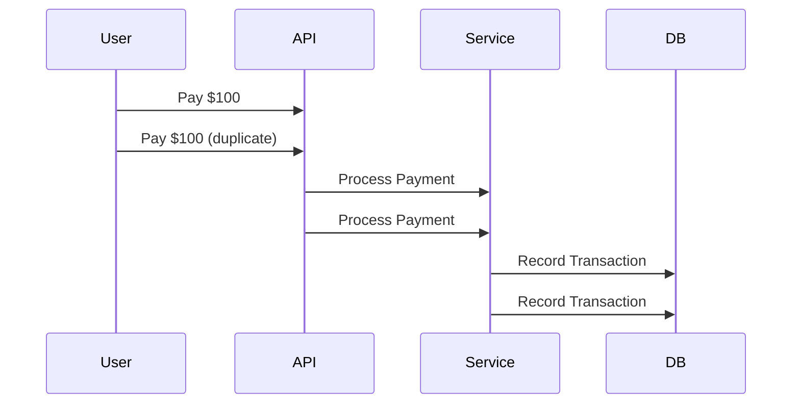
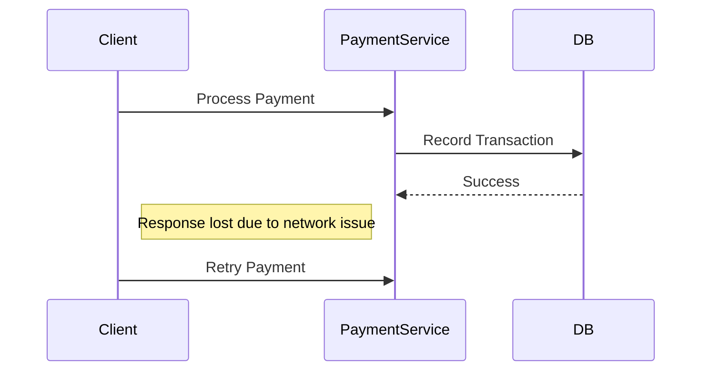
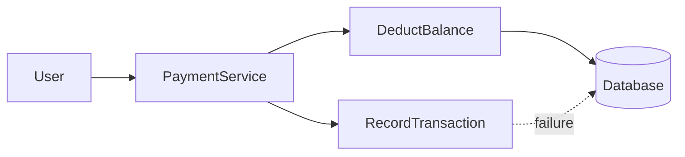
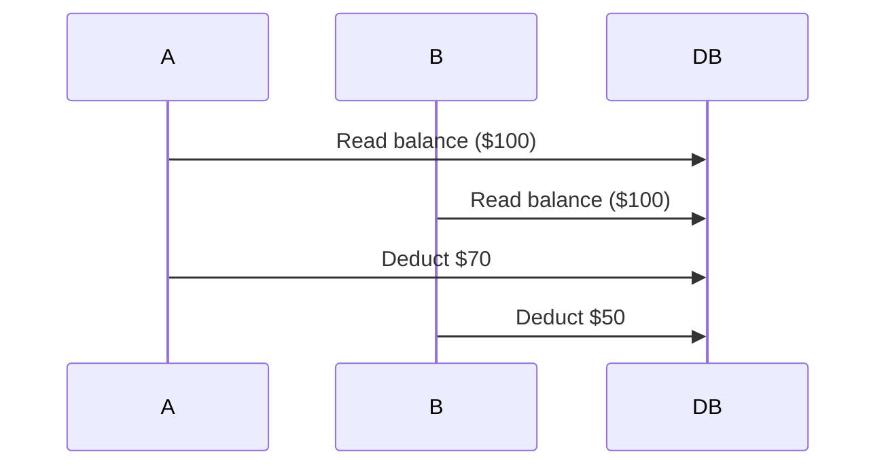

## 1. Why Failures Matter in Payment Systems

---

In the previous article we designed a **basic payment system architecture**.

```text
User → Payment API → Payment Service → Database
```

At first glance, the system appears simple and reliable.

However, real-world distributed systems operate in environments where **failures are inevitable**.

Networks fail, services crash, databases slow down, and clients retry requests.

For most applications these failures may cause temporary inconvenience.

For **financial systems**, however, failures can lead to serious problems such as:

```
duplicate payments
lost transactions
incorrect balances
inconsistent financial records
```

Understanding these failure scenarios is the first step toward designing a **correct and reliable payment system**.

---

## 2. Duplicate Requests

---

One of the most common issues in distributed systems is **duplicate requests**.

Example scenario:

```
User presses "Pay"
Network delay occurs
User presses "Pay" again
```

From the system's perspective, these appear as **two separate payment requests**.



Without safeguards, the system may process **two payments instead of one**.

---

## 3. Network Retries

---

Another common failure scenario occurs when a **network timeout** happens during a request.

Example:

```
User sends payment request
Payment processed successfully
Network timeout occurs before response
Client retries request
```

From the client's perspective, the payment appears to have **failed**, even though it actually succeeded.



If the system is not designed carefully, the retry may create **a second transaction**.

---

## 4. Partial Failures

---

Distributed systems may fail **midway through an operation**.

Example scenario:

```
Balance deducted
Transaction record not stored
```

Or:

```
Payment recorded
Notification service fails
```



This creates **inconsistent state**, which is unacceptable for financial systems.

---

## 5. Service Crashes

---

A service may crash **after completing a database operation but before sending the response**.

Example:

```
Payment recorded in database
Service crashes
Client retries payment
```

The retry may create another payment unless the system prevents it.

---

## 6. Concurrent Requests

---

Multiple requests may modify the same account simultaneously.

Example:

```
Account balance = $100

Request A: Pay $70
Request B: Pay $50
```

If both requests read the balance at the same time, the system might incorrectly allow **both payments**, resulting in a negative balance.



This creates a **race condition**.

---

## 7. Why These Failures Are Difficult

---

These problems arise because distributed systems have several inherent characteristics:

- requests may be retried
- services may crash
- networks may drop responses
- multiple servers may process requests concurrently

Because of this, systems cannot rely on simple request processing logic.

Instead, they must be designed to **safely handle retries and duplicates**.

---

## 8. The Core Problem

---

All the scenarios above lead to the same core challenge:

```
How do we ensure a payment is processed exactly once?
```

This requirement is critical in financial systems.

To solve this problem, distributed systems introduce techniques such as:

- **idempotent operations**
- **transaction identifiers**
- **safe retry mechanisms**

These techniques allow the system to safely handle repeated requests without creating duplicate financial operations.

---

## Key Takeaways

---

- Distributed systems experience failures frequently.
- Payment systems must handle duplicate requests and retries safely.
- Partial failures can lead to inconsistent financial state.
- Systems must guarantee that payments are processed **exactly once**.

---

### 🔗 What’s Next?

Now that we understand the common failure scenarios, the next step is learning how systems prevent duplicate payments.

👉 **Up Next: →**  
**[Idempotency and Safe Retries](/learning/advanced-skills/high-level-design/4_correct-reliable-systems/4_5_idempotency-and-safe-retries)**
