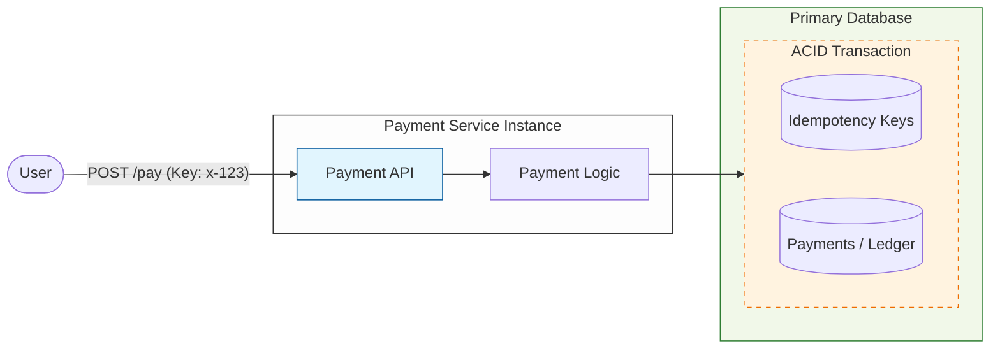
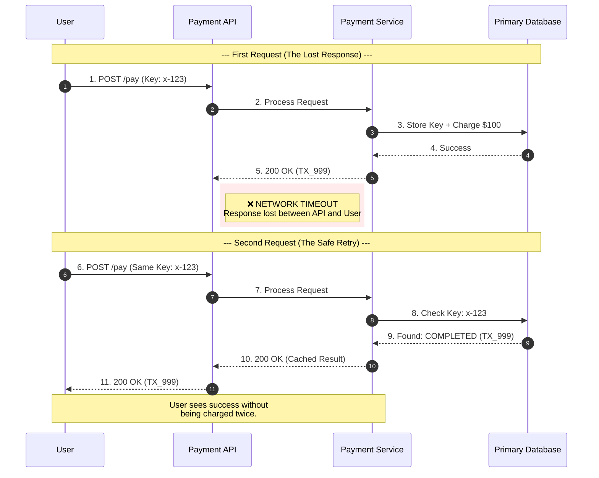
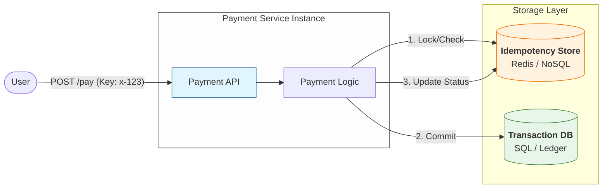
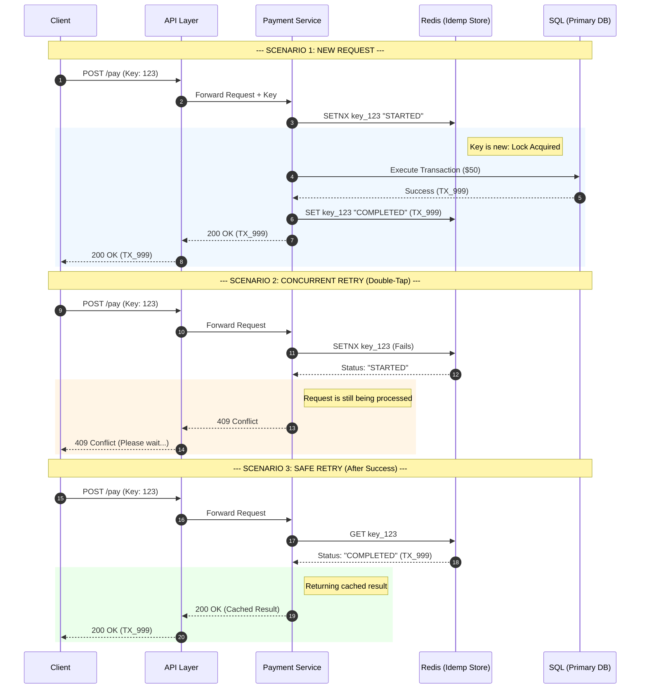

## 1. The Duplicate Request Problem

---

In the previous article we saw that **network failures can cause clients to retry requests**.

Consider the following situation:

```
User initiates payment
Payment processed successfully
Response lost due to network timeout
Client retries request
```

From the server's perspective, two identical requests arrive:

```
POST /payments
amount = $100
```

Without safeguards, the payment service may process both requests.

Result:

```
User charged twice
```

In financial systems this is unacceptable.

The system must guarantee that **retries never create duplicate transactions**.

---

## 2. Why Simple Solutions Do Not Work

---

One might think the system could simply detect duplicate requests by comparing request data.

For example:

```
amount = $100
merchant = ABC
```

However this approach fails.

Two identical requests might represent:

```
Two legitimate payments
```

or

```
A retry of the same payment

```

Since the server cannot reliably distinguish these cases, a different approach is required.

---

## 3. Introducing Idempotency

---

To safely handle retries, payment systems introduce a concept called **idempotency**.

An operation is **idempotent** if repeating it multiple times produces **the same result as executing it once**.

In payment systems this is typically implemented using an **Idempotency Key**.

Example request:

```
POST /payments
Idempotency-Key: 9f7a2c
amount = $100
```

The client generates a unique identifier for the request and sends it along with the payment.

---

## 4. Idempotency Handling

---

When the payment service receives a request with an idempotency key, it performs the following steps:

1. Check whether the key already exists
2. If the key does not exist → process the payment
3. Store the key along with the transaction result
4. If the same key appears again → return the previous result

This ensures that retries **do not execute the payment twice**.

---

## 5. Where Idempotency Data Is Stored

---

The next question is:

> **where should the idempotency data be stored?**

The simplest and most common initial design is to store idempotency information in the **same primary database** that stores payment transactions.

### This approach works well because:

- the system remains simple and easy to reason about
- the payment system already depends on the database for correctness
- idempotency records and payment records can be handled within the **same transaction**

This allows the system to guarantee that the **payment transaction and the idempotency record are written atomically**.

In other words:

```
either the payment and the idempotency record both succeed
or both fail
```

This is actually **one of the biggest reasons systems prefer DB idempotency first**.

In this design, the database stores both:

- the **payment transaction**
- the **idempotency key and its result**

Example architecture:



Inside the database we maintain an **Idempotency Table**.

Example:

```
Idempotency Key | Payment Result | Timestamp
```

When a request arrives:

1. The service checks whether the key already exists.
2. If the key is new → process the payment.
3. Store the key along with the transaction result.
4. If the same key appears again → return the stored result.

Because this can be executed inside a **single database transaction**, the system ensures that:

```
either both the payment and idempotency record are stored
or neither is stored
```

This makes the design **safe and reliable for financial systems**.

---

## 6. Safe Retry Flow

---

With idempotency in place, retries no longer create duplicate transactions.



Even if the client retries the request multiple times, the system returns the **same result instead of executing the payment again**.

This ensures that **retries are safe**.

---

## 7. When Systems Introduce a Dedicated Idempotency Store

---

As the payment system grows, retry checks may become very frequent.

At large scale, continuously querying the primary database for idempotency keys can introduce additional load.

To reduce this pressure, some systems move idempotency data to a **dedicated key-value store** such as:

- Redis
- DynamoDB
- other distributed KV stores

> When idempotency data is stored in a separate system such as Redis it handles **fast request deduplication**,  
> the primary database still remains the **source of truth for financial transactions**.
>
> If inconsistencies occur (for example due to service crashes),  
> the payment service may verify the transaction state in the database  
> before deciding how to handle retries.

Example evolved architecture:



The **core idea remains the same**:

```
Each request is associated with a unique idempotency key.
```

The system checks whether the request has already been processed and **returns the stored result instead of executing the operation again**.

---

## 8. Idempotency Key Workflow

---

A typical flow works as follows:

1. Client generates an idempotency key
2. Client sends request with the key
3. Server checks if the key already exists
4. If not → process the payment
5. Store the result associated with the key
6. If request repeats → return stored result



This mechanism guarantees that **duplicate requests do not create duplicate transactions**.

---

## Key Takeaways

---

- Client retries can cause **duplicate payment requests**.
- Payment systems prevent duplicates using **idempotency keys**.
- The simplest implementation stores idempotency records in the **same transactional database**.
- Larger systems may move idempotency data to a **dedicated key-value store** for performance.

---

## TL;DR

---

Duplicate requests can occur when clients retry payment requests after network failures.

Payment systems prevent duplicate transactions using **idempotency keys**.

Workflow:

1. Client sends request with a unique idempotency key
2. Server checks if the key already exists
3. If not → process the payment
4. Store the transaction result with the key
5. If the request repeats → return the stored result

Key design principles:

- idempotency makes retries **safe**
- the **database is the source of truth**
- Redis or other key-value stores may be used to **optimize lookup performance**

---

### 🔗 What’s Next?

Now that duplicate requests are handled safely, the system can reliably process payments.

However, as the number of users grows, a **single payment server becomes a bottleneck**.

In the next article we will evolve the architecture to support **horizontal scaling**.

👉 **Up Next: →**  
**[Payment System — Scaling the Architecture](/learning/advanced-skills/high-level-design/4_correct-reliable-systems/4_5_scaling-the-architecture)**
