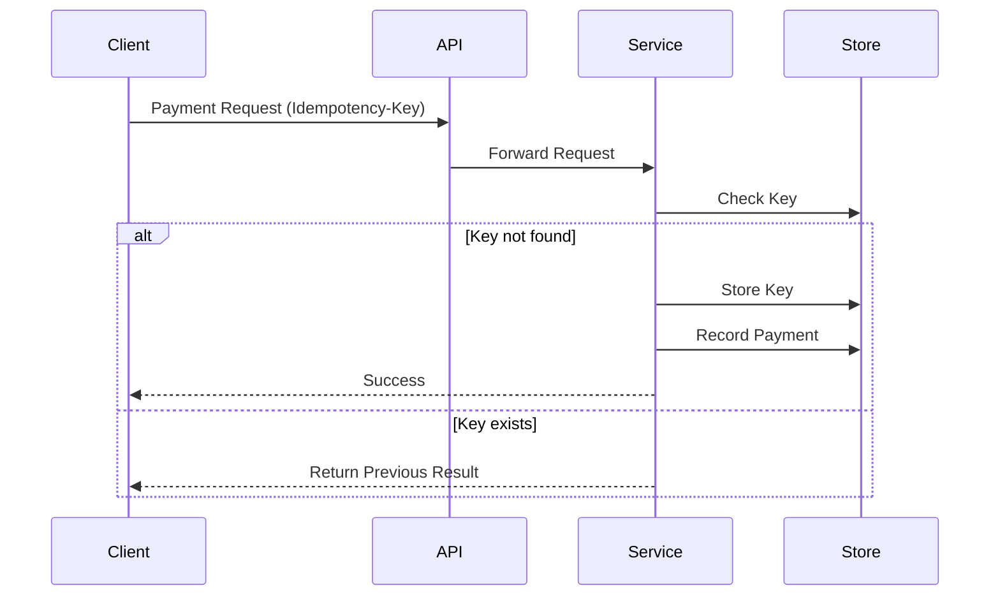
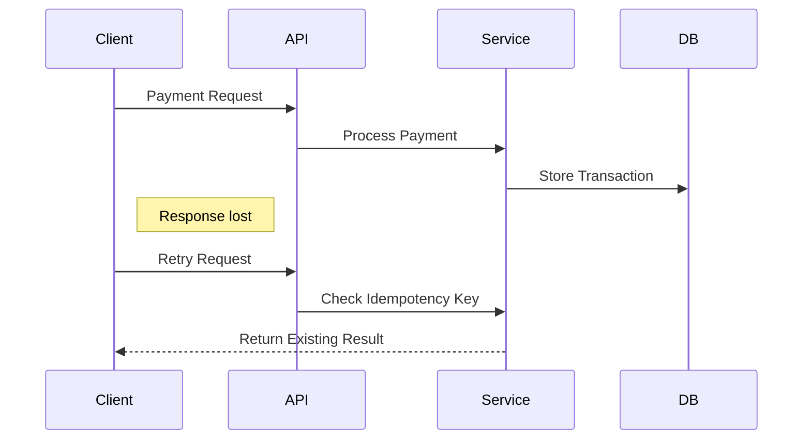

## 1. The Retry Problem in Distributed Systems

---

In the previous article we explored several **failure scenarios in payment systems**, including:

- duplicate requests
- network timeouts
- service crashes
- partial failures

One of the most common causes of duplicate transactions is **client retries**.

Example scenario:

```text
User initiates payment
Payment processed successfully
Network response lost
Client retries request
```

From the client’s perspective, the request failed. But the server may have **already processed the payment**.

If the retry is processed normally, the system may create **two payments instead of one**.

This is one of the most critical problems in distributed financial systems.

---

## 2. What Idempotency Means

---

An operation is **idempotent** if performing it multiple times produces the **same result as performing it once**.

Example:

```text
Create payment request
Request sent twice
System still creates only one payment
```

Mathematically:

```text
f(x) = f(f(x))
```

In distributed systems, idempotency ensures that **repeated requests do not produce duplicate side effects**.

---

## 3. Idempotency in Payment Systems

---

Payment systems often introduce a unique identifier called an **Idempotency Key**.

The client generates this key when making a payment request.

Example request:

```http
POST /payments
Idempotency-Key: 8f3c-7a2b-92d1
```

This key uniquely identifies the operation.

If the request is retried with the same key, the system knows that the operation has **already been attempted**.

---

## 4. Idempotency Key Workflow

---

A typical flow works as follows:

1. Client generates an idempotency key
2. Client sends request with the key
3. Server checks if the key already exists
4. If not → process the payment
5. Store the result associated with the key
6. If request repeats → return stored result



This mechanism guarantees that **duplicate requests do not create duplicate transactions**.

---

## 5. Where Idempotency Data Is Stored

---

Systems typically store idempotency keys in one of the following places:

- **database table**
- **distributed cache (Redis)**
- **transaction log**

Example schema:

```text
Idempotency Table

Key
Request Hash
Response
Timestamp
Status
```

This allows the server to quickly determine whether the operation has already been executed.

---

## 6. Handling Safe Retries

---

With idempotency in place, clients can safely retry requests.

Example retry flow:



Instead of executing the payment again, the system simply **returns the original response**.

---

## 7. Benefits of Idempotency

---

Implementing idempotency provides several advantages:

### Prevents Duplicate Operations

Ensures repeated requests do not create multiple transactions.

### Enables Safe Retries

Clients can retry requests during failures without risking duplicate operations.

### Improves System Reliability

Systems become resilient to network instability and transient failures.

---

## 8. Limitations of Idempotency

---

Idempotency solves duplicate requests but does **not solve all distributed system problems**.

For example:

```text
Payment recorded
Ledger update fails
Notification not sent
```

Here the system still experiences a **partial failure** across multiple services.

Handling such scenarios requires additional coordination mechanisms.

---

## Key Takeaways

---

- Distributed systems must handle request retries safely.
- Idempotent operations ensure duplicate requests do not cause duplicate effects.
- Idempotency keys allow systems to detect and reuse previous results.
- Safe retries are critical for financial systems.

---

### 🔗 What’s Next?

Idempotency prevents duplicate operations, but financial systems must also ensure **data consistency across multiple database replicas**.

👉 **Up Next: →**  
**[Replication and Write Consistency](/learning/advanced-skills/high-level-design/4_correct-reliable-systems/4_6_replication-and-write-consistency)**
