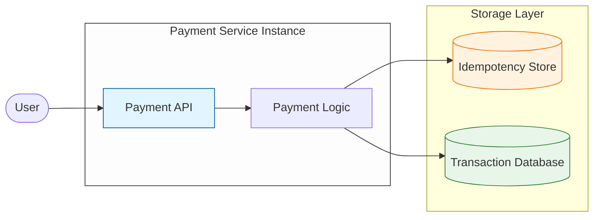
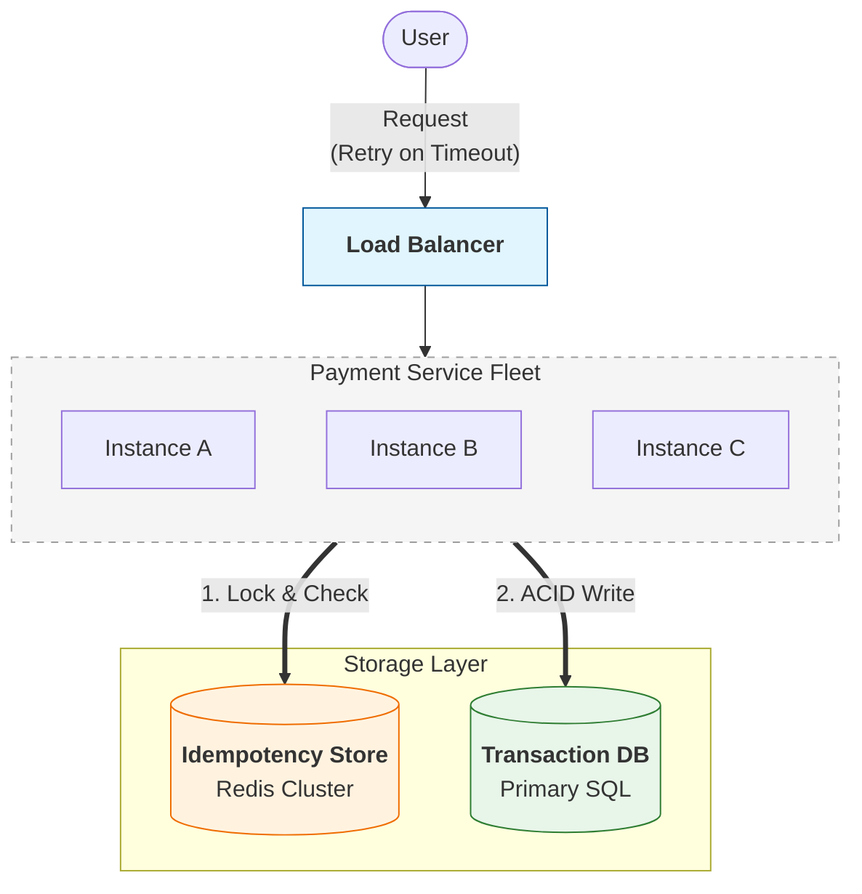
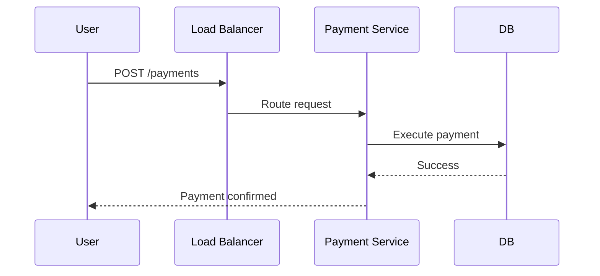

## 1. When a Single Payment Server Is Not Enough

---

So far our payment system architecture looks like this.



This architecture works well for **small systems**.

However, real payment platforms must support:

- thousands of concurrent users
- traffic spikes during peak hours
- high availability requirements

As traffic grows, **a single server becomes a bottleneck**.

Typical symptoms include:

```
High CPU utilization
Increasing request latency
Service crashes under peak load
```

To support higher traffic, the system must process **many requests in parallel**.

---

## 2. Introducing Horizontal Scaling

---

Instead of running a single payment service, the system can run **multiple service instances**.

A **load balancer** distributes incoming requests across these instances.



This architecture improves:

- **scalability** — more requests processed simultaneously
- **availability** — if one service instance fails, others continue serving traffic
- f**ault tolerance** — traffic can be redistributed automatically

At this point, our system has evolved into a **distributed architecture**.

---

## 3. Payment Flow in the Scaled System

---

A payment request now flows through the system as follows.



From the user’s perspective, nothing changes.

The system simply becomes capable of handling **more requests concurrently**.

---

## 4. Idempotency Still Protects Retries

---

The idempotency mechanism introduced earlier continues to work in the scaled architecture.

If a client retries a request with the same idempotency key:

```
POST /payments
Idempotency-Key: abc123
```

any service instance can check the idempotency store or database and return the **previous result instead of executing the payment again**.

This ensures retries remain **safe even when multiple servers are running**.

---

## 5. A New Class of Problems Appears

---

Horizontal scaling solves the **traffic bottleneck**, but it introduces new challenges.

Multiple service instances may now:

> **update the same account simultaneously**

Example scenario:

```
User balance = $100
Two payments arrive at the same time
Service A processes payment
Service B processes payment
```

Without careful coordination, this may result in:

```
incorrect account balances
race conditions
inconsistent financial state
```

As payment traffic grows further, another pressure also appears:

> **large numbers of read requests**

Examples include:

- checking payment status
- viewing transaction history
- fetching account balances

Handling these efficiently requires evolving the **database architecture**.

---

## Key Takeaways

---

- A single payment server cannot handle large-scale traffic.
- Horizontal scaling introduces multiple service instances.
- A load balancer distributes requests across the service fleet.
- Idempotency ensures retries remain safe even in distributed systems.
- Scaling the application tier introduces new consistency challenges.

---

## TL;DR

---

- Payment systems start with a **single server architecture**.
- As traffic grows, systems scale using **multiple service instances behind a load balancer**.
- Idempotency keys continue to protect against duplicate requests.
- Distributed architectures introduce new problems such as **concurrent updates and consistency issues**.

---

### 🔗 What’s Next?

As payment traffic grows, databases must serve large numbers of read requests.

To handle this load, systems introduce database replication.

However, replication introduces a new challenge:

```
replication lag and stale reads
```

👉 **Up Next: →**  
**[Payment System — Replication Lag and Stale Reads](/learning/advanced-skills/high-level-design/4_correct-reliable-systems/4_6_replication-lag-and-stale-reads)**
