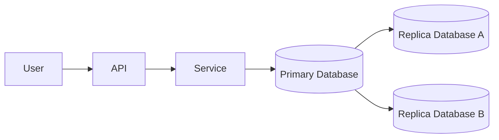
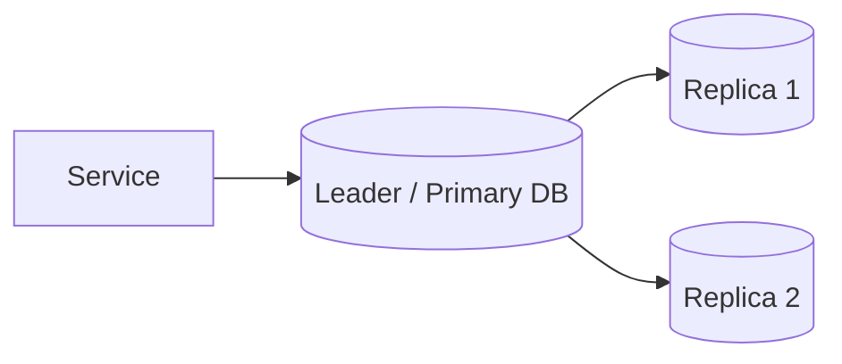
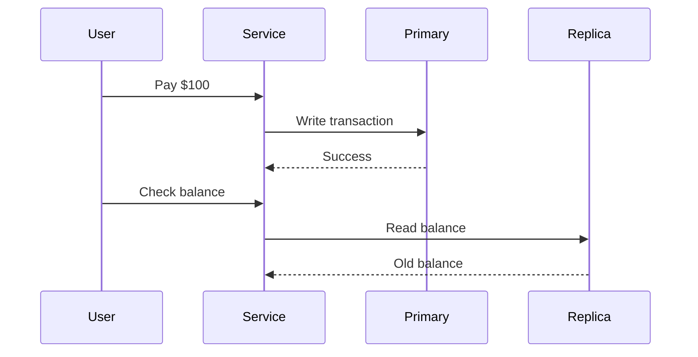
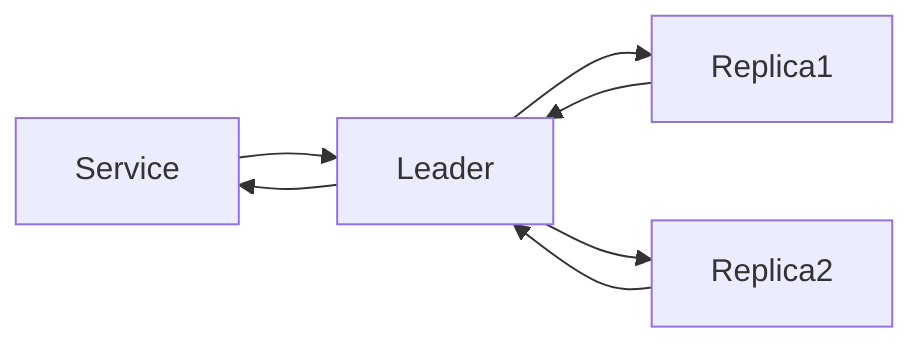
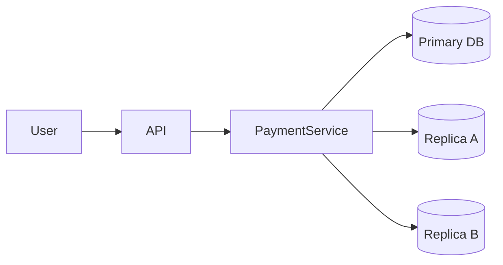
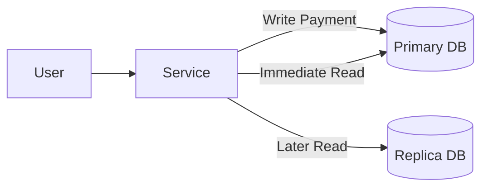

## 1. Why Replication Exists

---

In previous articles we designed a payment system capable of handling requests across multiple servers.

However, a single database can quickly become a **bottleneck**.

Large systems solve this by introducing **database replication**.

Replication means maintaining **multiple copies of the same database** across different servers.

Example architecture:



This architecture improves:

- read scalability
- availability
- fault tolerance

If one database node fails, another replica can continue serving requests.

---

## 2. Leader–Follower Replication

---

Most distributed databases implement **leader–follower replication** (also called primary–replica replication).

In this model:

- one node acts as the **leader (primary)**
- other nodes act as **followers (replicas)**



The leader handles **write operations**, while replicas handle **read operations**.

This architecture allows systems to scale reads while maintaining a single source of truth for writes.

---

## 3. Replication Lag

---

Replication does not occur instantly.

When the leader processes a write, the update must be **propagated to replicas**.

This propagation introduces a delay called **replication lag**.

Example timeline:

```text
T1: Payment written to leader
T2: Leader confirms success
T3: Replicas receive update
```

During the period between **T1 and T3**, replicas may still contain **stale data**.

---

## 4. Read‑After‑Write Problem

---

Replication lag introduces a classic distributed systems problem called **read‑after‑write inconsistency**.

Example scenario:

```
User sends payment
Primary database records payment
User immediately checks balance
```

If the read request goes to a **replica that has not yet received the update**, the user may see an outdated balance.



This behavior is unacceptable in many financial systems.

---

## 5. Strategies for Write Consistency

---

Systems use several strategies to ensure consistent reads after writes.

### 1. Read from Leader

After a write operation, the system temporarily routes reads to the **primary database**.

```
Write → Read from leader
```

This guarantees the client sees the latest data.

---

### 2. Read‑Your‑Writes Consistency

Some systems guarantee that a client always sees its own writes.

This can be implemented by:

- session routing
- version tracking
- client tokens

---

### 3. Synchronous Replication

In synchronous replication, the leader waits for replicas to acknowledge the write before confirming success.



This improves consistency but increases **write latency**.

---

## 6. Trade‑Offs of Replication

---

Replication introduces several trade‑offs.

| Benefit             | Cost                        |
| ------------------- | --------------------------- |
| Higher availability | Replication lag             |
| Scalable reads      | Increased system complexity |
| Fault tolerance     | Consistency challenges      |

Distributed systems must carefully balance **consistency, availability, and performance**.

---

## 7. Replication in Payment Systems

---

In payment systems, replication must be designed carefully because financial operations require **strong correctness guarantees**.

Typical strategy:

- **writes go to the primary database**
- **critical reads use the primary database**
- **non‑critical reads use replicas**

Example architecture:



This architecture allows the system to scale reads while maintaining a **single source of truth for writes**.

---

### 7.1 What Are Critical Reads?

A **critical read** is a read operation that must return the **most up-to-date data**.

Examples in a payment system include:

- checking payment status immediately after submitting a payment
- verifying an account balance after a transaction
- confirming whether a transaction succeeded or failed
- retrieving a newly created order or payment record

If these reads go to a **replica experiencing replication lag**, the user may see **incorrect or outdated data**.

For financial systems, this behavior is unacceptable.

---

### 7.2 How Systems Route Critical Reads

The routing decision is typically handled by the **application service or data access layer**.

Example logic:

```java
if request requires strong consistency
    read from primary database
else
    read from replica
```

In practice, systems implement this in several ways.

#### Read-After-Write Routing

After a user performs a write operation (such as submitting a payment), the system may temporarily route all reads from that user to the **primary database**.



This ensures the user always sees the **latest state of their transaction**.

---

### 7.3 When Replicas Are Safe to Use

Replicas are typically used for non-critical reads, such as:

- transaction history
- reporting queries
- analytics dashboards
- historical account statements

These queries can tolerate **slightly stale data**, making replicas ideal for improving read scalability.

This hybrid strategy allows payment systems to balance:

- **strong correctness for transactions**
- **high scalability for read-heavy workloads**

---

## 8. Why Replication Is Not Enough

---

Even with replication, systems may still face problems such as:

```
Payment recorded
Ledger update fails
Notification not sent
```

These problems occur because **multiple services must coordinate to complete a single business operation**.

Handling these scenarios requires mechanisms for coordinating work across services.

---

## Key Takeaways

---

- Replication improves availability and read scalability.
- Leader–follower replication separates reads and writes.
- Replication lag can cause stale reads.
- Systems must implement strategies to ensure write consistency.

---

### 🔗 What’s Next?

Even if the database is consistent, distributed systems must coordinate **multiple services involved in a single business transaction**.

👉 **Up Next: →**  
**[Coordinating Distributed Work (Saga / Orchestration)](/learning/advanced-skills/high-level-design/4_correct-reliable-systems/4_7_coordinating-distributed-work)**
