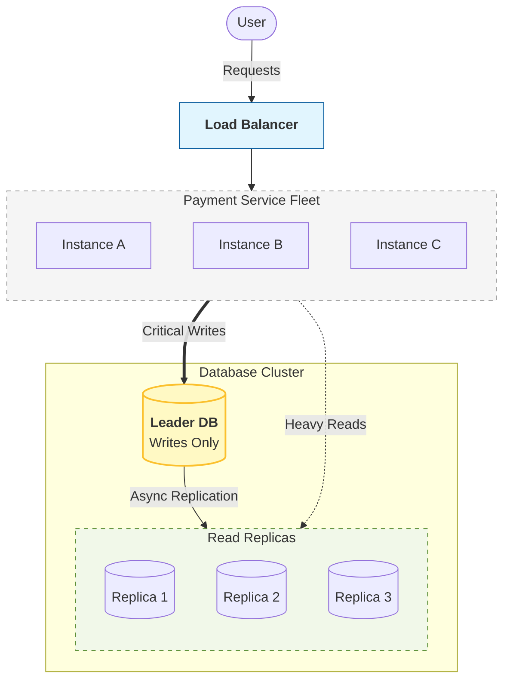
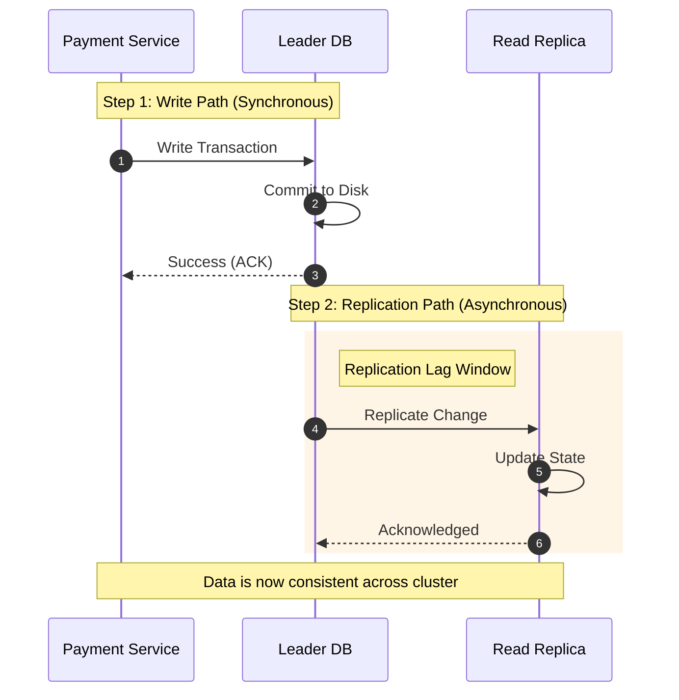
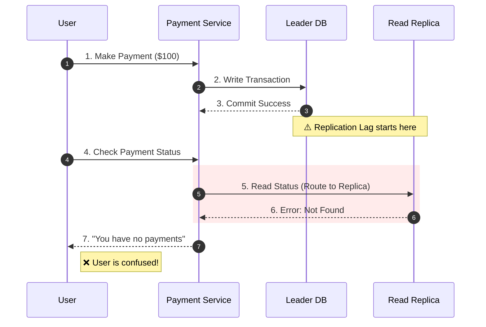
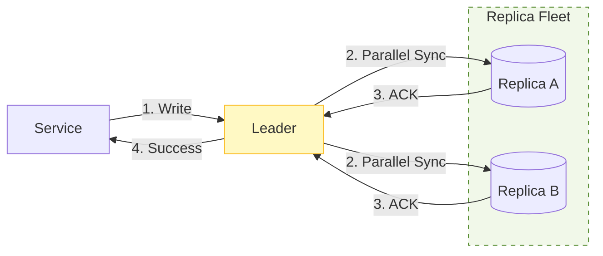

## 1. The Next Scaling Pressure

---

In the previous article we scaled the **payment service layer** using multiple service instances behind a load balancer.

That solved the compute bottleneck, but as the platform grows another bottleneck appears:

> **reads explode.**

Payment systems receive a large number of **read requests** such as:

- checking payment status (“Did my payment go through?”)
- viewing transaction history
- retrieving balances and limits

If every read request goes to the **same primary database**, you typically see:

```
high database CPU usage
increasing p95/p99 query latency
connection pool saturation
```

To scale read traffic, systems introduce **database replication**.

---

## 2. Introducing Database Leader–Replica Replication

---

Replication allows the system to create **multiple copies of the database**.

A common architecture is the **leader–follower (a.k.a. primary–replica) model**.

In this model:

- **writes go to the leader (primary database)**
- **read queries can be served by follower replicas**



Why this helps:

- replicas absorb **heavy read traffic**
- leader focuses on **writes + durability**
- availability improves (a replica can be promoted if the leader fails)

But replication introduces a correctness risk:

> replicas can be behind.

---

## 3. How Replication Works

---

In a leader–replica setup, there are two timelines:

1. **Write timeline (client-facing)**: leader database receives all **write operations**, it commits and returns success
2. **Replication timeline (background)**: replicas apply the change later and become consistent with the leader



The gap between these timelines is the **replication lag window**.

---

## 4. The Read-After-Write Problem: Replication Lag

---

In many real systems, replication is **asynchronous**.

This means the leader does not wait for replicas to apply the changes before responding.

As a result, replicas may temporarily contain **older data**.

This delay is known as **replication lag**.

Example scenario:



Even though the payment was successfully recorded in the leader database, the replica may still return **outdated information**.

This situation is called a **stale read**.

---

## 5. Why Stale Reads Are Dangerous for Payments

---

For many applications, stale reads are acceptable (like _social media feeds_, _analytics dashboards_, r*ecommendation systems* etc...)

In payments, stale reads can cause:

- **user confusion** (“Did it fail? Should I retry?”)
- **incorrect UX** (“payment pending/not found” right after success)
- **unsafe downstream decisions** (balance shown incorrectly)
- **higher support/dispute load**

Important connection:

> Stale reads can trigger retries — and retries are exactly what we worked to make safe via idempotency.

So we must decide which reads require stronger guarantees.

---

## 6. Classifying Reads: Critical vs Non-Critical

---

A practical production rule is:

```text
Writes             → Leader
Critical reads     → Leader
Non-critical reads → Replicas
```

### Critical reads (must reflect the latest write)

These reads affect **money movement or correctness** and must be served from the leader:

- payment status immediately after a payment (“Did it succeed?”)
- balance checks after a debit/credit
- “can I place this order?” checks that depend on latest available funds
- fraud/risk checks that depend on the latest state

### Non-critical reads (can tolerate some staleness)

These reads are safe to serve from replicas because a few seconds of lag does not break correctness:

- transaction history pages
- reporting and analytics
- batch reconciliation views

This classification is what lets systems scale reads **without breaking correctness**.

---

## 7. Practical Strategies to Reduce Stale Reads

---

We’ll keep this section practical. Deeper theory and database-specific details will be covered later in the **Concepts** section.

### 7.1 Read from Leader (Strong Consistency)

Simplest rule:

```text
If correctness matters → read from leader
```

**Trade-off:** the leader sees more read traffic.

---

## 7.2 Read-Your-Writes Consistency (Session Consistency)

After a user performs a write, route that user’s subsequent reads to the leader for a short period.

Common implementations:

- a short-lived **session flag** (e.g., “force leader reads for 5–30s”)
- a **read token** returned after the write that forces leader reads
- a shared “recent-write marker” keyed by user/account in a shared store

**Benefit:** most reads still hit replicas, but the user who just wrote sees correct state.

---

## 7.3 Synchronous Replication (Stronger Consistency, Higher Latency)

Make the leader wait for one or more replicas before acknowledging success.



**Trade-off:** higher write latency. Typically used only when the business requirement demands it.

---

## 7.4 Quorum Reads/Writes (When Supported)

Some databases support quorum semantics:

- a write is acknowledged by W nodes
- a read is served from R nodes

With a quorum rule (e.g., R + W > N), you reduce stale reads.

(Exact behavior varies by database; deep dive will live in the Concepts section.)

---

## 8. What We Use in This Payment System Design

---

For our Phase 3 payment system, we choose a **simple, production-realistic default** that prioritizes correctness:

```text
Writes             → Leader
Critical reads     → Leader
Non-critical reads → Replicas
```

On top of that, we apply **Read-Your-Writes** for a short window after a payment so the user doesn’t see confusing stale status immediately after a successful write.

We treat **synchronous replication** and **quorum reads/writes** as advanced options that may be adopted under stricter durability/consistency requirements or when the underlying database supports them well.

---

## 9. Observability: How Teams Monitor Replication Lag

---

Replication lag is not theoretical — teams measure it.

Common signals:

- replica lag time (seconds behind leader)
- replication queue depth / WAL(Write-Ahead Log) backlog
- “read-after-write mismatch” rate (status not found right after write)

When lag grows, systems may temporarily:

- route more reads to the leader
- shed non-critical read traffic
- scale replicas / investigate hotspots

---

## 10. Note on Write-Heavy Systems

---

Leader–replica replication scales **reads**, but it does **not scale writes horizontally**.

All writes still go through the leader, which can become a bottleneck under extreme write volume.

Write-heavy scaling strategies (e.g., **sharding / partitioned leaders**) belong in the **Large-Scale System Design** portion of this learning path.

---

## Key Takeaways

---

- Replication scales **reads**, not writes.
- Asynchronous replication introduces **replication lag**.
- Lag causes **stale reads**, which is dangerous for payments.
- Production systems classify reads into **critical** (leader) vs **non-critical** (replicas).
- Practical mitigations include **leader reads**, **read-your-writes**, and sometimes **synchronous replication / quorum semantics**.
- In our design, we use **leader for critical reads + read-your-writes**, and replicas for non-critical reads.

---

## TL;DR

---

- Large payment systems scale databases using **leader–replica replication**.
- Writes go to the **leader**, reads may go to **replicas**.
- Replicas can be behind (replication lag) → stale reads.
- Route correctness-sensitive reads to the leader; use read-your-writes to keep UX consistent after a payment.
- Consider synchronous replication / quorum reads only when requirements justify the latency/complexity.

---

### 🔗 What’s Next?

Replication improves scalability but introduces a new challenge.

How does the system ensure **correct reads and writes when multiple replicas exist**?

In the next article we explore how payment systems maintain **write consistency and safe database reads**.

👉 **Up Next: →**  
**[Payment System — Replication and Write Consistency](/learning/advanced-skills/high-level-design/4_correct-reliable-systems/4_7_replication-and-write-consistency)**
