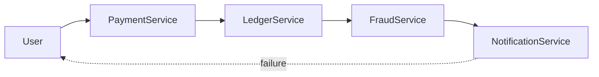
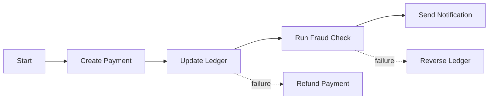
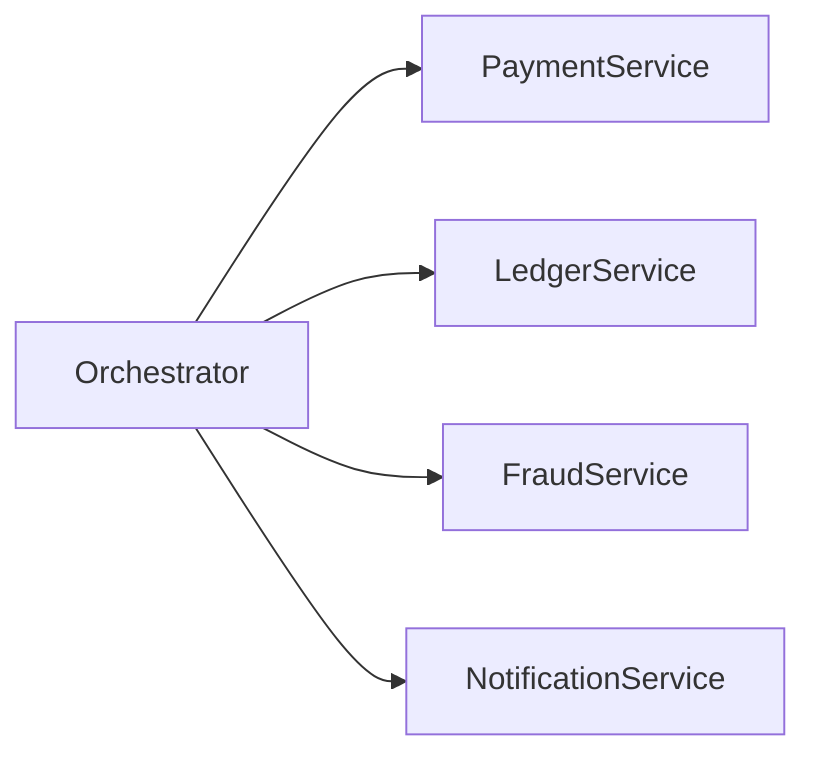
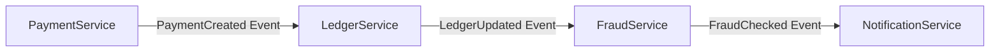
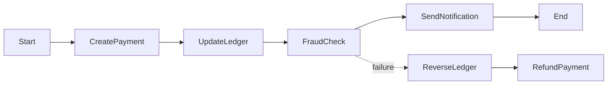

## 1. The Next Problem: Multi‑Service Transactions

---

In previous articles we solved several reliability challenges in payment systems:

- duplicate requests → **idempotency**
- replication lag → **write consistency strategies**

However, another major challenge appears in modern architectures.

Real payment systems rarely involve a **single service**.

A typical payment may involve multiple services such as:

```
Payment Service
Ledger Service
Fraud Detection Service
Notification Service
```

Example flow:

```
User makes payment
→ Payment recorded
→ Ledger updated
→ Fraud check executed
→ Notification sent
```

These steps together form a **single business operation**.

But each step may run on **different services and databases**.

---

## 2. The Partial Failure Problem

---

When multiple services participate in a workflow, failures can occur **midway through the process**.

Example scenario:

```
Payment recorded successfully
Ledger update fails
```

Now the system enters an **inconsistent state**.

Another example:

```
Payment recorded
Ledger updated
Notification service fails
```



Even though the payment succeeded, part of the workflow failed.

Distributed systems must therefore ensure that **multi‑service operations remain consistent**.

---

## 3. Why Traditional Database Transactions Do Not Work

---

In a single database, we could solve this problem using **ACID transactions**.

Example:

```text
BEGIN TRANSACTION
Update balance
Insert transaction record
COMMIT
```

If any step fails, the database performs a **rollback**.

However, this approach breaks down in distributed architectures because:

- different services own different databases
- cross‑service transactions are expensive
- network failures make global locking risky

For this reason, modern distributed systems avoid **global database transactions**.

Instead, they use coordination patterns.

---

## 4. The Saga Pattern

---

The **Saga pattern** is one of the most common solutions for distributed transactions.

A Saga breaks a large transaction into **multiple smaller steps**.

Each step:

- performs a local transaction
- triggers the next step

If a step fails, the system executes **compensating actions** to undo previous steps.

Example saga for a payment:



Instead of rolling back everything at once, the system **reverses completed steps**.

---

## 5. Orchestration vs Choreography

---

There are two common ways to implement a Saga.

### Orchestration

A central **orchestrator service** controls the workflow.



The orchestrator decides:

- which step runs next
- what to do when failures occur

Advantages:

- easier to understand workflows
- centralized error handling

Trade‑off:

- orchestrator becomes a critical component

---

### Choreography

In choreography, services communicate through **events** instead of a central controller.

Example:



Each service reacts to events and triggers the next step.

Advantages:

- loosely coupled architecture
- easier to scale services independently

Trade‑off:

- workflows become harder to trace and debug

---

## 6. Compensating Transactions

---

When a Saga step fails, the system must undo previous steps using **compensating actions**.

Examples:

```
Payment processed → Refund payment
Ledger updated → Reverse ledger entry
Inventory reserved → Release inventory
```

Compensating actions restore the system to a **consistent business state**.

Note that this is different from database rollback.

Instead of undoing a database operation automatically, the system performs a **new business operation that reverses the previous one**.

---

## 7. Real‑World Example: Payment Workflow

---

A simplified payment Saga might look like this:



This workflow ensures that **even when failures occur, the system eventually reaches a consistent state**.

---

## Key Takeaways

---

- Distributed systems often involve **multi‑service workflows**.
- Partial failures can leave systems in inconsistent states.
- The **Saga pattern** coordinates distributed transactions safely.
- Systems may use **orchestration or choreography** to implement workflows.
- Failures are handled using **compensating transactions**.

---

### 🔗 What’s Next?

We have now explored the key reliability challenges in distributed payment systems.

In the next article we will summarize the major architectural concepts introduced in **Phase 3**.

👉 **Up Next: →**  
**[Phase 3 Summary — Designing Reliable Distributed Systems](/learning/advanced-skills/high-level-design/4_correct-reliable-systems/4_7_coordinating-distributed-work)**
