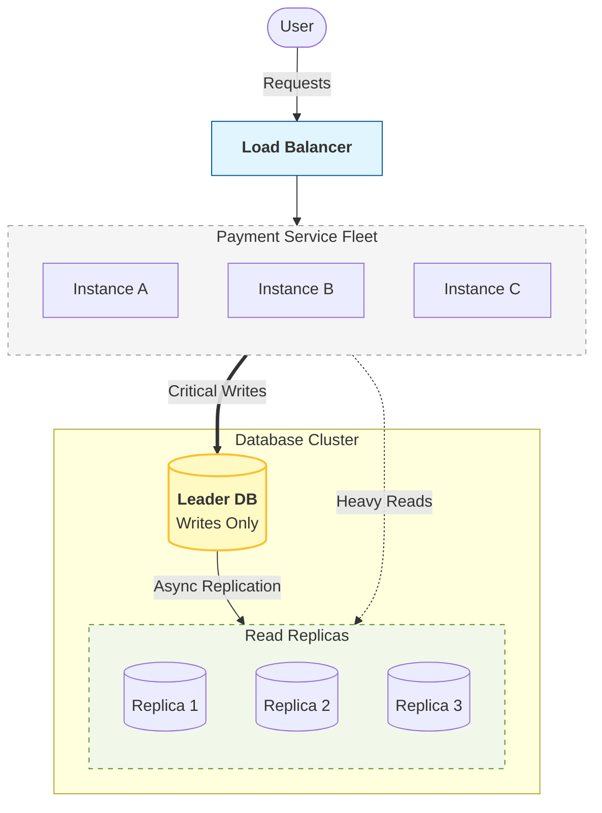
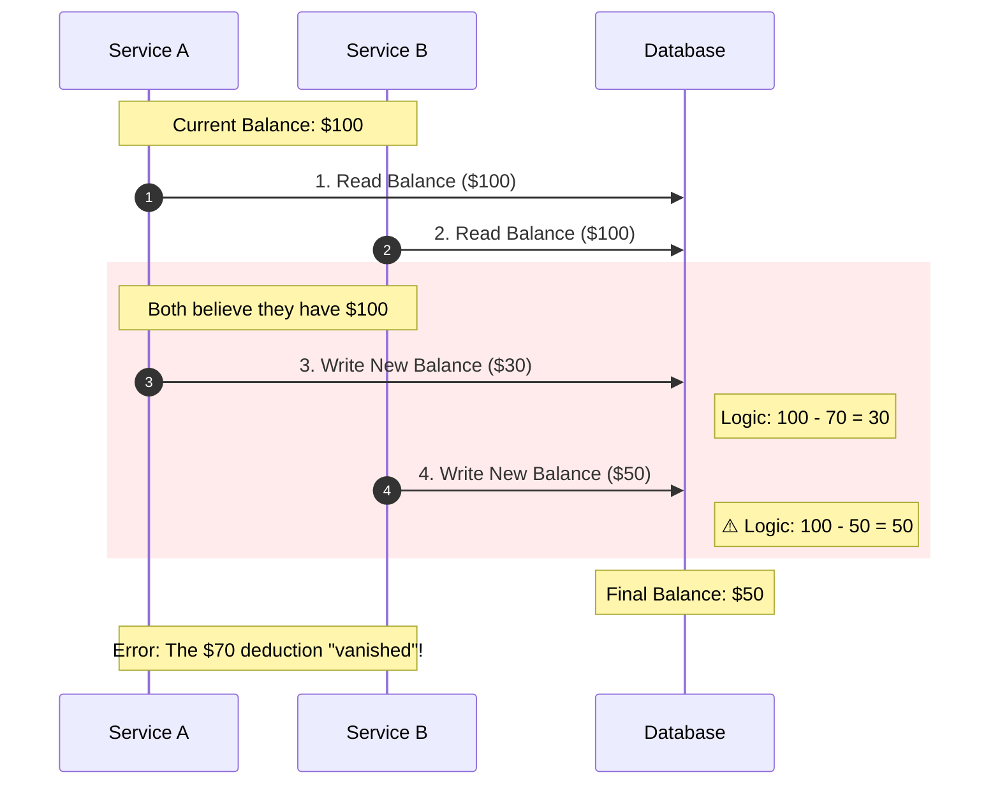
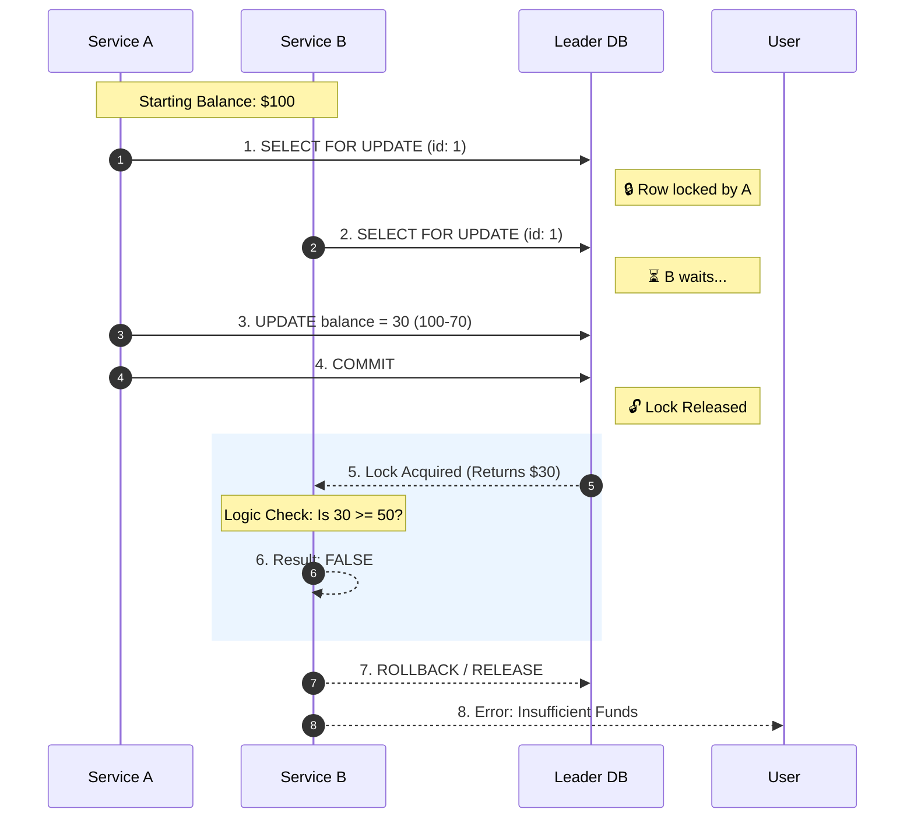

## 1. Why This Article Exists

---

In the previous article we introduced **leader–replica replication** to scale reads and discussed **replication lag / stale reads**.



At this point our payment system has:

- multiple payment service instances behind a load balancer
- a **leader database** that accepts writes
- replicas that serve read traffic

Now a new correctness problem becomes unavoidable:

> **Multiple service instances can write concurrently to the same account.**

Replication scales reads. It does **not** automatically make concurrent writes safe.

This article focuses on **write correctness**.

---

## 2. The Problem: Race Conditions on Account Balance

---

Consider the following scenario.

```
Account Balance = $100

Request A → Pay $70
Request B → Pay $50
```

Two payment service instances process these requests at nearly the same time.



If both succeed, the system **deducts $120** from an account that only had **$100**.

That violates a core invariant of payments:

```
Balance must never go below 0.
```

This leads to an **incorrect account balance**.

This type of issue is known as a **race condition**.

---

## 3. Why Horizontal Scaling Increases This Risk

---

In a single‑server architecture, requests are often processed sequentially.

However, once we introduce:

- multiple service instances
- load balancing
- distributed request handling

many operations may run **in parallel**.

This makes race conditions much more likely.

Financial systems must therefore ensure that **concurrent writes remain safe and consistent**.

---

## 4. The Baseline Tool: Transactions and Isolation

---

Most payment systems rely on **ACID database transactions** to guarantee correctness.

ACID stands for:

```
Atomicity
Consistency
Isolation
Durability
```

For concurrency control, the most important property is **Isolation**.

Isolation ensures that concurrent operations behave **as if they were executed one at a time** (to the degree required by the chosen isolation level).

This prevents multiple transactions from corrupting shared data.

We will not deep-dive isolation levels here (that belongs in the Concepts section), but we will use isolation via practical strategies below.

---

## 5. Practical Write Consistency Strategies

---

There are three common strategies teams use to prevent race conditions in payment flows.

### 5.1 Pessimistic Concurrency (Row Locking)

In pessimistic locking, the database locks the account row while processing the payment.

Typical pattern:

```sql
SELECT balance FROM accounts WHERE account_id = ? FOR UPDATE;
```

This guarantees that only one transaction can modify that row at a time.

Example flow:



Because the database locks the row, only **one transaction updates the balance at a time**.

This prevents the race condition shown earlier.

#### Pros

- strongest correctness
- straightforward reasoning

#### Trade-offs

- reduced throughput under hot accounts (contention)
- lock waits/timeouts must be handled

This is common in strict money movement paths.

---

### 5.2 Optimistic Concurrency (Version / Compare-and-Swap)

In optimistic locking, we avoid holding locks and instead detect conflicts.

Approach:

- each account row has a version
- reads return balance + version
- update succeeds only if the version is unchanged

Example pattern:

```sql
UPDATE accounts
SET balance = ?, version = version + 1
WHERE account_id = ? AND version = ?;
```

If 0 rows are updated, someone else wrote first.

The service retries by re-reading the latest state.

#### Pros

- higher throughput when conflicts are rare
- avoids long lock waits

#### Trade-offs

- retries are required under contention
- hot accounts can cause repeated conflicts

---

### 5.3 Atomic Update (Single-Statement Funds Check)

This is a highly practical pattern that avoids the read-modify-write race entirely.

Instead of:

```text
Read balance
Check balance >= amount
Write new balance
```

perform the check and update in **one atomic SQL statement**:

```sql
UPDATE accounts
SET balance = balance - :amount
WHERE account_id = :id AND balance >= :amount;
```

Interpretation:

- affected rows = 1 → debit succeeded, proceed
- affected rows = 0 → insufficient funds

This is concurrency-safe because the database executes the statement atomically.

#### Pros

- very fast
- minimal lock time
- perfect for “balance must not go below zero” invariants

#### Trade-offs

- best for simple invariants
- multi-row invariants (e.g., transfer between two accounts) may still require explicit transactions + locking

---

## 6. What We Use in This Payment System Design

---

For our Phase 3 payment system, we use a simple and production-realistic combination:

1. **Leader DB as the single write authority**
2. **ACID transaction** for “balance update + payment record”
3. Balance update performed using an **atomic update** (funds check + debit in one statement)

High-level flow:

```text
BEGIN TRANSACTION
1) Atomic debit: UPDATE ... WHERE balance >= amount
2) If debit succeeded: insert payment transaction record
3) COMMIT
Else: ROLLBACK (insufficient funds)
```

This ensures that under concurrency:

- balances remain correct
- only one conflicting payment succeeds
- failure is clean and deterministic

> If **later we add more complex invariants (holds, limits, multi-account transfers)**, we can extend this with **pessimistic locking** or **optimistic version checks**.

---

## 7. How Replication Fits (One-Line Rule)

---

To avoid mixing with the previous article:

```text
All writes happen on the leader DB.
Replicas never accept writes.
```

The leader’s commit log defines the write order.

---

## Key Takeaways

---

- Horizontal scaling introduces **concurrent write risk**.
- Payment systems must protect invariants like **non-negative balance**.
- Concurrency control is achieved through transaction isolation + practical patterns:
  - pessimistic locking
  - optimistic version checks
  - atomic single-statement updates
- In our design, we use **leader writes + ACID transaction + atomic debit update**.

---

## TL;DR

---

- Replication scales reads; write correctness still needs concurrency control.
- Prevent race conditions using locking, optimistic versioning, or atomic updates.
- Best practical default for balances:

```sql
  UPDATE ... SET balance = balance - amount WHERE balance >= amount.
```

---

### 🔗 What’s Next?

Now that our payment system handles:

- duplicate requests (idempotency)
- scaling (service fleet)
- stale reads (replication strategies)
- safe concurrent writes (concurrency control)

However, distributed systems can still fail **halfway through multi‑service operations**.

For example:

```
Payment recorded
Notification service fails
```

In the next article we will explore how systems handle **partial failures across services**.

👉 **Up Next: →**  
**[Payment System — Partial Failure Across Services](/learning/advanced-skills/high-level-design/4_correct-reliable-systems/4_8_partial-failure-across-services)**
