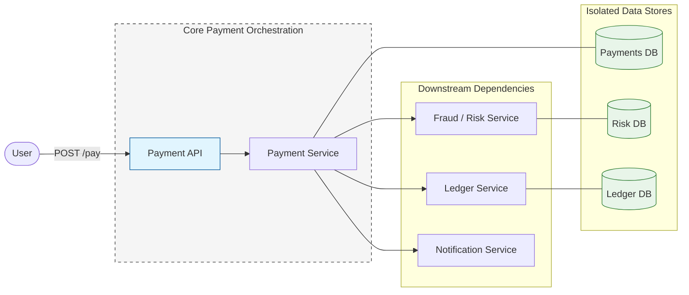
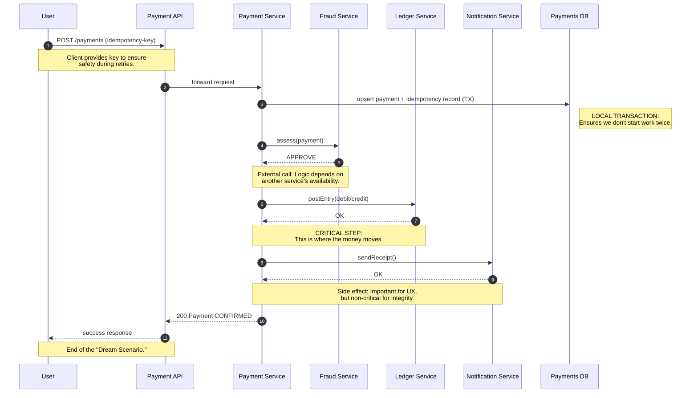

## 1. Why This Article Exists

---

So far in Phase 3 we strengthened the core payment path:

- **Retries are safe** (idempotency)
- **Concurrent writes are safe** (transactions + concurrency control)
- **Reads are safer under replication** (critical reads from leader + read-your-writes)

However, a real payment system is not a single database write.

A payment is a **workflow** that touches multiple services.

And this is where the next class of failures appears:

> **One step succeeds, another step fails.**

This is called a **partial failure**.

---

## 2. Baseline Multi-Service Architecture

---

A realistic payment workflow involves multiple components.

A simplified baseline architecture:

Even in this “simplified” diagram, notice the problem:

- **each service owns its own database**
- there is **no single transaction** that can atomically cover:
  - payment record
  - ledger entry
  - fraud decision
  - notification

So we move from a single-system correctness problem to a **distributed workflow correctness** problem.

---

## 3. The Happy Path Workflow (What We Want)

---

Let’s define the _intended_ workflow for a payment attempt:

1. User submits a payment request.
2. Payment Service creates/updates the payment record (idempotent).
3. Payment Service checks/records fraud/risk outcome.
4. Payment Service writes the money movement to the ledger.
5. Payment Service triggers notification.

A typical “happy path” sequence might look like this:

On paper, this seems reasonable.

In production, this is where things break.

---

## 4. The Hidden Problem: Partial Failures (Real Scenarios)

---

In distributed systems, _anything_ can fail:

- one service is down
- a downstream call times out
- a DB becomes slow or overloaded
- a message is delivered twice
- a response is lost (even if the receiver processed it)

Partial failure means:

> **The system makes progress, but not uniformly.**

Below are a few high-impact scenarios.

### 4.1 Scenario A — Payment saved, ledger write fails

- Payment Service successfully writes:
  - payment record = `CONFIRMED` (or `AUTHORIZED`)
- It then calls Ledger Service
- Ledger is down or times out
- The request fails back to the user

**User experience:**

- App shows “payment failed”
- But money may already be reserved/deducted (depending on your model)
- Support tickets begin: “Money deducted but order failed”

**System state:**

- Payments DB says “done”
- Ledger DB does not have the corresponding entry

This is a **financial mismatch**.

---

### 4.2 Scenario B — Ledger succeeds, notification fails

- Payment recorded
- Ledger entry posted
- Notification service fails
- User does not receive confirmation

This sounds “minor”, but it creates real cost:

- customer confusion
- repeated retries
- duplicate support load
- disputes and chargebacks

---

### 4.3 Scenario C — Fraud check times out, but the fraud service actually processed it

This is subtle and extremely common.

- Payment Service calls Fraud Service
- Fraud Service evaluates and decides `DECLINE`
- But the response is lost / times out
- Payment Service sees a timeout and treats it as “unknown”

If we retry blindly, we might:

- re-run fraud evaluation multiple times
- create inconsistent fraud audit trails
- or proceed to ledger without a clear decision

This is the classic:

> **Did it fail, or did we just not hear back?**

---

## 5. Why This Is Hard: “Local Correctness ≠ Global Correctness”

---

Inside one service boundary, we can often guarantee correctness:

- ACID transaction
- idempotency key
- locking / concurrency control

But across services:

- each service commits independently
- failures can happen between commits
- there is no shared atomic transaction

So you can end up with:

- **payment committed**
- **ledger not committed**
- **fraud state unknown**
- **notification missing**

Each service is “locally correct”.

The overall system is “globally inconsistent”.

This is why distributed workflows require new design tools.

---

## 6. Early Warning Signals You’ll See in Production

---

If your payment workflow suffers partial failures, the symptoms are usually visible before the architecture is fixed.

Common signals:

- **stuck states**
  - payments stuck in `PENDING`, `PROCESSING`, or `UNKNOWN`
- **mismatch metrics**
  - payments confirmed but no ledger entry
  - ledger entry exists but payment not confirmed
- **reconciliation load increases**
  - teams writing scripts to compare DBs
  - daily “mismatch reports”
- **support tickets spike**
  - “Money deducted, order not placed”
  - “I paid twice”
- **manual compensations become routine**
  - refunds initiated manually
  - ledger adjustments by operations

A reliable system treats these as engineering problems, not operational chores.

---

## 7. Why Naive Fixes Fail

---

When teams first encounter partial failures, they often try “simple” fixes that make things worse.

### 7.1 Naive fix 1 — “Just retry everything”

Retries are necessary, but without boundaries they amplify chaos:

- downstream sees duplicates (unless every step is idempotent)
- retries multiply load during incidents
- repeated ledger posts become catastrophic

Retries must be **idempotent + state-aware**, not blind.

### 7.2 Naive fix 2 — “Make it synchronous end-to-end”

Teams try to do:

Payment → Fraud → Ledger → Notification  
(all in one synchronous chain)

Problems:

- tail latency increases (slowest dependency defines response time)
- one slow dependency reduces global availability
- user-facing API becomes fragile

Synchronous chaining creates a brittle, failure-amplifying system.

### 7.3 Naive fix 3 — “Use a distributed database transaction”

Distributed transactions exist (2PC (Two-Phase Commit)), but as a baseline they often hurt:

- lock coordination across services
- complex failure modes and recovery
- coordination bottlenecks
- hard to scale and operate

For payment workflows, we usually prefer **application-level coordination** with clear state transitions.

(Deep dive goes in Concepts: Distributed Transactions.)

---

## 8. What a Real Solution Must Provide (Requirements)

---

Before choosing a coordination pattern, we should define what the system must guarantee.

A robust multi-service payment workflow needs:

### 8.1 Step idempotency

Every side effect must be safe to repeat:

- ledger posting
- fraud decision recording
- notification sending

Idempotency is not only for the API edge. It must exist **per step**.

### 8.2 Durable workflow state

We need a “source of truth” for _workflow progress_:

- which step has completed
- which step is pending
- which step failed
- what compensation is required

This cannot live only in memory.

### 8.3 Controlled retries

Retries must be:

- bounded (max attempts, backoff)
- classified (retryable vs non-retryable)
- observable (metrics + tracing)

### 8.4 Compensation strategy

When step A succeeds but step B fails, the system needs a plan:

- compensate A (refund / reverse / cancel)
- or keep retrying B until success
- or move to manual review if uncertain

The key is:

> **You must have an explicit recovery path.**

### 8.5 Observability built in

For distributed workflows you need visibility:

- workflow state transitions
- correlated logs (request id / payment id)
- traces across services
- dead-letter queues for “poison” cases

Without observability, partial failures become invisible debt.

---

## 9. Key Takeaways

---

- A payment is not a single DB write — it is a **multi-service workflow**.
- In distributed systems, partial failures are normal:
  - one step can commit while another fails.
- ACID guarantees help **inside** a service boundary, but they do not guarantee **workflow consistency** across services.
- Production symptoms appear early:
  - stuck states, mismatches, reconciliation load, support tickets.
- Naive fixes (blind retries, synchronous chaining, distributed transactions as baseline) often make incidents worse.
- A real solution requires:
  - per-step idempotency
  - durable workflow state
  - controlled retries
  - compensations
  - observability

---

## TL;DR

---

When your payment workflow spans multiple services, failures stop being “all-or-nothing”.

You will eventually see:

- payment recorded but ledger missing,
- ledger posted but notification missing,
- fraud decisions stuck in “unknown”.

Each service may be correct locally, but the system becomes globally inconsistent.

To fix this, you need **distributed coordination**:
durable workflow state + idempotent steps + retries + compensations.

---

### 🔗 What’s Next?

In the next article, we’ll introduce the coordination pattern most real payment systems use to handle partial failures safely:

- **Saga pattern** (what it is and why it fits workflows)
- **Orchestration vs choreography** (trade-offs and what we choose for our design)
- **A high-level payment saga flow** (steps + outcomes + where compensation fits)

We’ll keep this next chapter focused on the **coordination model and design choice**.

Then, in the following article, we’ll harden it into a production-ready workflow with:

- **durable state machine**
- **retry + timeout rules**
- **compensating transactions (mechanics)**
- observability and stuck-workflow handling

👉 **Up Next: →**  
**[Payment System — Distributed Coordination with Saga (Orchestration vs Choreography)](/learning/advanced-skills/high-level-design/4_correct-reliable-systems/4_9_distributed-coordination-saga)**
