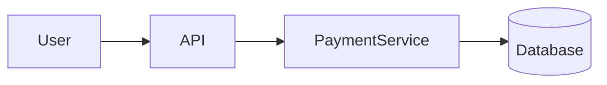
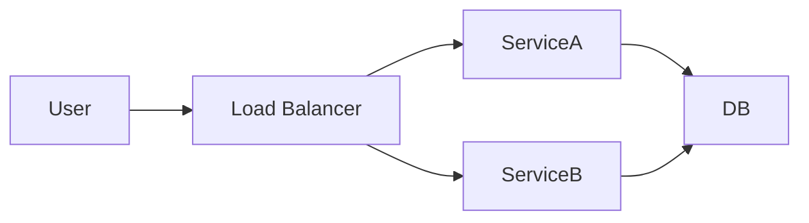
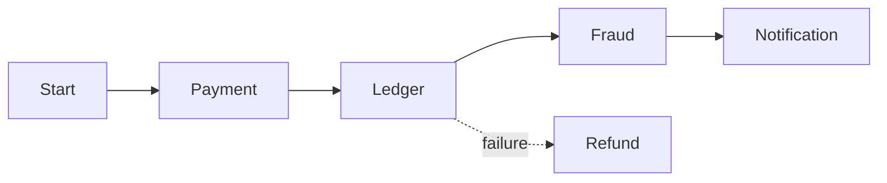

---
title: "Phase 3 Summary — Designing Reliable Distributed Systems"
description: "Summarize the key reliability and correctness concepts introduced while designing a distributed payment system, including idempotency, replication, and distributed coordination."
keywords:
  - distributed system reliability
  - payment system design summary
  - idempotency replication saga
  - high level design reliability
  - system design phase summary
weight: 8
date: 2026-03-07
layout: "topic-content"
---

## 1. What We Built in Phase 3

---

In Phase 3 we moved beyond basic scalability and focused on a harder problem:

```
How do we design systems that remain correct even when failures occur?
```

To explore this challenge, we designed a simplified **payment system**.

Unlike many web applications, financial systems must guarantee:

- no duplicate transactions
- no lost transactions
- consistent account balances
- safe recovery from failures

This makes payment systems an excellent example for understanding **reliable distributed system design**.

---

## 2. The Architecture Evolution

---

We began with a simple architecture.



This architecture works in simple environments.

However, as we introduced distributed infrastructure, new challenges appeared.


### Distributed Services



Once systems scale across multiple services and databases, **failures become unavoidable**.

---

## 3. The Reliability Challenges We Encountered

---

While designing the payment system, we encountered several distributed system problems.

### Duplicate Requests

Network retries or repeated user actions may send the same request multiple times.

```
User clicks "Pay" twice
Network retry occurs
```

Without protection, this can lead to **duplicate payments**.


### Partial Failures

Distributed workflows may fail halfway through execution.

Example:

```
Payment recorded
Ledger update fails
```

This creates **inconsistent system state**.


### Replication Lag

When databases replicate data across nodes, replicas may temporarily contain stale data.

Example:

```
Payment recorded
Replica still shows old balance
```


### Multi-Service Coordination

Payment systems often involve multiple services.

```
Payment Service
Ledger Service
Fraud Detection Service
Notification Service
```

Failures across these services can leave the system in an inconsistent state.

---

## 4. The Solutions We Introduced

---

To solve these problems, we introduced several distributed system techniques.


### Idempotency

Idempotency ensures that repeated requests do not create duplicate operations.

Example solution:

```
Idempotency Key → Detect duplicate requests
```


### Replication Strategies

We explored **leader–follower replication**, where:

- writes go to the primary database
- replicas handle scalable reads

To maintain correctness, systems may route **critical reads** to the primary database.


### Consistency Strategies

We introduced techniques to handle replication lag:

- read‑after‑write consistency
- primary reads for critical operations


### Distributed Coordination

To coordinate multi-service operations, we introduced the **Saga pattern**.

Instead of a single global transaction, the system executes a sequence of local transactions.

Failures are handled using **compensating actions**.



---

## 5. Key Design Principles Learned

---

Phase 3 highlighted several important principles of distributed system design.


### Failures Are Normal

Distributed systems must assume that failures occur frequently.

Designs must therefore focus on **recovery and fault tolerance**.


### Exactly-Once Is Difficult

Ensuring that an operation occurs exactly once requires careful design.

Systems combine:

- idempotency
- transaction identifiers
- safe retry mechanisms


### Consistency Has Trade-Offs

Replication improves availability but introduces consistency challenges.

Designers must balance:

- correctness
- performance
- availability


### Coordination Requires Patterns

Multi-service workflows require coordination mechanisms such as:

- Saga pattern
- orchestration
- choreography

---

## 6. What You Should Now Be Able to Do

---

After completing Phase 3, you should be able to:

- design a distributed payment workflow
- explain how systems prevent duplicate transactions
- reason about replication and consistency
- explain how distributed services coordinate safely

These capabilities form the foundation for designing **reliable large-scale systems**.

---

## Key Takeaways

---

- Distributed systems introduce new failure modes.
- Payment systems highlight the importance of correctness.
- Idempotency protects against duplicate requests.
- Replication improves scalability but introduces consistency challenges.
- Saga patterns help coordinate multi-service workflows.

---

### 🔗 What’s Next?

In the next phase we will move beyond correctness and explore systems that operate under **extreme scale and real-time workloads**.

👉 Up Next: **Phase 4 — Real-Time and Event-Driven Systems**
